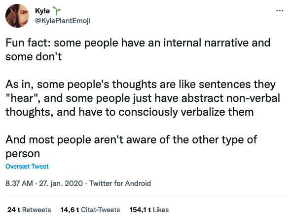
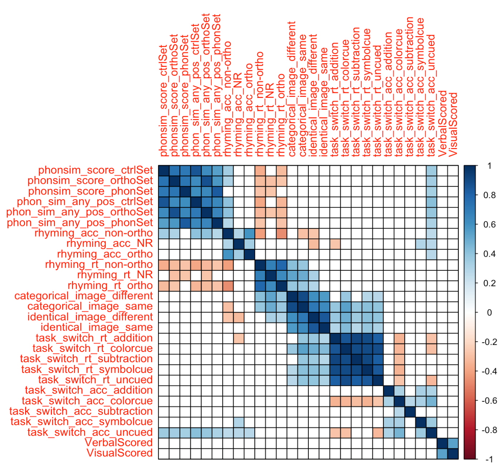
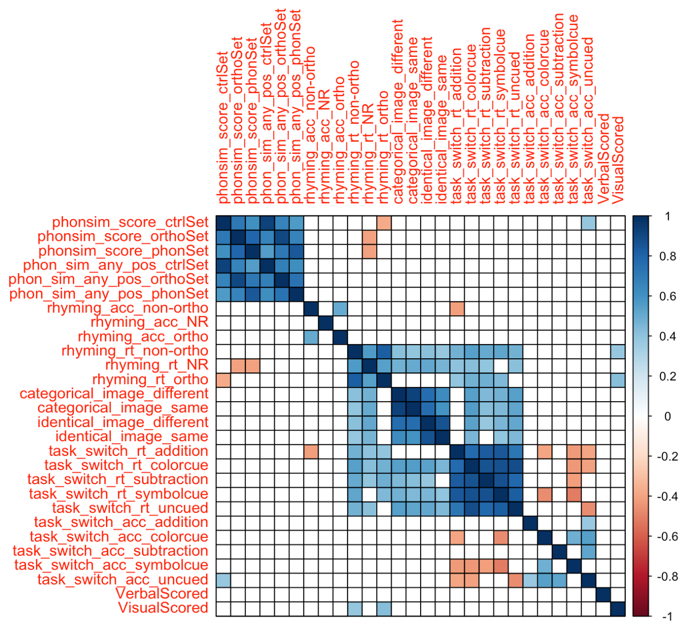
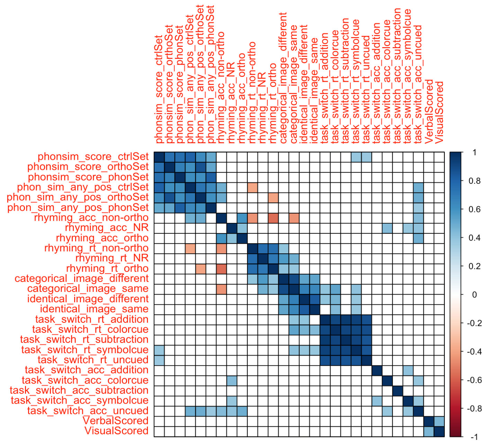
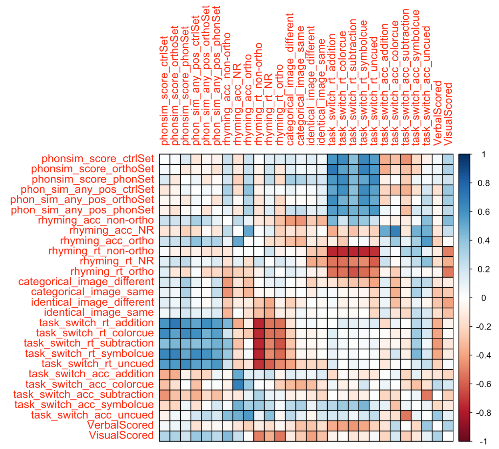

```{r setup, include = FALSE}
library("papaja")
library('tidyverse')
library('tufte')
library('kableExtra')
r_refs("r-references.bib")
knitr::opts_chunk$set(fig.pos = "H")
options(knitr.table.format = "latex")
```

\setcounter{secnumdepth}{5}

> "To think means to speak to oneself… hence to hear oneself inwardly.”
>
> `r tufte::quote_footer('--- Immanuel Kant in *Anthropology from a pragmatic viewpoint* (1798)')`

> "He who is capable of thinking with the aid of language alone, has not yet experienced abstract and genuine thinking."
>
> `r tufte::quote_footer('--- Eugen Karl Dühring as quoted in Engels (1877)')`

# Introduction

Everyone has an inner voice, and most of our waking hours are filled with internal monologue. These are claims that scientists of the mind casually make often [@chella2020cognitive; @perrone2014little] but the picture is muddied by the recent “discovery” that some people apparently do not experience an inner voice. The topic has received much attention in viral Twitter threads (e.g., @kyleplantemoji_2020, see Figure \@ref(fig:kyle))  as well as in articles such as ‘What it’s like living without an inner voice’ [@soloducha_2020] and ‘People With No Internal Monologue Explain What It's Like In Their Head’ [@felton_2020].

```{r kyle, echo=FALSE, out.width="50%", fig.align= 'center', fig.cap='Viral tweet from @KylePlantEmoji about the presence or absence of inner speech. Screenshot from November 17th 2022.'}

```

Judging by these accounts, there are important differences in the extent to which people experience an inner voice. Whether these differences in experience result in differences in behavior is still an open question which we hope begin to address in the present article.

If people’s reports are accurate and an absence or diminished awareness of inner speech is more widespread than previously thought, this has important consequences for the relationship between language/inner speech and thought. The assumption that everyone has an inner voice has served as a stepping stone for much research into the functions of inner speech – if everyone has it, it must be important. This importance ranges from claims that language constitutes (at least some types of) thought [@carruthers2002cognitive;  @gauker2011words; @frankish_isnv; @morin_isnv; @bermudez2007thinking; @clark_magicwords] to investigations into the connection between inner speech and behavioral control [@emerson2003role; @cragg2010language; @alderson2015inner; @morin2018self]. As the two quotes at the beginning of this article suggest, philosophers and psychologists have disagreed about the role of inner speech and language in thinking for centuries. It is possible that these disagreements stem at least in part from the philosophers’ and psychologists’ subjective experience as this is also the case with aphantasia, the inability to engage in visual imagery [@galton1880statistics]. With globalization and social media has come the opportunity to discuss these intuitions of a select few thinkers with a much wider range of people whose intuitions we would do well to take seriously.
 
##        Parallels with unsymbolized thinking 

Anecdotally, some people with no inner speech report that their thinking takes place largely in the visuospatial modality while another common description is that they ‘think in concepts’. What it means to think in concepts without relying on language is contentious but the idea to some extent parallels findings from Descriptive Experience Sampling (DES) [@heavey2008phenomena; @hurlburt2006descriptive], where participants often report what is called ‘unsymbolized thinking’ (around 22 % of experience prompts). In such episodes, people feel that they think ‘a particular, definite thought without the awareness of that thought’s being conveyed words, images, or any other symbols’ (Heavey & Hurlburt, 2008, p. 802). Unsymbolized thinking is a slippery phenomenon mostly characterized with negative definitions. For example, @hurlburt2008unsymbolized say that it is experienced as being ‘a thinking, not a feeling, not an intention, not an intimation, not a kinesthetic event, not a bodily event’ (p. 1366). The existence of conscious, unsymbolized thinking poses a challenge to views that hold that language is necessary for conscious thinking, as does the putative existence of people who do not experience inner speech at all. Indeed, proponents of such views tend to deny the existence of unsymbolized thought, claiming that reports may be a result of confabulation [@carruthers2009mindreading]. Either people who report such thoughts are using words or images without being aware of it, or they are not really thinking (e.g. confusing looking at something with considering something). One way of testing the confabulation idea is to test whether the presence or absence of verbal thought has behavioral consequences which is what we did in the series of experiments discussed in the present paper.

##        Parallels with aphantasia

That there are differences in subjective reports of inner experience is not a new finding, nor is the idea that such differences may result in subtle behavioral changes. In recent years, a very similar phenomenon to internal verbal experience has gained much attention, namely the presence or absence of visual imagery. In a 2010 article, Zeman and colleagues termed the inability to engage in visual imagery ‘aphantasia’ and reported that two thirds of the participants had difficulties with autobiographical memory as a result of their aphantasia [@zeman2010]. Generally, participants with aphantasia report weak or non-existing ability to visualize ‘in the mind’s eye’ [@dawes2020cognitive; @keogh2018blind] and may display poorer visual working memory performance than control participants [@jacobs2018visual] although this is not always the case [@keogh2021visual]. The conflicting findings about consequences of aphantasia in terms of working memory abilities have prompted a discussion of whether aphantasia represents a metacognitive deficit rather than difficulties with mental visual imagery. However, recent findings suggest that a more likely explanation is that people with aphantasia simply use different strategies to solve tasks that would normally require visual imagery. For example, Keogh, Wicken, and Pearson (2021) found that participants with aphantasia performed at the same level as control participants on visual working memory tasks. There were, however, marked differences in the reported strategies used by participants with aphantasia who reported rehearsing patterns verbally or ‘using ideas and semantics’ to remember the test items. Additionally, performance levels on a number working memory task and a visual working memory task were correlated for participants with aphantasia but not for control participants. This suggests that control participants used different strategies for the two types of tasks (one is traditionally thought to occupy verbal resources while the other is thought to utilize visual working memory resources) while participants with aphantasia may have used similar strategies for the two different tasks. The finding that differences in strategies are likely to mask differences in visualizing ability is important for research in inner speech as well. We might see comparable performance levels due to compensatory strategies that would then mask differences in mental verbalizing abilities.

There are, however, also important differences between aphantasia and lack of inner speech as inner speech cannot be reduced to auditory imagery. First, inner speech involves both auditory and articulatory-motor imagery [@perrone2014little; @geva_isnv]. Second, while internal language addressed to oneself is often experienced as having phonological features - one of the reasons people often perceive it as speech [@langlandhassan_isnv] - it does not necessarily. For example, inner speaking and inner signing have something in common as ways of producing internal language addressed to oneself that has nothing to do with auditory imagery [@mcguire1997neural].

##        How widespread might a lack of inner speech be?

It is difficult to assess the prevalence of inner speech in the general population but there are nevertheless several sources for making educated guesses. People with aphantasia often report difficulties with imagery in other modalities as well (Dawes et al., 2020) and so we might expect a similar incidence rate for lack of inner speech. If we take this as a starting point, we could see little to no inner speech in around 2-4 % of the population [@faw2009conflicting; @dance2022prevalence]. Alternatively, we could look at what proportion of children engage in private speech (93 % according to @winsler2003private) or how many adult participants report never engaging in self-talk in large-scale questionnaire studies (e.g. less than 10 % in @nedergaard2021valence). Regardless, people with no inner speech appear to be in a small minority, and the phenomenon is likely to be continuous rather than dichotomous. 

##        Which behavioral consequences of less inner speech would we expect?

Say that we take people’s claims seriously when they say that they experience no inner speech. Given the myriad of theories on the role that language plays in cognition, we would expect them to also think differently. For example, we might believe that inner speech is recruited for (or actually constitutes) self-reflection and metacognition (Morin, 2018; Clark, 1998), and so people with less inner speech should perform less well on metacognitive tasks. If we find both that they are right about not having inner speech and that they perform equally well, then we might conclude that inner speech is probably not crucial for metacognition. This line of reasoning hinges on finding a good way to test whether people are right when they claim that they experience no inner speech and finding tests of cognitive abilities that either could only be solved with inner speech or would allow us to differentiate between verbal and non-verbal solutions/strategies (despite them possibly resulting in comparable performance). 

## The present study

To test whether participants are accurate about their internal verbal representations, we use a rhyme judgment task  [@geva2011discrepancy; @langland2015inner] where participants see two images and have to judge whether the associated words rhyme or not. Presumably, this would require them to internally verbalize. Importantly, we need to include both orthographic rhymes (such as ‘boat’ and ‘moat’) and non-orthographic rhymes (such as ‘sleigh’ and ‘hay’) as participants could otherwise make rhyme judgments by visualizing the orthographic representations of the words. In functional neuroimaging studies, rhyme judgment tasks are associated with activation in language production areas such as the left inferior frontal gyrus and the inferior parietal lobe [@hoeft2007functional; @poldrack2001relations; @lurito2000; @paulesu1993neural; @pugh1996cerebral; @owen2004fmri]. Taking inspiration from aphantasia research on visual working memory, it also seems reasonable to focus on verbal working memory in the case of people with little to no inner speech. In particular, we might expect difficulties with verbal working memory tasks requiring a high degree of phonological precision [@jacobs2018visual]. For this, we use verbal working memory tests with orthographically similar sets, phonologically similar sets, and control sets. 

There is robust evidence that inner speech is generally recruited for behavioral control in task switching paradigms where participants have to switch between different task rules [@emerson2003role; @miyake2004inner; @baddeley2001working]. Here, participants for example have to switch between adding and subtracting numbers while also performing simultaneous tasks designed to interfere (see @nedergaard2022verbal for a systematic review of the verbal interference literature). People who do not habitually use inner speech might resort to other means of self-cueing in such cases. Given the robust literature on inner speech being involved in task switching, we also test participants’ ability to switch between simple addition and subtraction problems. This helps shed light on the consequences of (lack of) inner speech for behavioral control.

Aside from behavioral control, there is also empirical evidence that language influences thought on a more structural level through imposing categories on for example the color spectrum [@gilbert2006whorf; @gilbert2008support; @winawer2007russian]. Given that even people who report no inner speech grow up using language and learning categories through language, it is perhaps more of an open question whether we would expect them to be influenced by categories to the same extent as people with a lot of inner speech. Related to this idea that language structures the way we think about categories, we also test participants’ ability to detect simple visual differences as well as categorical differences between line drawings of cats and dogs.

# Methods
## Participants
**We contacted participants who had previously completed the Internal Representations Questionnaire [@roebuck2020internal] and recruited ones with the lowest and highest scores on verbal representation. This study received ethical approval from XXXX.** (@Gary how exactly was this done?) We will use the shorthand ‘high-verbal’ and ‘low-verbal’ to refer to these two groups although it should be noted that these just refer to their inclination or propensity to engage in verbal mental imagery and not to their general linguistic abilities. All four experiments were conducted using custom-written software with the JavaScript package jsPsych version 6 [@de2015jspsych].

## Method: Verbal working memory

### Materials
We used the same three word sets as @baddeley1966short: One set contained words that were phonologically similar but not orthographically similar (‘bought’, ‘sort’, ‘taut’, ‘caught’, and ‘wart’), one set contained words that were orthographically similar but not phonologically similar (‘rough’, ‘cough’, ‘through’, ‘dough’, ‘bough’), and one set was a control set (‘plea’, ‘friend’, ‘sleigh’, ‘row’, ‘board’).

### Procedure
Participants received the following instructions: ‘During each trial, you will see five words presented in sequence 1 second each. You will have to remember the words and the order they were presented in as you will be asked to reproduce them in the right order afterwards.’ There was a blank screen for 2000 ms between each word presentation. First, participants performed two practice trials with full feedback (correct/incorrect and the stimulus words – drawn from a different set than the ones used in the real experiment – shown in order). Then, participants performed 24 trials with eight trials from each of the three word sets. The order of both set type and words within a trial were randomized. There was no limit to how long participants could spend on reproducing the words on a given trial. See Figure \@ref(fig:verbwm-procedure).

```{r verbwm-procedure, echo=FALSE,    out.width="100%", fig.cap='A sketch of the procedure in the verbal working memory experiment. In this example, the words are drawn from the phonological similarity set'}
knitr::include_graphics("anendophasia_exp_procedures/verbwm.png")
```

## Method: Rhyme judgments

### Materials

We constructed a set of rhyme pairs with 20 orthographical pairs (e.g. ‘sock’ and ‘clock’)  and 20 non-orthographical pairs (e.g. ‘drawer’ and ‘door’). See Supplementary Materials for the full set of images, associated words, and name agreement scores. The images were selected from the MultiPic database [@dunabeitia2018multipic] and from @snodgrass1980standardized.

###        Procedure
Participants received the following instructions: ‘You will see two images at a time and have to judge whether the names of the items rhyme or not. For example, if you see a picture of a LAMP and a picture of a CAMP, you should respond that they rhyme (press UP arrow). If you see a picture of a BEAR and a picture of a CUP, you should respond that they do not rhyme (press DOWN arrow). All the words are short (one syllable). Please make the judgments as quickly and accurately as possible.’ Participants first performed four practice trials with correct/incorrect feedback – they did not receive feedback for the remaining trials. Between each rhyme judgment trial, the screen showed a central fixation cross for either 250, 500, 750, or 1000 ms. It then showed two square black frames for 500 ms to control spatial attention – the two images then appeared simultaneously in the two squares. Participants had 5000 ms to respond to each trial and performed a total of 60 rhyme judgments in randomized order (20 orthographical rhymes, 20 non-orthographic rhymes, and 20 no-rhyme control trials). See Figure \@ref(fig:rhyme-procedure).

```{r rhyme-procedure, echo=FALSE, out.width="100%", fig.cap="A sketch of a rhyme judgment trial. The stimuli here exemplify an orthographic rhyme – ‘bone’ and ‘cone’ – and the correct answer would therefore be ‘Rhyme’."}
knitr::include_graphics("anendophasia_exp_procedures/rhyme.png")
```

## Method: Task switching

###        Materials
For each of the five experimental conditions, we used 30 randomly selected integers between 13 and 96 as prompts to make sure that all correct results were two-digit positive numbers. 

### Procedure
There were five conditions in this experiment: (1) blocked addition (2) blocked subtraction, (3) alternating between addition and subtraction with operation marked by color cue (red/blue); (4) alternation marked with a symbol cue (+/-); (5) alternation without external cue requiring participants to remember which operation they just did.. Participants started with either the blocked subtraction or the addition condition (counterbalanced) and then proceeded to the switching conditions (counterbalanced). For each condition, participants first solved 10 problems with correct/incorrect feedback (including feedback specific to whether the arithmetic or the operation or both were incorrect) and then 30 problems without feedback. On a given trial, participants saw a prompt number and had to either add or subtract 3 and type their answer into a text box. In the switching conditions, a response counted as correct if it was the correct arithmetic and if the operation was switched from the previous trial (from addition to subtraction or vice versa). See Figure \@ref(fig:task-switch-procedure).

```{r task-switch-procedure, echo=FALSE, out.width="100%", fig.cap='A sketch of the three switched conditions in the task switching experiment. Figure A shows four color-cued switch trials with correct answers, Figure B shows four symbol-cued switch trials with correct answers, and Figure C shows four uncued switch trials with correct answers.'}
knitr::include_graphics("anendophasia_exp_procedures/taskswitch.png")
```

##        Method: Same/different judgments

### Materials
This experiment used three different black silhouettes of cats and three different black silhouettes of dogs (see Figure \@ref(fig:cats-dogs)). 

```{r cats-dogs, echo=FALSE, out.width="50%",    fig.align= 'center', fig.cap='The black silhouettes of cats and dogs used in the same/different judgment experiment.'}
knitr::include_graphics("samdiff_figs.png")
```

### Procedure
There were two conditions in the experiment: a category judgment condition and an identity judgment condition. In the category judgment condition, participants were instructed to press the UP arrow key if the two animals belonged to the same category (either cat or dog) and the DOWN arrow key if they did not. In the identity judgment condition, participants were instructed to press the UP arrow key if the two animals were completely identical (e.g., same silhouette of same dog) and the DOWN arrow key if they were not. See Figure \@ref(fig:same-diff-procedure). On each trial, participants first saw a fixation cross for 750 ms, then four empty square frames around the fixation cross for 500 ms to prompt participants’ spatial attention. The silhouette images appeared one at a time with a 300 ms delay between them in two out of four random positions around a fixation cross in the center of the screen. After the keyboard response, the screen was blank for 300 ms. Participants received feedback throughout but only for incorrect trials. They completed 100 trials in the category judgment condition and 100 trials in the identity judgment condition (half ‘same’ and half ‘different’).

```{r same-diff-procedure, echo=FALSE, out.width="100%",    fig.cap='A sketch of the two conditions of the category judgment experiment. On Figure A, we see a correct category judgment trial where the participant responds that the cat and dog silhouettes represent different animals. On Figure B, we see an incorrect identity judgment trial where the participant responds that the two dogs are identical.'}
knitr::include_graphics("anendophasia_exp_procedures/samedifferent.png")
```

## Method: Questionnaire
After completing the four experiments, participants answered the following custom questions. They also completed the Varieties of Inner Speech Questionnaire (VISQ) [@alderson2018varieties].

```{r, echo=FALSE}
questionnaire_table <- data.frame(
  Question = c('If you have to ask a question in front of an audience, which of these best describes what you typically do?',
               'How often do you experience trouble focusing on a face-to-face conversation you are having because of a conflicting conversation happening in your mind at the same time?',
               'How often do you have songs stuck in your head?',
               'If you had to recall a short conversation about a specific topic that you had yesterday with a friend, how easily can you recall the exact words your friend said?',
               "If you had to recall a short conversation about a specific topic that you had yesterday with a friend, how easily can you recall the exact words you said?",
               'When you recall a conversation like the one you were thinking about for the last 2 questions, do you hear the words in your mind?',
               'Can you "sing along" to music without singing out loud?',
               'If you can "sing along" to music without singing out loud, to what extent does this feel like regular thinking?',
               'If you imagine someone else speaking, how do you experience their voice?',
               'Many people feel that a lot of their thinking, planning, and decision-making takes place in the form of a conversation with themselves. They describe that when they think, they hear words in their mind. Other people don’t have this experience and instead say that they "think in ideas". Is your experience more like the first or the second?',
               "To what extent do you agree with this statement: 'It is generally difficult
and takes effort to express in words how I think and feel'.",
                'Do you think it is stressful and annoying to have an inner monologue?',
                'In books and movies, we often see characters talking to themselves at length. How much do you think this reflects real life?',
                'Have you been diagnosed with dyslexia or another reading disorder?',
                'Do you ever revise past conversations in your mind (i.e. think of a better comeback,
a way of phrasing what you wanted to say)?',
                'Do you ever rehearse a conversation before you have it in real life where you
simulate what you will say and how the other person will respond?',
                'Imagine you are lying in bed with your eyes closed trying to fall asleep. Is your inner experience then...',
                'To what extent do you agree with this statement: "I do not know why I do some of the things that I do."',
                'To what extent do you agree with this statement: “I am a firm believer in thinking things through.”',
                'To what extent do you agree with this statement: “I like to act on a whim.”',
                "For each scale, please indicate what percent of people you know you think have each of these three experiences:\n
-        Experience their thoughts in the form of a conversation with themselves\n
-        Can see vivid images in their mind's eye\n
-        Hear words in their mind's ear when they silently read"
),
  Options = c("I rehearse in my mind the exact phrasing of what I am going to ask (5)\n
        I rehearse in my mind some of what I am going to ask before asking it (4)\n
        I think of a question I want to ask and just ask it (3)\n
        Other (2)\n
        I'm never in a position to ask questions in front of an audience (1)",
        'Never (1)\n
        Rarely (2)\n
        Sometimes (3)\n
        Often (4)\n
        Always (5)',
        '        Multiple times a day (5)\n
        A few times a week (4)\n
        A few times a month (3)\n
        A few times a year (2)\n
        Never (1)',
        "I can easily recall it. If I wrote it down and matched to a recording of the conversation,
there'd be an almost perfect match (5)\n
        I remember the topic and remember much of what was said. If I matched it to a
recording of the conversation, a lot would match up. (4)\n
        I remember the topic, but remember only a few of the specific words/sentences. (3)\n
        I remember the topic, but can't remember any of the specifics. (2)\n
        Other (1)",
  "I can easily recall it. If I wrote it down and matched to a recording of the conversation,
there'd be an almost perfect match (5)\n
        I remember the topic and remember much of what was said. If I matched it to a
recording of the conversation, a lot would match up. (4)\n
        I remember the topic, but remember only a few of the specific words/sentences. (3)\n
        I remember the topic, but can't remember any of the specifics. (2)\n
        Other (1)",
  "It's just like I'm hearing the conversation again. (4)\n
        I hear a condensed version (e.g. only some words). (3)\n
        I hear something but I can't describe it. (2)\n
        I can't hear it, but I can still recall it. Please briefly say something about how you are
recalling it. (1)",
  "Yes - definitely (4)\n
        Yes - somewhat (3)\n
        No - but I can imagine how others can do it (2)\n
        No - I can't imagine how anyone could do this (1)",
  "Not at all (1)\n
  Mostly different from regular thinking (2)\n
        Neutral (3)\n
        Mostly similar to regular thinking (4)\n
        Exactly like regular thinking (5)\n
        I can't sing along without singing out loud (6)",
  "I hear what they say in their voice. (4)\n
        I hear what they say but in my own voice. (3)\n
        I hear the words but I can't tell whose voice it is. (2)\n
        I don’t “hear” anything, I imagine it by... (please specify) (1)",
  'More like a conversation (2)\n
        More like "thinking in ideas". Can you elaborate or give an example of what this means to you? (1)',
  "Strongly agree (1)\n
        Agree (2)\n
        Neither agree nor disagree (3)\n
        Disagree (4)\n
        Strongly disagree (5)",
  "Yes, very (3)\n
        Maybe a little (2)\n
        No, I don't think so (1)",
  "It's just for the viewer/reader's benefit (1)\n
        It might be like real life but mostly for the viewer's/reader's benefit (2)\n
        It's exactly like real life (3)",
  "Yes, officially diagnosed (1)\n
        Yes, self-diagnosed (2)\n
        No, never (3)",
  "Never (1)\n
        Rarely (2)\n
        Sometimes (3)\n
        Often (4)\n
        Very often (5)",
  "Never (1)\n
        Rarely (2)\n
        Sometimes (3)\n
        Often (4)\n
        Very often (5)",
  'Primarily verbal (you "hear" or "speak" words and sentences in your mind) (1)\n
        Primarily visual (you "see" situations, objects, people etc. in your mind) (2)\n
        Primarily about sensory awareness (what you are hearing, smelling, and feeling in the
  moment) (3)\n
        Primarily emotional (4)\n
        An even mix of verbal, visual, sensory, and emotional (5)\n
        My inner experience in that situation does not have a specific "format" (6)',
  "Strongly disagree (1)\n
        Disagree (2)\n
        Neither agree nor disagree (3)\n
        Agree (4)\n
        Strongly agree (5)",
  "Strongly disagree (1)\n
        Disagree (2)\n
        Neither agree nor disagree (3)\n
        Agree (4)\n
        Strongly agree (5)",
  "Strongly disagree (1)\n
        Disagree (2)\n
        Neither agree nor disagree (3)\n
        Agree (4)\n
        Strongly agree (5)",
"No one (0%) to Everyone (100%)"
        )
)
kable(questionnaire_table, align='l', booktabs = TRUE,
  longtable = TRUE, linesep = "") %>%
  kable_styling(full_width = T, latex_options = c("hold_position", 'repeat_header'),font_size = 8)
  
```

## Data analysis
We used `r cite_r("r-references.bib")` for all our analyses. In all linear mixed models, we modelled participant as random intercepts as well as random intercepts for all within-subjects factors (e.g. condition with repeated measures). For the statistical models predicting reaction time, we log-transformed the dependent variable to prevent issues with non-normal distributions. For the statistical models predicting accuracy, we constructed binomial generalized linear mixed models. All the plots visualize categorical differences between the two groups while all the statistical models use verbal score (average score on the verbal representation items on the Internal Representations Questionnaire) as a continuous predictor.

### Exclusion criteria 
We excluded 10 participants for responding randomly, missing at least one out of the four experiments, or otherwise not complying with task instructions. Our final sample included 47 participants with high verbal representation scores on the IRQ and 46 participants with low verbal representation scores. 

# Results
```{r, include=FALSE}
# read in full browser interaction data
library(tidyverse)
library(lme4)
library(lmerTest)
library(kableExtra)
library(optimx)
library(ggpubr)
library(forcats)
library(corrplot)
library(cowplot)
library(ggforce)
#library(Rmisc)
source("summarySEwithin_imp.R")
color_palette <- c('#88CCEE', '#44AA99', '#117733', '#332288', '#DDCC77', '#999933','#CC6677', '#882255', '#AA4499', '#DDDDDD') # Tol_muted from https://zenodo.org/record/3381072#.Y0_5ilJBw-Q
myCenter= function(x) {
        if (is.numeric(x)) { return(x - mean(x, na.rm=T)) }
        if (is.factor(x)) {
                x= as.numeric(x)
                return(x - mean(x, na.rm=T))
        }
        if (is.data.frame(x) || is.matrix(x)) {
                m= matrix(nrow=nrow(x), ncol=ncol(x))
                colnames(m)= paste("c", colnames(x), sep="")
                for (i in 1:ncol(x)) {
                        m[,i]= myCenter(x[,i])
                }
                return(as.data.frame(m))
        }
}
browser_interactions <- read.csv('browser_df_anendophasia_full.csv',row.names = 1)
irq_scores <- read.csv('irq_scores.csv', row.names = 1)
```

## Verbal working memory
```{r,include=FALSE}
phon_sim_trials <- read.csv('phon_sim_trials_221028.csv',row.names = 1)
# center predictors
phon_sim_trials$original_word_set_c <- ifelse(phon_sim_trials$original_word_set == "ctrlSet", -1,
         ifelse(phon_sim_trials$original_word_set == "orthoSet", 0,
                ifelse(phon_sim_trials$original_word_set == "phonSet", 1, phon_sim_trials$original_word_set)))
phon_sim_trials$VerbalScored_c <- scale(phon_sim_trials$VerbalScored)

```

### Descriptive statistics by group: Verbal working memory
```{r, include=FALSE}
phonsim_desc_df_score <- phon_sim_trials %>%
  summarySEwithin2(measurevar = 'score', betweenvars = c('high_low_verbal'),
                  withinvars = 'original_word_set', idvar='worker_id', na.rm=T)
phonsim_desc_df_any_pos <- phon_sim_trials %>%
  summarySEwithin2(measurevar = 'score_any_position', betweenvars = c('high_low_verbal'),
                  withinvars = 'original_word_set', idvar='worker_id', na.rm=T)
phonsim_desc_df <- cbind(phonsim_desc_df_score, phonsim_desc_df_any_pos)
colnames(phonsim_desc_df) <- make.names(colnames(phonsim_desc_df), unique = T)
phonsim_desc_df <- phonsim_desc_df %>% select(high_low_verbal, original_word_set,
                                              score, ci, score_any_position, ci.1)
colnames(phonsim_desc_df)[4] <- 'ci_score'
colnames(phonsim_desc_df)[6] <- 'ci_score_any_position'

phonsim_score_df_individual_score <- phon_sim_trials %>%
  summarySEwithin2(measurevar = 'score', betweenvars = c('high_low_verbal','worker_id'),
                  withinvars = 'original_word_set', idvar='worker_id', na.rm=T)
phonsim_score_df_individual_score_any <- phon_sim_trials %>%
  summarySEwithin2(measurevar = 'score_any_position', betweenvars = c('high_low_verbal','worker_id'),
                  withinvars = 'original_word_set', idvar='worker_id', na.rm=T)
phonsim_desc_df_individual <- cbind(phonsim_score_df_individual_score, phonsim_score_df_individual_score_any)
colnames(phonsim_desc_df_individual) <- make.names(colnames(phonsim_desc_df_individual), unique = T)
phonsim_desc_df_individual <- phonsim_desc_df_individual %>% select(high_low_verbal, original_word_set,  score, ci, score_any_position, ci.1, worker_id)
colnames(phonsim_desc_df_individual)[4] <- 'ci_score'
colnames(phonsim_desc_df_individual)[6] <- 'ci_score_any_position'

phonsim_desc_df_individual <- pivot_longer(phonsim_desc_df_individual, cols = c('score', 'score_any_position'), names_to='score_type')
```
High-verbal participants recalled more words correctly. This advantage was evident both when we scored only correctly ordered responses as correct as well as when we scored correctly recalled items regardless of their position (see Table \@ref(tab:phonsim-desc-table) and Figure \@ref(fig:phonsim-score-desc)).

```{r phonsim-desc-table, echo=FALSE}
levels(phonsim_desc_df$high_low_verbal) <- c('High-verbal', 'Low-verbal')
levels(phonsim_desc_df$original_word_set) <- c('Control set', 'Orthographical similarity set', 'Phonological similarity set')
phonsim_desc_df %>%
  kable(digits=2, booktabs = TRUE,
        caption = 'Descriptive statistics by group in the verbal working memory experiment.',
        col.names = c("Group",
                           "Word set",
                           "Score (item and position)",
                           "95% CI score (item and position)",
                            "Score (position indifferent",
                            "95% CI score (position indifferent)")) %>%
  row_spec(row = 0, bold = T) %>%
  kable_styling(font_size = 8, full_width = T)
```


```{r phonsim-score-desc, echo=FALSE, fig.cap='Score on the verbal working memory task by word set. Error bars indicate 95 % confidence intervals.'}
# word and position correct
pd <- position_dodge(width = 0.2)
VWM_score_p <- ggplot(phonsim_desc_df_score, aes(original_word_set, score, color=high_low_verbal)) +
  geom_sina(data= phonsim_score_df_individual_score, aes(original_word_set, score), alpha=0.3)+
  geom_errorbar(aes(ymin=score-ci, ymax=score+ci), width=.1, position= pd) +  
  stat_summary(fun = mean, geom = 'point', aes(group = high_low_verbal), position= pd) +
  stat_summary(fun = mean, geom = 'line', aes(group = high_low_verbal), size = 1, position= pd)+
  theme_bw() +
  scale_x_discrete(labels=c('Control set', 'Orthographical\nsimilarity set', 'Phonological\nsimilarity set'))+
  #theme(legend.position = 'none')+
  labs(y ='Accuracy (out of 5)', title = 'Correct word in correct position', x='')+
  scale_color_manual('Group',values = color_palette[c(4,6)], labels=c('High-verbal', 'Low-verbal'))

# correct word regardless of position
WRM_score_any_pos_p <- ggplot(phonsim_desc_df_any_pos, aes(original_word_set, score_any_position, color=high_low_verbal)) +
  geom_sina(data= phonsim_score_df_individual_score_any, aes(original_word_set, score_any_position), alpha=0.3)+
  geom_errorbar(aes(ymin=score_any_position-ci, ymax=score_any_position+ci), width=.1, position= pd) +  
  stat_summary(fun = mean, geom = 'point', aes(group = high_low_verbal), position= pd) +
  stat_summary(fun = mean, geom = 'line', aes(group = high_low_verbal), size = 1, position= pd)+
  theme_bw() +
  scale_x_discrete(labels=c('Control set', 'Orthographical\nsimilarity set', 'Phonological\nsimilarity set'))+
 # theme(legend.position = 'none')+
  labs(y ='Accuracy (out of 5 in any position)', title = 'Correct word regardless of position',x='')+
  scale_color_manual('Group',values = color_palette[c(4,6)], labels=c('High-verbal', 'Low-verbal'))
ggarrange(VWM_score_p, WRM_score_any_pos_p,common.legend = T)
```

### Statistical models: Verbal working memory
```{r, include=FALSE, cache=TRUE}
# some models
score_by_verbal_m <- lmer(score ~ original_word_set_c * VerbalScored_c + 
                            (original_word_set_c|worker_id), phon_sim_trials)
summary(score_by_verbal_m)
# phon set more difficult than ctrl set, ortho set not more difficult
# no interaction with verbalscored
score_any_by_verbal_m <- lmer(score_any_position ~ original_word_set_c * VerbalScored_c + 
                                (original_word_set_c|worker_id), phon_sim_trials)
summary(score_any_by_verbal_m)

```
We conducted two linear mixed models of original word set (phonologically similar, orthographically similar, and control set) and verbal score predicting either memory performance with both correct word and correct position or memory performance with correct word regardless of position. Both models included random intercepts by participant for the three word sets.
For memory performance requiring both accurate word and position, both the set with phonologically similar words and the set with orthographically similar words were more difficult than the control set (phonological set: $\beta$ = `r round(summary(score_by_verbal_m)$coefficients[3,1],2)`; SE = `r round(summary(score_by_verbal_m)$coefficients[3,2],2)`; t = `r round(summary(score_by_verbal_m)$coefficients[3,4], 2)`; p < .001; orthographical set: $\beta$ = `r round(summary(score_by_verbal_m)$coefficients[2,1],2)`; SE = `r round(summary(score_by_verbal_m)$coefficients[2,2],2)`; t = `r round(summary(score_by_verbal_m)$coefficients[2,4], 2)`; p < .001). A higher verbal score was associated with increased memory performance ($\beta$ = `r round(summary(score_by_verbal_m)$coefficients[4,1],2)`; SE = `r round(summary(score_by_verbal_m)$coefficients[4,2],2)`; t = `r round(summary(score_by_verbal_m)$coefficients[4,4], 2)`; p =  `r round(summary(score_by_verbal_m)$coefficients[4,5], 3)`). There were no interaction effects (all p > `r round(summary(score_by_verbal_m)$coefficients[5,5], 3)`).
The same pattern was found when the correct word in any position counted as correct: The phonologically similar set was more difficult than the control set ($\beta$ = `r round(summary(score_any_by_verbal_m)$coefficients[3,1],2)`; SE = `r round(summary(score_any_by_verbal_m)$coefficients[3,2],2)`; t = `r round(summary(score_any_by_verbal_m)$coefficients[3,4], 2)`; p < .001) and so was the orthographically similar set ($\beta$ = `r round(summary(score_any_by_verbal_m)$coefficients[2,1],2)`; SE = `r round(summary(score_any_by_verbal_m)$coefficients[2,2],2)`; t = `r round(summary(score_any_by_verbal_m)$coefficients[2,4], 2)`; p =  `r round(summary(score_any_by_verbal_m)$coefficients[2,5], 4)`). A higher verbal score was associated with increased memory performance ($\beta$ = `r round(summary(score_any_by_verbal_m)$coefficients[4,1],2)`; SE = `r round(summary(score_any_by_verbal_m)$coefficients[4,2],2)`; t = `r round(summary(score_any_by_verbal_m)$coefficients[4,4], 2)`; p =  `r round(summary(score_any_by_verbal_m)$coefficients[4,5], 3)`). There were no interaction effects (all p > `r round(summary(score_any_by_verbal_m)$coefficients[5,5], 3)`).

### Strategies: Verbal working memory
```{r, include=FALSE}
talk_out_loud_PS <- phon_sim_trials %>%
  group_by(worker_id, talk_out_loud, high_low_verbal) %>%
  tally()
# participant
tol_phon_sim <- talk_out_loud_PS %>%
  group_by(high_low_verbal,talk_out_loud) 
table(tol_phon_sim$high_low_verbal, tol_phon_sim$talk_out_loud)
chisq.test(tol_phon_sim$high_low_verbal, tol_phon_sim$talk_out_loud) #no difference
```
We were interested in whether participants said the words out loud to help them remember them. We asked about this at the end of the experiment. A chi-squared test showed that there was no significant difference between how many high-verbal participants (10 out of 47) and how many low-verbal participants (13 out of 46) reported that they had said the words out loud ($\chi^2$(1) = `r round(chisq.test(tol_phon_sim$high_low_verbal, tol_phon_sim$talk_out_loud)$statistic, 2)`, p = `r round(chisq.test(tol_phon_sim$high_low_verbal, tol_phon_sim$talk_out_loud)$p.value,3)`). Nevertheless, the effect of doing so was interestingly different for the two groups as can be seen in Figure \@ref(fig:phon-sim-TOL-fig).

```{r phon-sim-TOL-fig, echo=F,   fig.cap='Verbal working memory performance by whether participants reported talking out loud to help them remember or not. Error bars indicate 95 % confidence intervals.'}
# does it matter what strategy they used?
phonsim_desc_df_score_TOL <- phon_sim_trials %>%
  summarySEwithin2(measurevar = 'score', betweenvars = c('high_low_verbal', 'talk_out_loud'),
                  withinvars = 'original_word_set', idvar='worker_id', na.rm=T)
phonsim_desc_df_any_pos_TOL <- phon_sim_trials %>%
  summarySEwithin2(measurevar = 'score_any_position', betweenvars = c('high_low_verbal', 'talk_out_loud'),
                  withinvars = 'original_word_set', idvar='worker_id', na.rm=T)
phonsim_desc_df_TOL <- cbind(phonsim_desc_df_score_TOL, phonsim_desc_df_any_pos_TOL)
colnames(phonsim_desc_df_TOL) <- make.names(colnames(phonsim_desc_df_TOL), unique = T)
phonsim_desc_df_TOL <- phonsim_desc_df_TOL %>% select(high_low_verbal, original_word_set,
                                              score, ci, score_any_position, ci.1,talk_out_loud)
colnames(phonsim_desc_df_TOL)[4] <- 'ci_score'
colnames(phonsim_desc_df_TOL)[6] <- 'ci_score_any_position'

phonsim_score_df_individual_score <- phon_sim_trials %>%
  summarySEwithin2(measurevar = 'score', betweenvars = c('high_low_verbal','worker_id', 'talk_out_loud'),
                  withinvars = 'original_word_set', idvar='worker_id', na.rm=T)
phonsim_score_df_individual_score_any <- phon_sim_trials %>%
  summarySEwithin2(measurevar = 'score_any_position', betweenvars = c('high_low_verbal','worker_id', 'talk_out_loud'),
                  withinvars = 'original_word_set', idvar='worker_id', na.rm=T)
phonsim_desc_df_individual <- cbind(phonsim_score_df_individual_score, phonsim_score_df_individual_score_any)
colnames(phonsim_desc_df_individual) <- make.names(colnames(phonsim_desc_df_individual), unique = T)
phonsim_desc_df_individual <- phonsim_desc_df_individual %>% select(high_low_verbal, original_word_set,  score, ci, score_any_position, ci.1, worker_id, talk_out_loud)
colnames(phonsim_desc_df_individual)[4] <- 'ci_score'
colnames(phonsim_desc_df_individual)[6] <- 'ci_score_any_position'

ggplot(phonsim_desc_df_TOL, aes(talk_out_loud, score, color=high_low_verbal)) +
  geom_sina(data= phonsim_score_df_individual_score, aes(talk_out_loud, score), alpha=0.3)+
  geom_errorbar(aes(ymin=score-ci_score, ymax=score+ci_score), width=.1, position= pd) +  
  stat_summary(fun = mean, geom = 'point', aes(group = high_low_verbal), position= pd) +
  stat_summary(fun = mean, geom = 'line', aes(group = high_low_verbal), size = 1, position= pd)+
  theme_bw() +
  labs(y ='Accuracy out of 5', title = 'Verbal working memory x talking out loud', x='Did you talk out loud to remember the words?')+
  scale_color_manual('Group',values = color_palette[c(4,6)], labels=c('High-verbal', 'Low-verbal'))+
  facet_wrap(~original_word_set, labeller= labeller(original_word_set = c("ctrlSet" = "Control set",
      "orthoSet" = "Orthographical\nsimilarity set",
      "phonSet" = "Phonological\nsimilarity set")))

```

The difference between the two groups' memory performance disappears when they report that they said the words out loud to help them remember. Doing so helps low-verbal participants but makes no difference for high-verbal participants. Participants gave some interesting alternative strategies in response to the free answer question about strategies:

*High-verbal group*

* Remembering the order of the first letters once the words were familiar (e.g. c, b, t, r, d for 'cough', 'bough', 'through', 'rough', 'dough'). One participant reported this.
* Finding a cadence/melody and using this to repeat the words.
* Chunking.
* Hand and body gestures.
* Creating a story or a sentence with the words in order (both visual and verbal). This one was the most common strategy.

*Low-verbal group*

* Remembering the order of the first letters once the words were familiar (e.g. c, b, t, r, d for 'cough', 'bough', 'through', 'rough', 'dough'). This strategy was much more common for the low-verbal group than for the high-verbal group.
* Form a story or a narrative. This was a less common strategy than remembering the first letters.

## Rhyme judgments
We excluded five rhyming pairs as they had below-chance performance on average for at least one group. These pairs were bin/chin, cab/crab, rake/cake, wave/cave, and park/shark. 

```{r, include =FALSE}
rhyming_trials <- read.csv('rhyming_trials_221028.csv',row.names = 1)
# center predictors
rhyming_trials$type_c <- ifelse(rhyming_trials$type == "NR", -1,
         ifelse(rhyming_trials$type  == "ortho", 0,
                ifelse(rhyming_trials$type  == "non-ortho", 1, rhyming_trials$type)))
rhyming_trials$VerbalScored_c <- scale(rhyming_trials$VerbalScored)
rhyming_trials$name_agreement_img1_c <- scale(rhyming_trials$name_agreement_img1)

```
```{r, include=FALSE}
rhyme_desc_df_rt <- rhyming_trials %>%
  summarySEwithin2(measurevar = c('rt'), betweenvars = 'high_low_verbal',
                  withinvars = 'type', idvar='worker_id', na.rm=T)
rhyme_desc_df_correct <- rhyming_trials %>%
  summarySEwithin2(measurevar = 'correct', betweenvars = 'high_low_verbal',
                  withinvars = 'type', idvar='worker_id')
rhyme_desc_df <- cbind(rhyme_desc_df_rt, rhyme_desc_df_correct)
colnames(rhyme_desc_df) <- make.names(colnames(rhyme_desc_df),unique = T)
colnames(rhyme_desc_df)[8] <- 'ci_rt'
colnames(rhyme_desc_df)[16] <- 'ci_accuracy'
rhyme_desc_df <- rhyme_desc_df %>% select(high_low_verbal, type, rt,ci_rt, correct,ci_accuracy) 

rhyme_rt_df <- rhyming_trials %>%
  filter(correct == 1) %>%
  summarySEwithin2(measurevar = 'rt', betweenvars = c('high_low_verbal','talk_out_loud'),
                  withinvars = c('type'),idvar = 'worker_id',na.rm=T)
rhyme_rt_df_individual <- rhyming_trials %>%
  filter(correct == 1) %>%
  summarySEwithin2(measurevar = 'rt', betweenvars = c('high_low_verbal', 'worker_id', 'talk_out_loud'),
                  withinvars = c('type'),idvar = 'worker_id', na.rm = T)
rhyme_correct_df <- rhyming_trials %>%
  summarySEwithin2(measurevar = 'correct', betweenvars = c('high_low_verbal', 'talk_out_loud'), withinvars = c('type'),idvar = 'worker_id')
rhyme_correct_df_individual <- rhyming_trials %>%
  summarySEwithin2(measurevar = 'correct', betweenvars = c('high_low_verbal', 'worker_id', 'talk_out_loud'),  withinvars = c('type'),idvar = 'worker_id')
```
### Descriptive statistics by group: Rhyme judgments
Here is a table of accuracy and reaction time for the two groups (high- and low-verbal) across types of rhyming trials.
```{r rhyme-desc-table, echo=FALSE}
levels(rhyme_desc_df$high_low_verbal) <- c('High-verbal', 'Low-verbal')
levels(rhyme_desc_df$type) <- c('Non-orthographical rhyme', 'No rhyme','Orthographical rhyme')
rhyme_desc_df %>%
  dplyr::mutate(correct = correct * 100, ci_accuracy = ci_accuracy*100) %>%
  kable(digits=2, caption = 'Descriptive statistics on rhyming accuracy and reaction time by group and by rhyme type.', booktabs=T,
  col.names = c("Group",
                           "Type of rhyme trial",
                           "Reaction time (ms)",
                           "95% CI (reaction time)",
                            "Accuracy",
                            "95% CI (accuracy)")) %>%
  row_spec(row = 0, bold = T) %>%
  kable_styling(full_width = T)

```
As can be seen in Table \@ref(tab:rhyme-desc-table), high-verbal participants were generally both faster and more accurate than low-verbal participants on all three types of trials. See also Figure \@ref(fig:rhyme-desc).

```{r rhyme-desc, echo=FALSE,   fig.cap='Reaction time and accuracy across groups by rhyme type. Error bars indicate 95 % confindence intervals.'}
rhyme_rt_p <- ggplot(rhyme_desc_df_rt, aes(type, rt, color=high_low_verbal)) +
  geom_sina(data= rhyme_rt_df_individual, aes(type, rt), alpha=0.3)+
  geom_errorbar(aes(ymin=rt-ci, ymax=rt+ci), width=.1, position= pd) +  
  stat_summary(fun = mean, geom = 'point', aes(group = high_low_verbal), position= pd) +
  stat_summary(fun = mean, geom = 'line', aes(group = high_low_verbal), size = 1, position= pd)+
  theme_bw() +
  theme(axis.text.x=element_text(size=rel(0.9)))+
  scale_x_discrete(labels=c('Non-orthographical\nrhyme', 'No rhyme','Orthographical\nrhyme'))+
  labs(y ='Reaction time (ms)', x='')+
  scale_color_manual('Verbal score',values = color_palette[c(4,6)], labels=c('High-verbal', 'Low-verbal'))
rhyme_acc_p <- ggplot(rhyme_desc_df_correct, aes(type, correct, color=high_low_verbal)) +
  geom_sina(data= rhyme_correct_df_individual, aes(type, correct), alpha=0.3)+
  geom_errorbar(aes(ymin=correct-ci, ymax=correct+ci), width=.1, position= pd) + 
  stat_summary(fun = mean, geom = 'point', aes(group = high_low_verbal),  position= pd) +
  stat_summary(fun = mean, geom = 'line', aes(group = high_low_verbal), size = 1,  position= pd)+
  theme_bw() +
  theme(axis.text.x=element_text(size=rel(0.9)))+
  scale_x_discrete(labels=c('Non-orthographical\nrhyme', 'No rhyme','Orthographical\nrhyme'))+
  labs(y ='Accuracy', x='')+
  scale_color_manual('Group',values = color_palette[c(4,6)], labels=c('High-verbal', 'Low-verbal'))
ggarrange(rhyme_rt_p, rhyme_acc_p, common.legend = T)
```

### Statistical models: Rhyme judgments
```{r, include=FALSE, cache = TRUE}

rhyme_rt_m <- lmer(log(rt) ~ as.numeric(type_c) * VerbalScored_c + name_agreement_img1_c + (as.numeric(type_c)|worker_id),
                    subset(rhyming_trials, correct ==1))
summary(rhyme_rt_m) 
rhyme_acc_m <- glmer(correct ~ as.numeric(type_c) * VerbalScored_c + 
                       name_agreement_img1_c + 
                       (as.numeric(type_c)|worker_id),
                     family='binomial',
                     rhyming_trials,
                     control = glmerControl(optimizer ='bobyqa', optCtrl=list(maxfun=2e5)))
summary(rhyme_acc_m) 

```

Both the model predicting reaction time and the model predicting accuracy included random intercepts by participant for the within-subjects variable rhyme type. All predictors were centered. A model of verbal score, rhyme type, and name agreement for the first image predicting log-transformed reaction time showed no main effect of verbal score ($\beta$ = `r round(summary(rhyme_rt_m)$coefficients[3,1],2)`; SE = `r round(summary(rhyme_rt_m)$coefficients[3,2], 2)`; t = `r round(summary(rhyme_rt_m)$coefficients[3,4],2)`; p = `r round(summary(rhyme_rt_m)$coefficients[3,5],3)`), but it did find a significant effect of no-rhyme trials being slower than other trials ($\beta$ = `r round(summary(rhyme_rt_m)$coefficients[2,1],2)`; SE = `r round(summary(rhyme_rt_m)$coefficients[2,2], 2)`; t = `r round(summary(rhyme_rt_m)$coefficients[2,4],2)`; p < .001) and a significant effect of higher name agremeent being associated with faster reaction times ($\beta$ = `r round(summary(rhyme_rt_m)$coefficients[4,1],2)`; SE = `r round(summary(rhyme_rt_m)$coefficients[4,2], 3)`; t = `r round(summary(rhyme_rt_m)$coefficients[4,4],2)`; p < .001).  There were no significant interactions between rhyme type and verbal score (p = `r round(summary(rhyme_rt_m)$coefficients[5,5],3)`). Another model of verbal score, rhyme type, and name agreement for the first image predicting accuracy showed that no-rhyme trials were easier than other trials ($\beta$ = `r round(summary(rhyme_acc_m)$coefficients[2,1],2)`; SE = `r round(summary(rhyme_acc_m)$coefficients[2,2], 2)`; z = `r round(summary(rhyme_acc_m)$coefficients[2,3],2)`; p < .001) and that a higher verbal score was associated with a higher likelihood of responding accurately ($\beta$ = `r round(summary(rhyme_acc_m)$coefficients[3,1],2)`; SE = `r round(summary(rhyme_acc_m)$coefficients[3,2], 2)`; z = `r round(summary(rhyme_acc_m)$coefficients[3,3],2)`; p = `r round(summary(rhyme_acc_m)$coefficients[3,4],4)`). It also showed that trials with images with higher name agreement were significantly easier ($\beta$ = `r round(summary(rhyme_acc_m)$coefficients[4,1],2)`; SE = `r round(summary(rhyme_acc_m)$coefficients[4,2], 2)`; z = `r round(summary(rhyme_acc_m)$coefficients[4,3],2)`; p = `r round(summary(rhyme_acc_m)$coefficients[4,4],4)`). There was no significant interaction between rhyme type and verbal score (p = `r round(summary(rhyme_acc_m)$coefficients[5,4],3)`).

### Strategies: Rhyme judgments
```{r, include=F}
talk_out_loud_rhyme <- rhyming_trials %>%
  group_by(worker_id, talk_out_loud, high_low_verbal) %>%
  tally()
table(talk_out_loud_rhyme$talk_out_loud)
tol_rhyme <-talk_out_loud_rhyme %>%
  group_by(high_low_verbal,talk_out_loud)
table(tol_rhyme$high_low_verbal, tol_rhyme$talk_out_loud)
test <- chisq.test(tol_rhyme$high_low_verbal, tol_rhyme$talk_out_loud)
```
We were interested in whether participants said the words out loud to make the rhyme judgments and so we included this as a question at the end of the rhyming experiment. A chi-squared test showed that there was no significant difference between how many high-verbal participants (23 out of 47) and how many low-verbal participants (21 out of 46) reported that they had said the words out loud ($\chi^2$(1) = `r round(chisq.test(tol_rhyme$high_low_verbal, tol_rhyme$talk_out_loud)$statistic, 2)`, p = `r round(chisq.test(tol_rhyme$high_low_verbal, tol_rhyme$talk_out_loud)$p.value,3)`). Nevertheless, the effect of doing so was interestingly different for the two groups as can be seen in Figure \@ref(fig:rhyme-TOL).

```{r rhyme-TOL, echo=FALSE, fig.cap= 'Reaction time and accuracy by whether participants indicated that they had talked out loud to make the rhyme judgments. Error bars indicate 95 % confidence intervals.'}
# does it matter what strategy they used?
rhyme_tol_rt_p <- ggplot(rhyme_rt_df, aes(talk_out_loud, rt, color=high_low_verbal)) +
  geom_sina(data= rhyme_rt_df_individual, aes(talk_out_loud, rt), alpha=0.3)+
  geom_errorbar(aes(ymin=rt-ci, ymax=rt+ci), width=.1, position= pd) +  
  stat_summary(fun = mean, geom = 'point', aes(group = high_low_verbal), position= pd) +
  stat_summary(fun = mean, geom = 'line', aes(group = high_low_verbal), size = 1, position= pd)+
  theme_bw() +
  theme(axis.title.x=element_text(size=rel(0.7)),strip.text = element_text(size=rel(0.5)))+
  labs(y ='Reaction time (ms)',x='Did you talk out loud to make the rhyme judgments?')+
  scale_color_manual('Group',values = color_palette[c(4,6)], labels=c('High-verbal', 'Low-verbal'))+
  facet_wrap(~type, labeller= labeller(type = c("non-ortho" = "Non-orthographical\nrhyme",
      "NR" = "No rhyme",
      "ortho" = "Orthographical\nrhyme")))

rhyme_tol_acc_p <- ggplot(rhyme_correct_df, aes(talk_out_loud, correct, color=high_low_verbal)) +
  geom_sina(data= rhyme_correct_df_individual, aes(talk_out_loud, correct), alpha=0.3)+
  geom_errorbar(aes(ymin=correct-ci, ymax=correct+ci), width=.1, position= pd) +  
  stat_summary(fun = mean, geom = 'point', aes(group = high_low_verbal), position= pd) +
  stat_summary(fun = mean, geom = 'line', aes(group = high_low_verbal), size = 1, position= pd)+
  theme_bw() +
  theme(axis.title.x=element_text(size=rel(0.7)),strip.text = element_text(size=rel(0.5)))+
  labs(y ='Accuracy', x='Did you talk out loud to make the rhyme judgments?')+
  scale_color_manual('Group',values = color_palette[c(4,6)], labels=c('High-verbal', 'Low-verbal'))+
  facet_wrap(~type, labeller= labeller(type = c("non-ortho" = "Non-orthographical\nrhyme",
      "NR" = "No rhyme",
      "ortho" = "Orthographical\nrhyme")))

ggarrange(rhyme_tol_rt_p, rhyme_tol_acc_p, common.legend = T)

```

For both reaction time and accuracy, saying the words out loud diminished the difference between the two groups. This suggests that this was the strategy that high-verbal participants used in their heads - indeed, this was the most common strategy provided by the participants (from both groups) who chose to answer the free answer about strategy. There were no other notable strategies from the free answers.

## Task switching
We excluded trials over 10 seconds (0.5 % of trials). We also recalculated the accuracy measure so that any trial in the three switch conditions where participants in fact switched between adding and subtracting counted as correct (as long as the arithmetic itself was also correct). We did this to prevent a failure to switch once resulting in the remaining trials counting as incorrect.

```{r, include=FALSE}
task_switch_trials <- read.csv('task_switch_trials_221028.csv',row.names = 1)
# center predictors
task_switch_trials$condition_c <- ifelse(task_switch_trials$condition == "addition", -1,
         ifelse(task_switch_trials$condition == "subtraction", -0.5,
                ifelse(task_switch_trials$condition == "symbolcue", 0,
                       ifelse(task_switch_trials$condition == "colorcue", 0.5,
                            ifelse(task_switch_trials$condition == "uncued", 1, task_switch_trials$condition)))))
task_switch_trials$VerbalScored_c <- scale(task_switch_trials$VerbalScored)
# calculate switch cost (like Emerson & Miyake):
# 1. average speed on addition and subtraction
# 2. average speed on three switching conditions
# 3. subtract switching speed from simple operation speed
task_switch_trials$VerbalScored_c <- as.numeric(task_switch_trials$VerbalScored_c)
simple_operation <- task_switch_trials %>%
  filter(condition %in% c('addition', 'subtraction')) %>%
  group_by(worker_id, high_low_verbal, VerbalScored, VerbalScored_c) %>%
  summarise(mean_rt_simple = mean(rt), mean_accuracy_simple = mean(switching_is_correct))
switching <- task_switch_trials %>%
  filter(!condition %in% c('addition', 'subtraction')) %>%
  group_by(worker_id,condition,high_low_verbal, VerbalScored, VerbalScored_c) %>%
  summarise(mean_rt_complex = mean(rt), mean_accuracy_complex = mean(switching_is_correct))
switch_costs <- merge(switching, simple_operation, by = c('worker_id', 'VerbalScored', 'high_low_verbal', 'VerbalScored_c'), all.x = T)
switch_costs$switch_cost_rt <- switch_costs$mean_rt_complex - switch_costs$mean_rt_simple
switch_costs$switch_cost_acc <- switch_costs$mean_accuracy_simple - switch_costs$mean_accuracy_complex

```
### Descriptive statistics: Task switching
```{r, include=FALSE}
task_switch_desc_df_rt <- task_switch_trials %>%
  filter(switching_is_correct==1) %>%
  summarySEwithin2(measurevar = 'rt', betweenvars = 'high_low_verbal',
                  withinvars = 'condition', idvar='worker_id', na.rm=T)
task_switch_desc_df_acc <- task_switch_trials %>%
  summarySEwithin2(measurevar = 'switching_is_correct', betweenvars = 'high_low_verbal', withinvars = 'condition', idvar='worker_id', na.rm=T)
task_switch_desc_df <- cbind(task_switch_desc_df_rt,task_switch_desc_df_acc)
colnames(task_switch_desc_df) <- make.names(colnames(task_switch_desc_df),unique = T)
colnames(task_switch_desc_df)[8] <- 'ci_rt'
colnames(task_switch_desc_df)[16] <- 'ci_accuracy'
task_switch_desc_df <- task_switch_desc_df %>% select(high_low_verbal, condition, rt,ci_rt, switching_is_correct,ci_accuracy) 

task_switch_rt_df <- task_switch_trials %>%
  filter(switching_is_correct == 1) %>%
  summarySEwithin2(measurevar = 'rt', betweenvars = c('high_low_verbal', 'talk_out_loud'),
                  withinvars = 'condition',idvar = 'worker_id',na.rm=T)
task_switch_rt_df_individual <- task_switch_trials %>%
  filter(switching_is_correct == 1) %>%
  summarySEwithin2(measurevar = 'rt', betweenvars = c('high_low_verbal', 'worker_id', 'talk_out_loud'),
                  withinvars = 'condition',idvar = 'worker_id', na.rm = T)
task_switch_correct_df <- task_switch_trials %>%
  summarySEwithin2(measurevar = 'switching_is_correct', betweenvars = c('high_low_verbal', 'talk_out_loud'), withinvars = 'condition',idvar = 'worker_id')
task_switch_correct_df_individual <- task_switch_trials %>%
  summarySEwithin2(measurevar = 'switching_is_correct', betweenvars = c('high_low_verbal', 'worker_id', 'talk_out_loud'),  withinvars = 'condition',idvar = 'worker_id')
```
As can be seen from Table \@ref(tab:task-switch-desc-table) and Figure \@ref(fig:task-switch-desc-fig), accuracy was generally quite high in all conditions, and reaction times were comparable across the two groups of participants.
```{r task-switch-desc-table, echo=FALSE}
task_switch_desc_df <- task_switch_desc_df %>%
  dplyr::mutate(condition = fct_relevel(condition, 
            "addition", "subtraction", "symbolcue", 
            "colorcue", "uncued")) 
levels(task_switch_desc_df$high_low_verbal)<- c('High-verbal','Low-verbal')
levels(task_switch_desc_df$condition) <- c('Blocked\naddition', 'Blocked\nsubtraction', 'Symbol-cued\nswitch', 'Color-cued\nswitch', 'Un-cued\nswitch')
task_switch_desc_df %>%
  dplyr::mutate(switching_is_correct = switching_is_correct*100, ci_accuracy=ci_accuracy*100) %>%
  kable(digits=2, caption = 'Descriptive statistics of reaction time and accuracy on the task switching experiment.',booktabs=T,
        col.names = c("Group",
                           "Condition",
                           "Reaction time (ms)",
                           "95% CI (reaction time)",
                            "Accuracy",
                            "95% CI (Accuracy)")) %>%
  row_spec(row = 0, bold = T) %>%
  kable_styling(full_width = T)
```

```{r task-switch-desc-fig, echo=FALSE, fig.cap='Reaction time and accuracy across conditions in the task switching experiment. Error bars indicate 95 % confidence intervals.'}
# reaction time
task_switch_rt_df$condition <- as.factor(task_switch_rt_df$condition)
task_switch_desc_df_rt <- task_switch_desc_df_rt %>%
  dplyr::mutate(condition = fct_relevel(condition, 
            "addition", "subtraction", "symbolcue", 
            "colorcue", "uncued")) 
task_switch_rt_df_individual <- task_switch_rt_df_individual %>%
  dplyr::mutate(condition = fct_relevel(condition, 
            "addition", "subtraction", "symbolcue", 
            "colorcue", "uncued")) 
task_switch_rt_desc_p <- task_switch_desc_df_rt %>% 
  ggplot(aes(condition, rt, color=high_low_verbal)) +
  geom_sina(data= task_switch_rt_df_individual, aes(condition, rt), alpha=0.3)+
  geom_errorbar(aes(ymin=rt-ci, ymax=rt+ci), width=.1, position= pd) +  
  stat_summary(fun = mean, geom = 'point', aes(group = high_low_verbal), position= pd) +
  stat_summary(fun = mean, geom = 'line', aes(group = high_low_verbal), size = 1, position= pd)+
  theme_bw() +
  theme(axis.text.x = element_text(size=rel(0.7)))+
  labs(y ='Reaction time (ms) per problem', title = 'Reaction time for task switching',x='')+
  scale_x_discrete(labels =c('Blocked\naddition', 'Blocked\nsubtraction', 'Symbol-cued\nswitch', 'Color-cued\nswitch', 'Un-cued\nswitch'))+
  scale_color_manual('Group',values = color_palette[c(4,6)], labels=c('High-verbal', 'Low-verbal'))

# accuracy 
task_switch_desc_df_acc$condition <- as.factor(task_switch_desc_df_acc$condition)
task_switch_desc_df_acc <- task_switch_desc_df_acc %>%
  dplyr::mutate(condition = fct_relevel(condition, 
            "addition", "subtraction", "symbolcue", 
            "colorcue", "uncued")) 
task_switch_correct_df_individual <- task_switch_correct_df_individual %>%
  dplyr::mutate(condition = fct_relevel(condition, 
            "addition", "subtraction", "symbolcue", 
            "colorcue", "uncued")) 
task_switch_acc_desc_p <- task_switch_desc_df_acc %>% 
  ggplot(aes(condition, switching_is_correct, color=high_low_verbal)) +
  geom_sina(data= task_switch_correct_df_individual, aes(condition, switching_is_correct), alpha=0.3)+
  geom_errorbar(aes(ymin=switching_is_correct-ci, ymax=switching_is_correct+ci), width=.1, position= pd) +  
  stat_summary(fun = mean, geom = 'point', aes(group = high_low_verbal), position= pd) +
  stat_summary(fun = mean, geom = 'line', aes(group = high_low_verbal), size = 1, position= pd)+
  theme_bw() +
  theme(axis.text.x = element_text(size=rel(0.7)))+
  labs(y ='Accuracy (corrected)', title = 'Accuracy for task switching',x='')+
  scale_x_discrete(labels =c('Blocked\naddition', 'Blocked\nsubtraction', 'Symbol-cued\nswitch', 'Color-cued\nswitch', 'Un-cued\nswitch'))+
  scale_color_manual('Group',values = color_palette[c(4,6)], labels=c('High-verbal', 'Low-verbal'))

ggarrange(task_switch_rt_desc_p, task_switch_acc_desc_p,common.legend = T)

```

### Statistical models: Task switching
```{r, include=FALSE}
switching_condition_acc_m <- glmer(switching_is_correct ~ as.numeric(condition_c)*VerbalScored_c + 
                                       (as.numeric(condition_c)|worker_id), 
                                     task_switch_trials, family='binomial')
summary(switching_condition_acc_m) # sig eff of condition and marg sig interaction!

switching_rt_m <- lmer(log(rt) ~ as.numeric(condition_c)*VerbalScored + (as.numeric(condition_c)|worker_id), 
                              subset(task_switch_trials, switching_is_correct==1))
summary(switching_rt_m) 

# switch cost models
switch_costs$condition_c <- ifelse(switch_costs$condition == 'uncued', -1,
                                   ifelse(switch_costs$condition == 'colorcue', 0,
                                          ifelse(switch_costs$condition == 'symbolcue', 1, switch_costs$condition)))
switch_cost_acc_m <- lmer(switch_cost_acc ~ as.numeric(condition_c) * VerbalScored_c + (1|worker_id), switch_costs)
summary(switch_cost_acc_m)
switch_cost_rt_m <- lmer(switch_cost_rt ~ as.numeric(condition_c) * VerbalScored_c + (1|worker_id), switch_costs)
summary(switch_cost_rt_m)
```
We conducted two linear mixed models of verbal score and condition predicting reaction time and accuracy. Both models included random intercepts for condition by participants, and the predictors were both centered. The model predicting accuracy found that condition was a significant predictor with an "increase" in condition being associated with lower accuracy ($\beta$ = `r round(summary(switching_condition_acc_m)$coefficients[2,1],2)`; SE = `r round(summary(switching_condition_acc_m)$coefficients[2,2],2)`; z = `r round(summary(switching_condition_acc_m)$coefficients[2,3],2)`; p < .001). There was no effect of verbal score (p = `r round(summary(switching_condition_acc_m)$coefficients[3,4],3)`). However, there was a marginally significant interaction effect with a higher verbal score diminishing the negative effect of condition difficulty ($\beta$ = `r round(summary(switching_condition_acc_m)$coefficients[4,1],2)`; SE = `r round(summary(switching_condition_acc_m)$coefficients[4,2],2)`; z = `r round(summary(switching_condition_acc_m)$coefficients[4,3],2)`; p = `r round(summary(switching_condition_acc_m)$coefficients[4,4],3)`).
As for log-transformed reaction time, there was a significant effect of condition difficulty with more difficult conditions being associated with slower reaction times ($\beta$ = `r round(summary(switching_rt_m)$coefficients[2,1],2)`; SE = `r round(summary(switching_rt_m)$coefficients[2,2],2)`; z = `r round(summary(switching_rt_m)$coefficients[2,4],2)`; p =  `r round(summary(switching_rt_m)$coefficients[2,5],4)`) but no effect of verbal score and no interaction effects (both p > `r round(summary(switching_rt_m)$coefficients[3,5],3)`).

If we calculate switch cost in a similar way to @emerson2003role (i.e., by averaging problem solution time across simple addition and subtraction and then subtracting the result from average problem solution time in the three switching conditions), we also do not find any effects of verbal score on either reaction time ($\beta$ = `r round(summary(switch_cost_rt_m)$coefficients[3,1],2)`; SE = `r round(summary(switch_cost_rt_m)$coefficients[3,2],2)`; t = `r round(summary(switch_cost_rt_m)$coefficients[3,4],2)`; p =  `r round(summary(switch_cost_rt_m)$coefficients[3,5],3)`) or accuracy ($\beta$ = `r round(summary(switch_cost_acc_m)$coefficients[3,1],2)`; SE = `r round(summary(switch_cost_acc_m)$coefficients[3,2],3)`; t = `r round(summary(switch_cost_acc_m)$coefficients[3,4],2)`; p =  `r round(summary(switch_cost_acc_m)$coefficients[3,5],3)`). However, switch costs differed between the three switching conditions with the uncued switch condition being associated with higher reaction time switch costs ($\beta$ = `r round(summary(switch_cost_rt_m)$coefficients[2,1],2)`; SE = `r round(summary(switch_cost_rt_m)$coefficients[2,2],2)`; t = `r round(summary(switch_cost_rt_m)$coefficients[2,4],2)`; p =  `r round(summary(switch_cost_rt_m)$coefficients[2,5],4)`) and higher accuracy switch costs ($\beta$ = `r round(summary(switch_cost_acc_m)$coefficients[2,1],2)`; SE = `r round(summary(switch_cost_acc_m)$coefficients[2,2],3)`; t = `r round(summary(switch_cost_acc_m)$coefficients[2,4],2)`; p < .001).

### Strategies: Task switching
```{r, include=FALSE}
talk_out_loud_TS <- task_switch_trials %>%
  group_by(worker_id, talk_out_loud, high_low_verbal) %>%
  tally()
tol_task_switch <- talk_out_loud_TS %>%
  group_by(high_low_verbal,talk_out_loud)
table(tol_task_switch$high_low_verbal, tol_task_switch$talk_out_loud)
chisq.test(tol_task_switch$high_low_verbal, tol_task_switch$talk_out_loud)
```

```{r task-switch-TOL,   echo=FALSE, fig.cap='Accuracy in the task switching experiment by whether participants reported talking out loud to remember the correct rule or not.'}
task_switch_tol_acc <- task_switch_correct_df %>%
ggplot(aes(condition, switching_is_correct, color=high_low_verbal)) +
  geom_sina(data= task_switch_correct_df_individual, aes(condition, switching_is_correct), alpha=0.3)+
  geom_errorbar(aes(ymin=switching_is_correct-ci, ymax=switching_is_correct+ci), width=.1, position= pd) +  
  stat_summary(fun = mean, geom = 'point', aes(group = high_low_verbal), position= pd) +
  stat_summary(fun = mean, geom = 'line', aes(group = high_low_verbal), size = 1, position= pd)+
  theme_bw() +
  labs(y ='Accuracy (corrected)', title = 'Task switching x talking out loud',x='')+
  scale_color_manual('Group',values = color_palette[c(4,6)], labels=c('High-verbal', 'Low-verbal'))+
  facet_wrap(~talk_out_loud, labeller = labeller(talk_out_loud = c('No' = 'Reported not talking out loud', 'Yes'='Reported talking out loud'))) +
  scale_x_discrete(labels =c('Blocked\naddition', 'Blocked\nsubtraction', 'Symbol-cued\nswitch', 'Color-cued\nswitch', 'Un-cued\nswitch'))+
  theme(axis.text.x = element_text(angle = 90, size=rel(0.8),hjust=1), strip.text = element_text(size=rel(0.5)))

task_switch_tol_rt <- task_switch_rt_df %>%
ggplot(aes(condition, rt, color=high_low_verbal)) +
  geom_sina(data= task_switch_rt_df_individual, aes(condition, rt), alpha=0.3)+
  geom_errorbar(aes(ymin=rt-ci, ymax=rt+ci), width=.1, position= pd) +  
  stat_summary(fun = mean, geom = 'point', aes(group = high_low_verbal), position= pd) +
  stat_summary(fun = mean, geom = 'line', aes(group = high_low_verbal), size = 1, position= pd)+
  theme_bw() +
  labs(y ='Reaction time (ms) per problem', title = 'Task switching x talking out loud', x='')+
  scale_color_manual('Group',values = color_palette[c(4,6)], labels=c('High-verbal', 'Low-verbal'))+
  facet_wrap(~talk_out_loud, labeller = labeller(talk_out_loud = c('No' = 'Reported not talking out loud', 'Yes'='Reported talking out loud'))) +
  scale_x_discrete(labels =c('Blocked\naddition', 'Blocked\nsubtraction', 'Symbol-cued\nswitch', 'Color-cued\nswitch', 'Un-cued\nswitch'))+
  theme(axis.text.x = element_text(angle = 90, size=rel(0.8),hjust=1), strip.text = element_text(size=rel(0.5)))

ggarrange(task_switch_tol_rt, task_switch_tol_acc,common.legend = T)
```

We once again examined differences associated with talking out loud, despite the fact that there were no general differences in performance between the two groups. A chi-squared test showed that there was no significant difference between how many high-verbal participants (20 out of 47) and how many low-verbal participants (13 out of 46) reported that they had talked to themselves out loud during the task ($\chi^2$(1) = `r round(chisq.test(tol_task_switch$high_low_verbal, tol_task_switch$talk_out_loud)$statistic, 2)`, p = `r round(chisq.test(tol_task_switch$high_low_verbal, tol_task_switch$talk_out_loud)$p.value,3)`). There were not any obvious differences between the effects that talking out loud had on these two groups (see accuracy and reaction time Figure \@ref(fig:task-switch-TOL)).

In response to the free answer question in the task switching experiment, several of the high-verbal participants said that they had said the answers out loud to themselves but not the operation ('add', 'subtract'). One visualized a cartoon character wearing red and giving thumbs-up or wearing blue and giving thumbs-down, one used their own thumb to keep track, and one used their fingers to count. Participants from the low-verbal group did not report many specific strategies apart from a few saying the operation or result out loud - one reported that they had tapped their index finger to mean 'add' and their middle finger to mean 'subtract'.

## Same/different judgments
We excluded trials above 5 seconds (0.7 %) and below 200 ms (0.07 %).

```{r, include=FALSE}
same_different_trials <- read.csv('same_different_trials_221028.csv',row.names = 1)
same_different_trials$judgment_type_c <- ifelse(same_different_trials$judgment_type == 'categorical_image', -1,
                                                ifelse(same_different_trials$judgment_type == 'identical_image', 1,
                                                       same_different_trials$judgment_type))
same_different_trials$same_category_animal_c <- ifelse(same_different_trials$same_category_animal == 'within_category', -1,                                                 
                                                       ifelse(same_different_trials$same_category_animal == 'between_category', 1, 
                                                              same_different_trials$same_category_animal))
same_different_trials$VerbalScored_c <- scale(same_different_trials$VerbalScored)
same_different_trials$cat_or_dog_c <- ifelse(same_different_trials$cat_or_dog == 'cat-cat', -1,
                                                ifelse(same_different_trials$cat_or_dog == 'dog-dog', 0,
                                                       ifelse(same_different_trials$cat_or_dog == 'cat-dog',1,
                                                              same_different_trials$cat_or_dog)))
```

### Descriptive statistics by group: Same/different judgments
```{r, include=FALSE}
# how many correct
SD_correct <- same_different_trials %>%
  dplyr::summarise(correct = sum(correct)/n())
SD_correct
# how many correct by group
SD_correct_groups <- same_different_trials %>%
  summarySEwithin2(measurevar = 'correct', betweenvars = 'high_low_verbal',idvar = 'worker_id')
SD_correct_groups

```
Generally, participants made the correct judgment on `r round(SD_correct[1]*100, 2)` % of trials. This did not differ between the high-verbal (`r round(SD_correct_groups$correct[1]*100,2)` %) and the low-verbal group (`r round(SD_correct_groups$correct[2]*100,2)` %). In subsequent analyses and plots, we only include correct trials. See Figure \@ref(fig:judg-verb-score) for reaction times between the high-verbal and low-verbal groups for category judgments ('do these two animals belong to the same category?') or identity judgments ('are these two animals identical?').

```{r, include=FALSE}
SD_rt_df <- same_different_trials %>%
  filter(correct == 1) %>%
  summarySEwithin2(measurevar = 'rt', betweenvars = c('high_low_verbal'),
                  withinvars = 'judgment_type',idvar = 'worker_id')
SD_rt_df_individual <- same_different_trials %>%
  filter(correct == 1) %>%
  summarySEwithin2(measurevar = 'rt', betweenvars = c('high_low_verbal', 'worker_id'),
                  withinvars = 'judgment_type',idvar = 'worker_id')
```

```{r judg-verb-score, echo=FALSE,   fig.cap = "Reaction time in response to category or identity judgments. Error bars indicate 95 % confidence intervals."}
ggplot(SD_rt_df, aes(judgment_type, rt, color=high_low_verbal)) +
  geom_sina(data= SD_rt_df_individual, aes(judgment_type, rt), alpha=0.3)+
  geom_errorbar(aes(ymin=rt-ci, ymax=rt+ci), width=.1, position= pd) +
  stat_summary(fun = mean, geom = 'point', aes(group = high_low_verbal), position=pd) +
  stat_summary(fun = mean, geom = 'line', aes(group = high_low_verbal), size = 1,position=pd)+
  theme_bw() +
  labs(y ='Reaction time (ms)', title = 'Judgment types and verbal score', x= '')+
  scale_x_discrete(labels=c('Categorical judgment', 'Identity judgment'))+
  scale_color_manual('Group',values = color_palette[c(4,6)], labels=c('High-verbal', 'Low-verbal'))
```

### Statistical models: Same/different judgments
```{r, include=FALSE, cache = TRUE}
category_model <- lmer(log(rt) ~ as.numeric(judgment_type_c) * VerbalScored_c + ( as.numeric(judgment_type_c)|worker_id), 
                        subset(same_different_trials, correct ==1))
summary(category_model)
```
We conducted a linear mixed model of verbal score and judgment type predicting log-transformed reaction time including random intercepts per judgment type by participant. This model indicated  significant main effect of judgment type and a marginally significant effect of verbal score. Identity judgments were faster than category judgments ($\beta$ = `r round(summary(category_model)$coefficients[2,1],2)`; SE = `r round(summary(category_model)$coefficients[2,2],2)`; t = `r round(summary(category_model)$coefficients[2,4],2)`; p < .001), and a higher verbal score was marginally associated with faster reaction times ($\beta$ = `r round(summary(category_model)$coefficients[3,1],2)`; SE = `r round(summary(category_model)$coefficients[3,2],2)`; t = `r round(summary(category_model)$coefficients[3,4],2)`; p = `r round(summary(category_model)$coefficients[3,5],3)`).

The key test for this experiment was whether the two groups behaved differently when giving correct 'DIFFERENT' responses on identity trials when the two images belonged to the same category. That is, we expected high-verbal participants to be more susceptible to interference from a same-category distractor. See Figure \@ref(fig:samediff-key-comp).

```{r, include=F}
SD_rt_df_key_comparison <- same_different_trials %>%
  filter(judgment_type == 'identical_image' & correct ==1 & answer =='different') %>%
  summarySEwithin2(measurevar = 'rt', betweenvars = c('high_low_verbal'),
                  withinvars = c('judgment_type', 'same_category_animal'),idvar = 'worker_id')

SD_rt_df_key_comparison_individual <- same_different_trials %>%
  filter(judgment_type == 'identical_image' & correct ==1 & answer =='different') %>%
  summarySEwithin2(measurevar = 'rt', betweenvars = c('high_low_verbal', 'worker_id'),
                  withinvars = c('judgment_type', 'same_category_animal'),idvar = 'worker_id')
```

```{r samediff-key-comp, echo=FALSE, fig.cap = "Reaction time on identity trials where the correct response was 'DIFFERENT' either because the two silhouettes were from different categories or different images from the same category. Error bars indicate 95 % confidence intervals."}
ggplot(SD_rt_df_key_comparison, aes(same_category_animal, rt, color=high_low_verbal)) +
  geom_sina(data= SD_rt_df_key_comparison_individual, aes(same_category_animal, rt), alpha=0.3)+
  geom_errorbar(aes(ymin=rt-ci, ymax=rt+ci), width=.1, position= pd) +
  stat_summary(fun = mean, geom = 'point', aes(group = high_low_verbal), position= pd) +
  stat_summary(fun = mean, geom = 'line', aes(group = high_low_verbal), size = 1, position= pd)+
  theme_bw() +
  labs(y ='Reaction time (ms)', title = 'Latency to correct DIFFERENT response on identity trials', x = '') +
  scale_x_discrete(labels=c('Between-category distractor','Within-category distractor'))+
  scale_color_manual('Group',values = color_palette[c(4,6)], labels=c('High-verbal', 'Low-verbal'))
```
```{r, include=FALSE, cache = TRUE}

latency_to_different <- lmer(log(rt) ~ VerbalScored_c * as.numeric(same_category_animal_c) + (as.numeric(same_category_animal_c)|worker_id),
                            subset(same_different_trials, judgment_type == 'identical_image' & correct ==1 & answer =='different'))
summary(latency_to_different)
```
A linear mixed model of log-transformed reaction time with verbal score and category membership of the distractor as predictors, including random intercepts per category membership by participant, provided evidence that high-verbal participants were not particularly affected by the within-category interference (interaction effect: p = `r round(summary(latency_to_different)$coefficients[4,5],3)`). However, there was a significant main effect of category membership of the distractor with within-category distractors being associated with slower reaction times ($\beta$ = `r round(summary(latency_to_different)$coefficients[3,1],2)`; SE = `r round(summary(latency_to_different)$coefficients[3,2],2)`; t = `r round(summary(latency_to_different)$coefficients[3,4],2)`; p < .001). 

### Additional analyses: Same/different judgments
```{r, include= FALSE}
SD_rt_df_catdog <- same_different_trials %>%
  filter(judgment_type == 'identical_image' & correct ==1 & answer =='different') %>%
  summarySEwithin2(measurevar = 'rt', betweenvars = c('high_low_verbal'),
                  withinvars = c('judgment_type', 'same_category_animal', 'cat_or_dog'),idvar = 'worker_id')

SD_rt_df_catdog_individual <- same_different_trials %>%
  filter(judgment_type == 'identical_image' & correct ==1 & answer =='different') %>%
  summarySEwithin2(measurevar = 'rt', betweenvars = c('high_low_verbal', 'worker_id'),
                  withinvars = c('judgment_type', 'same_category_animal','cat_or_dog'),idvar = 'worker_id')
```
We also checked whether the kind of animal made a difference on a within-category distractor trial. See Figure \@ref(fig:same-diff-catdog).

```{r same-diff-catdog, echo=FALSE,  fig.cap = "Reaction time in response to cat-cat or dog-dog judgments on identity trials when the correct response was 'DIFFERENT' (i.e., one cat and another cat or one dog and another dog). Error bars indicate 95 % confidence intervals."}
ggplot(subset(SD_rt_df_catdog, cat_or_dog != 'cat-dog'), aes(cat_or_dog, rt, color=high_low_verbal)) +
geom_sina(data= subset(SD_rt_df_catdog_individual, cat_or_dog != 'cat-dog'), aes(cat_or_dog, rt), alpha=0.3)+
  geom_errorbar(aes(ymin=rt-ci, ymax=rt+ci), width=.1, position= pd) +  
  stat_summary(fun = mean, geom = 'point', aes(group = high_low_verbal),position= pd) +
  stat_summary(fun = mean, geom = 'line', aes(group = high_low_verbal), size = 1, position= pd)+
  theme_bw() +
  labs(y ='Reaction time (ms)', title = 'Latency to correct DIFFERENT response on identity trials', x = 'Image pair') +
  scale_color_manual('Group',values = color_palette[c(4,6)], labels=c('High-verbal', 'Low-verbal'))
```
```{r include=FALSE, cache = TRUE}
kind_of_animal_model <- lmer(log(rt) ~ as.numeric(cat_or_dog_c) * VerbalScored_c + 
                               (as.numeric(cat_or_dog_c)|worker_id),
                             control=lmerControl(optimizer="bobyqa",
                                 optCtrl=list(maxfun=2e5)),
                              data = subset(same_different_trials, judgment_type =='identical_image' & correct & answer=='same'))
summary(kind_of_animal_model) 
```
A linear mixed model of log-transformed reaction times with verbal score and animal pair (dog-dog or cat-cat) as predictors, including random intercepts per animal pair by participant, provided evidence that dog-dog trials were faster than cat-cat trials ($\beta$ = `r round(summary(kind_of_animal_model)$coefficients[2,1],2)`; SE = `r round(summary(kind_of_animal_model)$coefficients[2,2],2)`; t = `r round(summary(kind_of_animal_model)$coefficients[2,4],2)`; p < .001). However, this effect of animal pair was less strong when verbal score was higher as indicated by a significant interaction effect between verbal score and animal pair ($\beta$ = `r round(summary(kind_of_animal_model)$coefficients[4,1],2)`; SE = `r round(summary(kind_of_animal_model)$coefficients[4,2],2)`; t = `r round(summary(kind_of_animal_model)$coefficients[4,4],2)`; p = `r round(summary(kind_of_animal_model)$coefficients[4,5],4)`).

### Strategies: Same/different judgments
In this experiment, most participants said that they had no particular strategy. However, eight of the high-verbal participants and one of the low-verbal participants explicitly mentioned something to do with verbalizing the problems (e.g. 'In my head I said "same" or "different" before I pressed the arrow key.')

## Intertask correlations
We were interested in how performance on the different tasks correlated with each other and whether these correlations were different for the two groups.
```{r, include=FALSE, message=FALSE}
phonsim_score <- phon_sim_trials %>%
  group_by(worker_id, original_word_set) %>%
  dplyr::summarise(phonsim_score = mean(score, na.rm=T), phon_sim_any_pos = mean(score_any_position, na.rm=T))
phonsim_score <- pivot_wider(phonsim_score, names_from = original_word_set, values_from = c(phonsim_score, phon_sim_any_pos))
rhyme_score <- rhyming_trials %>%
  group_by(worker_id, type) %>%
  dplyr::summarise(rhyming_acc = mean(correct, na.rm=T))
rhyming_rt <- rhyming_trials %>%
  filter(correct ==1) %>%
  group_by(worker_id, type) %>%
  dplyr::summarise(rhyming_rt = mean(rt, na.rm=T))
rhyme_score <- merge(rhyme_score, rhyming_rt, by = c('worker_id', 'type'))
rhyme_score <- pivot_wider(rhyme_score, names_from = type, values_from = c(rhyming_acc, rhyming_rt))
# only take rt on correct trials
same_different_score <- same_different_trials %>%
  filter(correct ==1) %>%
  group_by(worker_id, judgment_type, answer) %>%
  dplyr::summarise(samediff_rt = mean(rt, na.rm=T))
same_different_score <- pivot_wider(same_different_score, names_from = c(judgment_type, answer), values_from = samediff_rt)
task_switching_score <- task_switch_trials %>%
  group_by(worker_id,condition) %>%
  dplyr::summarise(task_switch_acc=mean(switching_is_correct, na.rm=T))
task_switching_rt <- task_switch_trials %>%
  filter(switching_is_correct ==1) %>%
  group_by(worker_id,condition) %>%
  dplyr::summarise(task_switch_rt=mean(rt, na.rm=T))
task_switching_score <- merge(task_switching_score, task_switching_rt, 
                              by = c('worker_id', 'condition'))
task_switching_score <- pivot_wider(task_switching_score, names_from = condition, values_from = c(task_switch_rt, task_switch_acc))

score_df_list <- list(phonsim_score,rhyme_score,
                      same_different_score,task_switching_score)
score_df <- score_df_list %>% reduce(full_join, by='worker_id')
# put verbal scores in
score_df <- merge(score_df, irq_scores, by ='worker_id', all.x = T)
score_df <- distinct(score_df)

```
### Overall intertask correlations
See Figure \@ref(fig:total-cor). Generally, different performance measures correlated within the same experiment. Interestingly, reaction times on rhyming were negatively correlated with verbal working memory score suggesting some working memory involvement in the rhyming task. Accuracy on uncued switch trials in the task switching experiment was also positively correlated with accuracy on verbal working memory and rhyming. 

```{r total-cor, echo=FALSE,out.width='100%', fig.cap='Intertask correlations in the total sample of high-verbal and low-verbal participants. Colored squares represent significant correlations at p < .01.'}
# this was used to produce the plot:
  # library(Hmisc)
  # correlations <- rcorr(as.matrix(score_df[2:29]))
  # cors <- correlations$r
  # ps <- cor.mtest(as.matrix(score_df[2:29]))$p
  # corrplot(correlations$r, addgrid.col='black',method="color", p.mat=ps, sig.level = 0.01,insig='blank', tl.cex =   1)


```

### Intertask correlations for the *high-verbal group*
See Figure \@ref(fig:high-verbal-cor). For high-verbal participants, reaction times on rhyming, category judgments, and task switching were positively correlated, suggesting that these relied on similar mechanisms for this group.
```{r high-verbal-cor, echo=FALSE,out.width='100%', fig.cap= 'Intertask correlations within the high-verbal group. Colored squares represent significant correlations at p < .01.'}
# this was used to produce the plot
  # score_df_high_verbal <- subset(score_df, high_low_verbal =='high_verbal')
  # correlations_hv <- rcorr(as.matrix(score_df_high_verbal[2:29]))
  # cors_hv <- correlations_hv$r
  # ps_hv <- cor.mtest(as.matrix(score_df_high_verbal[2:29]))$p
  # corrplot(correlations_hv$r, method="color",addgrid.col='black',p.mat=ps_hv, sig.level = 0.01,insig='blank',       tl.cex = 1)



```

### Intertask correlations for the *low-verbal group*
See Figure \@ref(fig:low-verbal-cor). For low-verbal participants, there was no such widespread correlation between rhyming, category judgments, and task switching reaction times. However, they showed a positive correlation between accuracy on uncued switch trials and (position-indifferent) verbal working memory and rhyming accuracy.
```{r low-verbal-cor, echo=FALSE, out.width='100%', fig.cap= 'Intertask correlations within the low-verbal group. Colored squares represent significant correlations at p < .01.'}
# this was used to produce the plot:  
  # score_df_low_verbal <- subset(score_df, high_low_verbal =='low_verbal')
  # correlations_lv <- rcorr(as.matrix(score_df_low_verbal[2:29]))
  # cors_lv <- correlations_lv$r
  # ps_lv <- cor.mtest(as.matrix(score_df_low_verbal[2:29]))$p
  # corrplot(correlations_lv$r, method="color", addgrid.col='black',p.mat=ps_lv, sig.level = 0.01,insig='blank',     tl.cex = 1)


```

### Difference between task correlations in *low-verbal group* and *high-verbal group*
See Figure \@ref(fig:subtracted-cor). Note that colored squares do not have any relationship with statistical significance on this plot. Blue simply means that when the correlation coefficient for the high-verbal group was subtracted from the correlation coefficient for the low-verbal group, the result was positive. Similarly, red-orange means that when the correlation coefficient for the high-verbal group was subtracted from the correlation coefficient for the low-verbal group, the result was negative.
```{r subtracted-cor, echo=FALSE, out.width='100%', fig.cap= 'Intertask correlations in the high-verbal group subtracted from intertask correlations in the low-verbal group.'}
# this was used to produce the plot:
  # cors_subtracted <- correlations_lv$r - correlations_hv$r
  # corrplot(cors_subtracted, method="color", addgrid.col='black', tl.cex = 1)


```

## Summary of behavioral findings
In the phonological similarity experiment, the high-verbal group performed better at both position-specific recall and position-indifferent recall. The difference between the two groups was diminished for the orthographically similar set when considering position-indifferent recall. Interestingly, the differences between the two groups was diminished if participants reported talking out loud to remember the words.

In the rhyming experiment, high-verbal participants performed significantly better than low-verbal participants. Once again, the differences in both accuracy and reaction time between the two groups was eliminated when participants reported naming the pictures out loud. 

Participants who scored lower on verbal representations were slower at making category-based judgments in the same-different experiment. We expected high-verbal participants to show a more marked effect of being distracted by category membership on identity judgment trials (e.g. being slower at correctly responding 'different' to two pictures of different cats), but this did not appear to be the case.

There were no notable differences between the two groups in the task switching experiment.

## Questionnaire measures
```{r, include=FALSE}
Q_anendophasia_numeric <- read.csv('alexinoia_questionnaire_numeric_wide.csv', row.names = 1)
Q_anendophasia_text <- read.csv('alexinoia_questionnaire_text_wide.csv', row.names = 1)

ptcpts_exp <- unique(rhyming_trials$worker_id)
ptcpts_q <- unique(Q_anendophasia_numeric$worker_id)
length(intersect(ptcpts_exp,ptcpts_q))

ptcpts_exp[which(!ptcpts_exp %in% ptcpts_q)] # A3KVKK1XLBTSN3 is missing from the questionnaire data? 

table(Q_anendophasia_numeric$high_low_verbal)
```
**For some strange reason, we do not have questionnaire data from A3KVKK1XLBTSN3.** We will retain their data from the four behavioral experiments and here report questionnaire data from 47 high-verbal and 45 low-verbal participants.
```{r, include=FALSE, cache = TRUE}
# get the variables of interest
# worker_id, express_inner_state, rehearse_convo, revise_convo etc
questionnaire_numeric_interest <- Q_anendophasia_numeric[,c(1,18,20,21,22,24,26,28,29,30,32,34:46, 120:122)]
questionnaire_text_interest <- Q_anendophasia_text[,c(1,18,20,21,22,24,26,28,29,30,32,34:46, 120:122)]

# plot all questions in preparation for One Big Plot

# REHEARSE QUESTION IN LECTURE
rehearse_question_labs <- c('I rehearse in my mind\nsome of what I am going to\nask before asking it', 'I rehearse in my mind\nthe exact phrasing of what\nI am going to ask', 'I think of a\nquestion I want to ask\nand just ask it', 'Other',"I'm never in a\nposition to ask questions in\nfront of an audience")
rehearse_question_p <- ggplot(questionnaire_text_interest, aes(rehearse_question,fill=high_low_verbal)) +
  geom_bar(position="dodge", aes(y = (..count..)/sum(..count..)), width = 0.5)+
  theme_bw()+
  labs(title='If you have to ask a question in front of an audience,\nwhich of these best describes what you typically do?', x='', y= '') +
    theme(plot.title = element_text(size = 12, face = "bold"), axis.title = element_text(size = 10),
        axis.text.x = element_text(size = 10, angle = 90, hjust = 1), legend.position = 'none')+
  scale_x_discrete(labels=rehearse_question_labs) +
  scale_fill_manual(values = color_palette[c(4,6)])

# REAL-LIFE CONVERSATION FOCUS
likert_order_a <- c('Never', 'Rarely', 'Sometimes', 'Often','Always')
conversation_focus_p <- ggplot(questionnaire_text_interest, aes(factor(conversation_focus,level=likert_order_a),fill=high_low_verbal)) +
  geom_bar(position="dodge", aes(y = (..count..)/sum(..count..)), width = 0.5)+
  theme_bw()+
  labs(title='How often do you experience trouble focusing on \na face-to-face conversation you are having because of a conflicting \nconversation happening in your mind at the same time?', x='', y= '') +
    theme(plot.title = element_text(size = 12, face = "bold"), axis.title = element_text(size = 10),
        axis.text.x = element_text(size = 10, angle = 90, hjust = 1), legend.position = 'none')+
  scale_fill_manual(values = color_palette[c(4,6)])

# EARWORMS
freq_order <- c('Never', 'A few times a year', 'A few times a month', 'A few times a week','Multiple times a day')
earworms_p <- ggplot(questionnaire_text_interest, aes(factor(earworms, level=freq_order), fill=high_low_verbal)) +
  geom_bar(position="dodge", aes(y = (..count..)/sum(..count..)), width = 0.5)+
  theme_bw()+
  labs(title = 'How often do you have songs stuck in your head?', x='', y='')+
  theme(plot.title = element_text(size = 12, face = "bold"), axis.title = element_text(size = 10),
        axis.text.x = element_text(size = 10, angle = 90, hjust = 1), legend.position = 'none')+
  scale_fill_manual(values = color_palette[c(4,6)])

# REMEMBER FRIEND CONVO
labels <- c("I can easily recall it.\nIf I wrote it down and\nmatched to a recording\nof the conversation,\nthere'd be an\nalmost perfect match",     
"I remember the topic\nand remember much of what\nwas said. If I matched\nit to a recording of the\nconversation, a lot\nwould match up.",
"I remember the topic,\nbut can't remember\nany of the specifics." ,                                                                   
"I remember the topic,\nbut remember only a few\nof the specific\nwords/sentences."  ,                                                  
"Other")
convo_memory_friend_p <- ggplot(questionnaire_text_interest, aes(convo_memory_friend, fill=high_low_verbal)) +
  geom_bar(position="dodge", aes(y = (..count..)/sum(..count..)), width = 0.5)+
  theme_bw()+
  labs(title = 'If you had to recall a short conversation \nabout a specific topic that you had yesterday with a friend, \nhow easily can you recall the exact words your friend said?', x='', y='')+
  theme(plot.title = element_text(size = 12, face = "bold"), axis.title = element_text(size = 10),
        axis.text.x = element_text(size = 10, angle = 90, hjust = 1), legend.position = 'none')+
  scale_x_discrete(labels=labels) +
  scale_fill_manual(values = color_palette[c(4,6)])

# REMEMBER SELF CONVO
convo_memory_self_p <- ggplot(questionnaire_text_interest, aes(convo_memory_self, fill=high_low_verbal)) +
  geom_bar(position="dodge", aes(y = (..count..)/sum(..count..)), width = 0.5)+
  theme_bw()+
  labs(title = 'If you had to recall a short conversation \nabout a specific topic that you had yesterday with a friend, \nhow easily can you recall the exact words you said?', x='', y='')+
  theme(plot.title = element_text(size = 12, face = "bold"), axis.title = element_text(size = 10),
        axis.text.x = element_text(size = 10, angle = 90, hjust = 1), legend.position = 'none')+
  scale_x_discrete(labels=labels) +
  scale_fill_manual(values = color_palette[c(4,6)])

# HEARING CONVERSATION
hearing_levels <- c("I can't hear it,\nbut I can still recall it.\nPlease briefly say something\nabout how you are recalling it.",
"I hear a condensed version\n(e.g. only some words).",
"I hear something \nbut I can't describe it.",
"It's just like I'm\nhearing the conversation again.")
hearing_conversation_p <- ggplot(questionnaire_text_interest, aes(hearing_conversation, fill=high_low_verbal)) +
  geom_bar(position="dodge", aes(y = (..count..)/sum(..count..)), width = 0.5)+
  theme_bw()+
  labs(title = 'When you recall a conversation,\ndo you hear the words in your mind?', x='', y='')+
  theme(plot.title = element_text(size = 12, face = "bold"), axis.title = element_text(size = 10),
        axis.text.x = element_text(size = 10, angle = 90, hjust = 1), legend.position = 'none')+
  scale_x_discrete(labels=hearing_levels) +
  scale_fill_manual(values = color_palette[c(4,6)])

# SING ALONG
sing_along_levels <- c("No - I can't imagine\nhow anyone could do this", "No - but I can imagine\nhow others can do it", "Yes - definitely", "Yes - somewhat")
sing_along_p <- ggplot(questionnaire_text_interest, aes(sing_along, fill=high_low_verbal)) +
  geom_bar(position="dodge", aes(y = (..count..)/sum(..count..)), width = 0.5)+
  theme_bw()+
  labs(title = 'Can you "sing along" to music without singing out loud?', x='', y='')+
  theme(plot.title = element_text(size = 12, face = "bold"), axis.title = element_text(size = 10),
        axis.text.x = element_text(size = 10, angle = 90, hjust = 1), legend.position = 'none')+
  scale_x_discrete(labels=sing_along_levels) +
  scale_fill_manual(values = color_palette[c(4,6)])

# SING ALONG THINKING
thinking_levels <- c("Exactly like regular thinking", "I can't sing along\nwithout singing out loud","Mostly different\nfrom regular thinking" , "Mostly similar\nto regular thinking","Neutral",  "Not at all")
sing_along_thinking_p <- ggplot(questionnaire_text_interest, aes(sing_along_thinking, fill=high_low_verbal)) +
  geom_bar(position="dodge", aes(y = (..count..)/sum(..count..)), width = 0.5)+
  theme_bw()+
  labs(title = 'If you can "sing along" to music without singing out loud,\nto what extent does this feel like regular thinking?', x='', y='')+
  theme(plot.title = element_text(size = 12, face = "bold"), axis.title = element_text(size = 10),
        axis.text.x = element_text(size = 10, angle = 90, hjust = 1), legend.position = 'none')+
  scale_x_discrete(labels=thinking_levels) +
  scale_fill_manual(values = color_palette[c(4,6)])

# EXPERIENCE OTHERS' VOICES
voice_qual_labs <- c('I hear what they\nsay in their voice.',
'I hear what they\nsay but in my own voice.',
"I hear the words but\nI can't tell whose voice it is.",
'I don’t “hear” anything,\nI imagine it by...')
other_voice_quality_p <- ggplot(questionnaire_text_interest, aes(other_voice_quality, fill=high_low_verbal)) +
  geom_bar(position="dodge", aes(y = (..count..)/sum(..count..)), width = 0.5)+
  theme_bw()+
  theme(plot.title = element_text(size = 12, face = "bold"), axis.title = element_text(size = 10),
        axis.text.x = element_text(size = 10, angle = 90, hjust = 1), legend.position = 'none')+  
  labs(title = 'If you imagine someone else speaking, how do you experience their voice?',x='', y='') +
  scale_x_discrete(labels=rev(voice_qual_labs)) +
  scale_fill_manual(values = color_palette[c(4,6)])

# THINKING IN IDEAS
ideas_labs <- c('"Thinking in ideas"', 'Conversation')
thinking_in_ideas_p <- ggplot(questionnaire_text_interest, aes(thinking_in_ideas,fill=high_low_verbal)) +
  geom_bar(position="dodge", aes(y = (..count..)/sum(..count..)), width = 0.5)+
  theme_bw()+
  labs(title ='Many people feel that a lot of their thinking, planning,\nand decision-making takes place in the form of a conversation with themselves.\nThey describe that when they think, they hear words in their mind.\nOther people don’t have this experience and instead say\nthat they "think in ideas". Is your experience\nmore like the first or the second?',
       x='', y='Proportion of total responses')+
  theme(plot.title = element_text(size = 12, face = "bold"), axis.title = element_text(size = 10),
        axis.text.x = element_text(size = 10, angle = 90, hjust = 1), legend.position = 'none')+
  scale_x_discrete(labels=ideas_labs) +
  scale_fill_manual(values = color_palette[c(4,6)])

# EXPRESS INNER STATES - it is generally difficult
agree_levs <- c("Strongly agree","Agree" , "Neither agree not disagree", "Disagree",  "Strongly disagree")
express_inner_states_p <- ggplot(questionnaire_text_interest, aes(factor(express_inner_states, levels=agree_levs), fill=high_low_verbal)) +
  geom_bar(position="dodge", aes(y = (..count..)/sum(..count..)), width = 0.5)+
  theme_bw()+
  theme(plot.title = element_text(size = 12, face = "bold"), axis.title = element_text(size = 10),
        axis.text.x = element_text(size = 10, angle = 90, hjust = 1), legend.position = 'none')+  
  labs(title="'It is generally difficult and takes effort\nto express in words how I think and feel.'",
       x='', y='')+
  scale_fill_manual(values = color_palette[c(4,6)])

# it sounds stressful to have an inner voice
stress_IS_p <- ggplot(questionnaire_text_interest, aes(stress_IS, fill=high_low_verbal)) +
  geom_bar(position="dodge", aes(y = (..count..)/sum(..count..)), width = 0.5)+
  theme_bw()+
  theme(plot.title = element_text(size = 12, face = "bold"), axis.title = element_text(size = 10),
        axis.text.x = element_text(size = 10, angle = 90, hjust = 1), legend.position = 'none')+
  labs(title='Do you think it is stressful and annoying to have an inner monologue?', x='', y='')+
  scale_fill_manual(values = color_palette[c(4,6)])
# no difference

# inner speech in books and movies
narrative_labs <- c("It might be like real life but\nmostly for the viewer's/reader's benefit",
"It's exactly like real life",
"It's just for the viewer/reader's benefit")
narrative_IS_p <-ggplot(questionnaire_text_interest, aes(narrative_IS, fill=high_low_verbal)) +
  geom_bar(position="dodge", aes(y = (..count..)/sum(..count..)), width = 0.5)+
  theme_bw()+
  theme(plot.title = element_text(size = 12, face = "bold"), axis.title = element_text(size = 10),
        axis.text.x = element_text(size = 10, angle = 90, hjust = 1), legend.position= 'none')+
  labs(title='In books and movies, we often see characters talking to themselves\nat length. How much do you think this reflects real life?',x='', y='')+
    scale_x_discrete(labels=narrative_labs) +
  scale_fill_manual(values = color_palette[c(4,6)])

# revise conva
likert_order_b <- c('Never', 'Rarely', 'Sometimes', 'Often','Very often')
revise_convo_p <- ggplot(questionnaire_text_interest, aes(factor(revise_convo, levels=likert_order_b), fill=high_low_verbal)) +
  geom_bar(position="dodge", aes(y = (..count..)/sum(..count..)), width = 0.5)+
  theme_bw()+
  theme(plot.title = element_text(size = 12, face = "bold"), axis.title = element_text(size = 10),
        axis.text.x = element_text(size = 10, angle = 90, hjust = 1), legend.position = 'none')+
  labs(title='Do you ever revise past conversations in your mind?', x='', y='')+
  scale_fill_manual(values = color_palette[c(4,6)])

# rehearse convo
rehearse_convo_p <- ggplot(questionnaire_text_interest, aes(factor(rehearse_convo, levels=likert_order_b), fill=high_low_verbal)) +
  geom_bar(position="dodge", aes(y = (..count..)/sum(..count..)), width = 0.5)+
  theme_bw()+
  theme(plot.title = element_text(size = 12, face = "bold"), axis.title = element_text(size = 10),
        axis.text.x = element_text(size = 10, angle = 90, hjust = 1), legend.position = 'none')+
  labs(title='Do you ever rehearse a conversation before you have it in real life\nwhere you simulate what you will say and how the other person will respond?',x='', y='')+
  scale_fill_manual(values = color_palette[c(4,6)])

# experience type while falling asleep
exp_type_levs <- c("An even mix of verbal, visual,\nsensory, and emotional",                                  
                   "My inner experience in that situation \ndoesn't have a specific \"format\"",                     
                   "Primarily about sensory awareness (what \nyou are hearing, smelling, and \nfeeling in the moment)",
                   "Primarily emotional",                                                                          
                   "Primarily verbal (you \"hear\" or\n \"speak\" words and sentences in your mind)",                
                   "Primarily visual (you \"see\" situations,\n objects, people etc. in your mind)")
exp_type_nodding_off_p <- ggplot(questionnaire_text_interest, aes(exp_type_nodding_off, fill=high_low_verbal)) +
  geom_bar(position="dodge", aes(y = (..count..)/sum(..count..)), width = 0.5)+
  theme_bw()+
  theme(plot.title = element_text(size = 12, face = "bold"), axis.title = element_text(size = 10),
        axis.text.x = element_text(size = 10, angle = 90, hjust = 1), legend.position = 'none')+
  scale_x_discrete(labels=exp_type_levs)+
  labs(title='What is your experience like when you are trying to fall asleep?',x='', y='')+
  scale_fill_manual(values = color_palette[c(4,6)])

level_order <- c('Strongly disagree', 'Disagree', 'Neither agree nor disagree', 'Agree','Strongly agree')
# impulsiveness 1: i don't know why i do some of the things that i do
impulsiveness_1_p <- ggplot(questionnaire_text_interest, aes(factor(impulsiveness_1, level = level_order),fill=high_low_verbal)) +
  geom_bar(position="dodge", aes(y = (..count..)/sum(..count..)), width = 0.5)+
  theme_bw()+
  theme(plot.title = element_text(size = 12, face = "bold"), axis.title = element_text(size = 10),
        axis.text.x = element_text(size = 10, angle = 90, hjust = 1), legend.position = 'none')+
  labs(title="'I do not know why I do some of the things that I do'",x='', y='')+
  scale_fill_manual(values = color_palette[c(4,6)])

# impulsiveness 2: i am a firm believer in thinking things through
impulsiveness_2_p <- ggplot(questionnaire_text_interest, aes(factor(impulsiveness_2, level=level_order),fill=high_low_verbal)) +
  geom_bar(position="dodge", aes(y = (..count..)/sum(..count..)), width = 0.5)+
  theme_bw()+
  theme(plot.title = element_text(size = 12, face = "bold"), axis.title = element_text(size = 10),
        axis.text.x = element_text(size = 10, angle = 90, hjust = 1), legend.position = 'none')+
  labs(title="'I believe in thinking things through'",x='', y='')+
  scale_fill_manual(values = color_palette[c(4,6)])

# impulsiveness 1: i like to act on a whim
impulsiveness_3_p <- ggplot(questionnaire_text_interest, aes(factor(impulsiveness_3, level=level_order),fill=high_low_verbal)) +
  geom_bar(position="dodge", aes(y = (..count..)/sum(..count..)), width = 0.5)+
  theme_bw()+
  theme(plot.title = element_text(size = 12, face = "bold"), axis.title = element_text(size = 10),
        axis.text.x = element_text(size = 10, angle = 90, hjust = 1), legend.position = 'none')+
  labs(title="'I like to act on a whim'",x='', y='')+
  scale_fill_manual(values = color_palette[c(4,6)])

```
```{r, include=FALSE}
# put all the plots together
combined_q_plot_1 <- plot_grid(rehearse_question_p, conversation_focus_p, earworms_p, convo_memory_friend_p,convo_memory_self_p, hearing_conversation_p, sing_along_p, sing_along_thinking_p, other_voice_quality_p, thinking_in_ideas_p,
                             labels = c('A', 'B', 'C', 'D','E', 'F', 'G','H', 'I', 'J'),
                             label_size = 12,
                             nrow=5, ncol=2)
combined_q_plot_2 <- plot_grid(express_inner_states_p, stress_IS_p, narrative_IS_p, revise_convo_p, rehearse_convo_p, exp_type_nodding_off_p, impulsiveness_1_p, impulsiveness_2_p, impulsiveness_3_p, 
                               labels = c('K', 'L', 'M', 'N','O', 'P', 'Q','R', 'S'),
                               label_size = 12,
                               nrow=5, ncol = 2)
#ggsave('combined_q_plot_1.png', combined_q_plot_1, width = 20, height = 30)
#ggsave('combined_q_plot_2.png', combined_q_plot_2, width = 20, height = 30)

```

For most of our custom questions, there were notable differences in how participants from the two groups responded (see Figures \@ref(fig:questionnaire-1) and \@ref(fig:questionnaire-2)). The questions with the clearest differences concerned rehearsing and revising conversations where the high-verbal group reported doing so much more often than the low-verbal group did.

```{r questionnaire-1, echo=FALSE, out.width="100%", out.height="100%", fig.cap='Grouped bar plots of our custom questions. Dark blue represents the high-verbal group and dark yellow represents the low-verbal group.'}
knitr::include_graphics("combined_q_plot_1.png")
```

```{r questionnaire-2, echo=FALSE, out.width="100%", out.height="100%", fig.cap='Grouped bar plots of our custom questions. Dark blue represents the high-verbal group and dark yellow represents the low-verbal group.'}
knitr::include_graphics("combined_q_plot_2.png")
```

# Discussion
In this exploratory study, we found significant behavioral differences between participants who experience a lot of verbal representations and participants who do not. High-verbal participants were more accurate at making rhyme judgments from images, faster at making both category and identity judgments for simple visual stimuli, and showed better verbal working memory performance. The only experiment where we found no performance differences between the two groups was the task switching experiment. Interestingly, in both the rhyming experiment and the verbal working memory experiment, performance differences between the two groups disappeared when participants reported talking out loud to solve the problems. In terms of our questionnaire, the differences were as expected: High-verbal participants were more likely to say that they rehearse or revise conversations, and that their experience of thinking about or recalling conversations is much like hearing every word. They also reported having songs stuck in their head more often and were less likely to say that the way inner speech is represented in media is for the reader's/viewer's benefit.

Having found evidence that a diminished experience of inner speech has behavioral consequences, we would like to propose a name for the phenomenon: *anendophasia*. We came up with this in collaboration with people on Reddit and in real life who experience no inner speech. Many of them objected to words implying silent or quiet minds as they experience their minds as quite busy. Similarly, they did not find words implying lack of mental language appropriate as they experience words/concepts but not speech. We believe anendophasia is suitable because it includes components that people are likely to already be familiar with (‘-phasia’ as something to do with speech) and targets specifically speech and not words per se. Furthermore, the term endophasia already exists as a term for inner speech [@loevenbruck_isnv; @bergounioux2001]. We do not believe a lack of inner speech could simply be subsumed under the umbrella term 'aphantasia' for lack of mental imagery [@Monzel2022] because inner speech is both auditory and articulatory in nature (whether it is better termed 'inner hearing' or 'inner speaking' is also subject to debate) and because the linguistic properties of inner speech are not reducible to phonological properties. For these reasons, we also do not believe the previously proposed term *anauralia* is appropriate [@Hinwar2021]. 

## What have we learned about people with anendophasia?
Most importantly, it appears that people are right when they report that their experience rarely takes a verbal format. This is not self-evident as Descriptive Experience Sampling has sometimes found that people can be quite mistaken about the format of their inner experience [@heavey2008phenomena; @Hurlburt2013; @Hurlburt2011]. On our tasks, participants with anendophasia seemed less able to use internal verbalization to increase performance. This is especially interesting as the questions that are related to the verbal factor on the Internal Representations Questionnaire [@roebuck2020internal] and which we used for participant selection are about the format of spontaneous thought (e.g., ‘I think about problems in my mind in the form of a conversation with myself’ and ‘If I am walking somewhere by myself, I often have a silent conversation with myself’). There is some evidence that spontaneously occurring inner speech and experiment-elicited inner speech are not necessarily comparable and have different neural subtrates [@hurlburt2016exploring] which makes it remarkable that our participants’ reports of spontaneous inner speech seem related to their ability to use internal verbalization and verbal working memory. It is also interesting that performance was in many cases related to verbal score as a continuous factor which indicates that anendophasia is not an all-or-nothing phenomenon, much like aphantasia is not [@dance2022prevalence]. 

Regarding the parallels with aphantasia, it is important to note that the analogy can only take us so far. Given the findings from the present study, it seems unlikely that people with anendophasia are completely unable to verbalize internally like some people with aphantasia are completely unable to visualize. If you ask somebody with anendophasia to read something out loud in their head, for example, they can do it. What seems instead to be the case is that they do not use or only rarely use inner speech spontaneously in everyday life to plan, solve problems, and rehearse conversations [@perrone2014little]. A question remains of how thinking is experienced if not verbally. As discussed in the Introduction, there is anecdotal evidence that some people with anendophasia have very visual experience and others “think in ideas”. This largely corresponds to what we found when we asked participants whether their thinking was more like a conversation or more like “thinking in ideas”. One participant described their thinking as ‘I really do think in concepts rather than forming words in my head’ and another reported ‘I visualize what I am trying to do or plan and act accordingly’. We are not much closer to understanding what “thinking in ideas” means but note that it is probably related to the unsymbolized thinking of Hurlburt and colleagues.

We did find evidence that using other strategies that internal verbalization could diminish the performance differences between our two groups. This was clearest when we examined whether participants reported talking out loud to solve the problems or not. In both the verbal working memory experiment and in the rhyme judgment experiment, performance differences disappeared when participants reported talking out loud. This suggests that participants without anendophasia were already using verbalization strategies internally. One particularly interesting example comes from orthographically similar words in the verbal working memory experiment (‘rough’, ‘cough’, ‘through’, ‘dough’, ‘bough’). Many participants with anendophasia reported a strategy of remembering just the first letters of the words once they were familiar with the set, thus reducing the load on verbal working memory. This is likely to be the reason why there was no difference in performance between the two groups for this word set. Another interesting case is the finding that the two groups did not differ in either reaction time or performance on the task switching experiment. This suggests that while the inner voice can be used as a behavioral self-cue, other and equally effective strategies may be available.

##        Implications for the relationship between language and cognition
In our view, the most interesting question that the present paper can help address is this: If there are indeed people who have no inner voice and do not use language to think, and if these people behave more or less like everyone else (hence the masked individual differences), does this mean that the connection between language and thought could in fact be quite weak? We saw that participants with anendophasia performed worse on tasks specifically requiring internal verbalization (verbal working memory and rhyme judgments) and were also slower on both category and identity judgments. However, they did not differ from our high-verbal control group in performance on a task switching paradigm – this is surprising because verbal interference studies have previously suggested that people use their inner voice to cue themselves on the relevant task rule (plus or minus). Our interpretation of our findings is that inner speech can be recruited for self-cuing but that self-cuing can be as effectively achieved through other means as well. 

Taking the findings from our experiments together, it seems unlikely that inner speech plays a constitutive role in cognition, although we allow that this may still be the case for some kinds of cognition (e.g., metacognition and self-reflection, see @morin_isnv and @bermudez2007thinking). Inner speech is instead plausibly recruited as a tool by some people for some tasks which is a much weaker connection than has previously been suggested. When inner speech is recruited for tasks, it provides format that supports linear order (as seen in our verbal working memory experiment) and more readily available categorization (as seen in our same-different experiment). Our study is merely a preliminary exploration, and there are many other kinds of thinking that should be tested as a next step. Candidates include abstraction, relational thinking, metacognition, and social cognition, all of which have been hypothesized to rely on language to some extent.

##        Limitations of the present study
It may be the case that the performance differences we found were driven by some other factor than how verbally represented participants’ thoughts were. For example, high-verbal participants could be generally more motivated or conscientious than low-verbal participants. We believe that this explanation is unlikely, however, since we saw examples of specific conditions where there were no differences between the two groups (e.g., responses to the no-rhyme pairs in the rhyme judgment experiment, responses to the orthographically similar set in the verbal working memory experiment, and all conditions in the task switching experiment).
 
##        Future directions

The present work is exploratory and presents a few examples of how we might empirically test the consequences of having or not having an inner voice. Some of the most interesting avenues forward concern alternative strategies as well as how a lack of inner speech might influence other things than behavior such as mental health and social cognition. 
 
Just as in aphantasia, it could be the case that individual differences in inner speech remain largely undiscovered because people use alternative but equally efficient strategies for solving problems. We saw this for example in the aphantasia study where participants with aphantasia performed equally well but had a different response profile [@keogh2021visual]. We see some indications in our present study as well with the intertask correlations being different in the low- and high-verbal groups. This should be explored in future studies – the optimal way would be to design an experiment where different strategies would show different behavioral profiles but this is quite difficult.

Many areas of research and therapy (most notably Cognitive Behavior Therapy and many mindfulness practices) rely heavily on inner speech and are difficult to tailor to people who find this unnatural. A natural first step would be to ask people how much they spontaneously use their inner voice in everyday life and take this into account when designing interventions. 

The largest difference between the two groups in the questionnaire was that high-verbal participants spent more time rehearsing conversations which makes us wonder what kind of consequences this might have. Would we expect high- verbal people to be somehow “better” at conversations? Or maybe worse because they over-rehearse? It seems that inner speech is very linked to social interactions so in future studies we would like to assess social cognitive abilities in populations with and without habitual inner speech. This could for example be with an adult version of the Faux Pas test [e.g., @BaronCohen1999; @Thibaut2015].

#        Conclusion
In four exploratory behavioral experiments, we found significant differences between participants whose inner experience is verbal to a large extent and participants whose inner experience is verbal to a much lesser extent. We propose a term for the experience of the latter group: anendophasia. Participants with anendophasia were worse at making rhyme judgments in response to images, remembering words in order, and slower at making both category and identity judgments of simple visual stimuli. They were not, however, either slower or less accurate at a task switching experiment requiring them to switch between addition and subtraction problems. Taken together, our experiments suggest that there are real behavioral consequences of experiencing less or more inner speech, and that these differences may usually be masked because people with anendophasia use alternative strategies. Our findings have important implications for theories about the relationship between inner speech and cognition.

\newpage

# References

::: {#refs custom-style="Bibliography"}
:::
