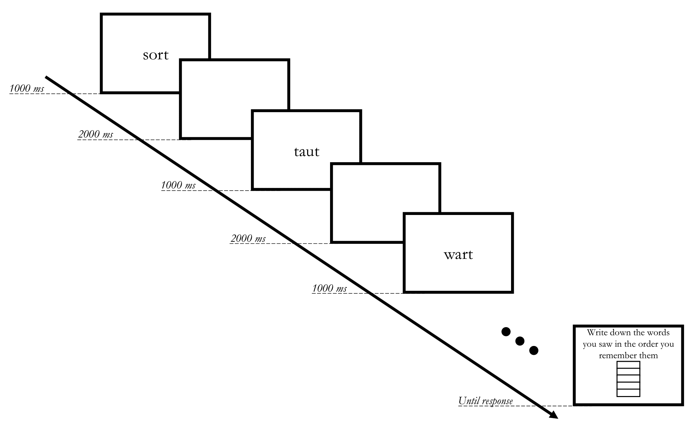
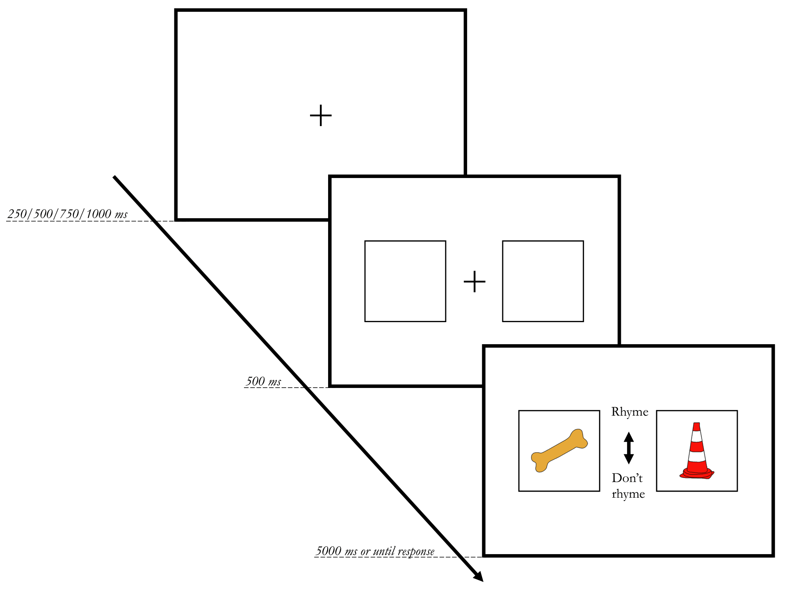
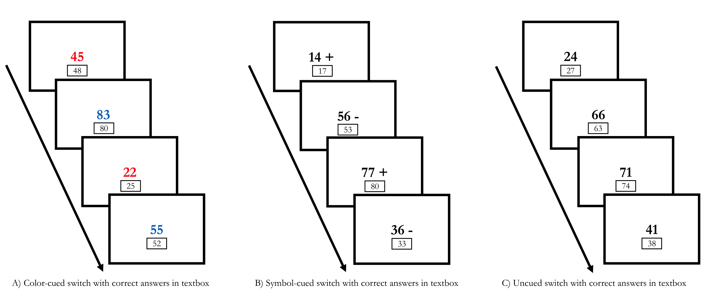
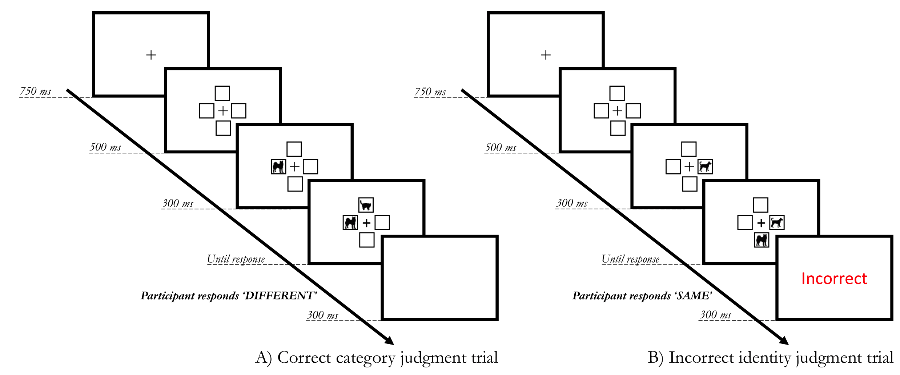

```{r setup, include = FALSE}
library("papaja")
library('tidyverse')
library('tufte')
library('kableExtra')
library(effectsize)
library(ggforce)
library(parameters)
library(ggpubr)
r_refs("r-references.bib")
knitr::opts_chunk$set(fig.pos = "!ht")
options(knitr.table.format = "latex")

report_effect_size <- function(model, index) {
  effects <- parameters::standardize_parameters(model)
  return(paste0(round(effects$Std_Coefficient[index],2), ' [',round(effects$CI_low[index],2), ',',round(effects$CI_high[index],2), ']'))
} 
```

\setcounter{secnumdepth}{5}

**Research Transparency Statement**

Conflicts of interest: Both authors declare no conflicts of interest. Funding: This research was supported by NSF-PAC 2020969 to G.L. Artificial intelligence: No artificial intelligence assisted technologies were used in this research or the creation of this article. Ethics: This research complies with the Declaration of Helsinki (2023), aside from the requirement to preregister human subjects research, and received approval from the Institutional Review Board at the University of Wisconsin-Madison. Open science: The experiment code, materials, data, and analysis scripts can be accessed at https://github.com/johannenedergaard/anendophasia. The studies were not preregistered. 

\newpage

# Introduction

Everyone, it is often said, has an inner voice: ‘Daily, human beings are engaged in a form of inner dialogue, which enables them to [engage in] high-level cognition, including self-control, self-attention and self-regulation.’: [@chella2020cognitive, p. 287]; ‘We all hear a voice inside our brain, commonly called “inner voice”, “inner speech” or referred to as “verbal thoughts”’ (@perrone2014little, p. 22). Most people do report experiencing inner speech [@alderson2015inner; @morin2018self; @heavey2008phenomena] and because we often assume that our experiences mirror those of others, the majority experience comes to be viewed as universal [@lupyan2023hidden].
The assumption that everyone has an inner voice has served as a stepping stone for research into the functions of inner speech – if everyone has it, it must be important. Speculations have ranged from the idea that natural language constitutes (at least some types of) thought [@carruthers2002cognitive;  @gauker2011words; @frankish_isnv; @bermudez2007thinking; @clark_magicwords] or is necessary for self-awareness [@morin_isnv] to investigations of connections between inner speech and specific processes such as cognitive control [e.g., @emerson2003role; @cragg2010language; @alderson2015inner; @morin2018self], behavioral control [e.g., @nedergaard2023mind], and planning and problem-solving [e.g., @morin2018self; @LIDSTONE2010438; @wallace2017interfering]^[We use the terms “inner speech” and “inner voice” interchangeably, but we are not committed to the view that inner speech has all the same auditory and articulatory features as overt speech [@langlandhassan_isnv; @fernyhough2023inner, for a recent overarching review]. Importantly, inner speech displays variation both in terms of its form (e.g., dialogic vs. condensed) and modality (e.g., inner speech as hearing a voice vs. experiencing the imagined articulation of speech) [@alderson2018varieties; @perrone2014little; @grandchamp_condialint_2019; @gregory2016inner]. There is evidence that the different modalities of inner speech involve different neural and cognitive mechanisms [e.g., @nalborczyk2023distinct; @tian2016mental].]. But not everyone experiences inner speech. This is attested by personal narratives such as ‘What it’s like living without an inner voice’ [@soloducha_2020] and ‘People With No Internal Monologue Explain What It’s Like In Their Head’ [@felton_2020], as well as more systematic investigations both targeting variation in inner speech [@alderson2018varieties; @brinthaupt2019individual; @Hurlburt2013] and auditory imagery, which has sometimes been used as a proxy for inner speech [@Hinwar2021; @dawes2020cognitive].

## The Present Study

We recruited participants differing in subjectively reported inner speech and tested them on four behavioral tasks. These tasks were chosen based on prior theoretical claims that suggested performance on them may differ as a function of inner speech. First, just as visual imagery has been predicted (and sometimes found) to be linked to visual memory, we tested whether inner speech predicted memory for verbal material. We focused on memory for sets of words that were either phonologically similar and orthographically different or orthographically similar and phonologically different. Less inner speech was predicted to be associated with poorer overall memory for verbal material, but to the extent that phonological similarity creates memory confusion [@baddeley1966short; @murray1968articulation], less inner speech may be associated with a reduced phonological similarity effect. Second, participants completed a rhyme judgment task: participants saw pairs of images and needed to indicate whether their names rhymed or not. We reasoned that although participants with low inner speech would have no trouble naming the objects, a reduced reliance on inner speech would make it harder to compare the names in memory – necessary for making a rhyme judgment [@geva2011discrepancy; @langland2015inner]. Third, there is substantial evidence that inner speech is often recruited for behavioral control when participants have to switch between different tasks [@emerson2003role; @miyake2004inner; @baddeley2001working; @laurent2016inner]. For example, when asked to switch between adding and subtracting numbers, participants show a selective impairment if they undergo articulatory suppression, but no such impairment is found if the cues are exogenously provided, e.g., a symbol or color cue is used to inform participants whether they should add or subtract [see @nedergaard2022verbal, for a systematic review of verbal interference effects]. We reasoned that people who do not habitually use inner speech might be selectively impaired when they have to rely on self-generated cues to keep track of which task they should be doing. On the other hand, it is possible that they have learned to rely on other strategies in which case no difference would be found. Our fourth task involved examining category effects in perception. There is considerable evidence that language induces more categorical representations from basic perception onward [e.g., @winawer2007russian; @perry2014role; @forder2019hearing]. In a study examining the effects of conceptual categories, @lupyan2010conceptual showed that - controlling for visual differences - people’s ability to tell whether two stimuli were physically the same was affected by the categorical status of those stimuli. For example, it took longer to distinguish two cats than an equally visually similar cat and dog. We wondered whether such category effects, insofar as they may be in part induced by feedback from verbal labels, may be reduced in people with less inner speech. For all four experiments, we were also interested in whether performance differed by whether participants reported talking out loud during the task.

# Open Practices Statement
The experiment code, materials, data, and analysis scripts can be accessed at https://github.com/johannenedergaard/anendophasia. The studies were not preregistered. 

# Methods
## Measurement of inner speech
We measured subjectively experienced inner speech using a previously developed and validated Internal Representations Questionnaire (IRQ) [@roebuck2020internal]. This questionnaire is broadly similar to other surveys of inner-speech [e.g., the General Inner Speech Questionnaire: @racy2020using; the Self-Talk Scale: @brinthaupt2009self; the Varieties of Inner Speech Questionnaire: @mccarthy2011varieties], and its verbal factor is most closely related to dialogic inner-speech as measured by the Varieties of Inner Speech Questionnaire (r~.7). Two advantages of the IRQ are that its inner speech questions are more inclusive than those on the other scales and the same instrument can be used to assess other individual differences such as visual and orthographic imagery. As is true of other scales, the IRQ measures propensities rather than abilities. @geva2019test suggested that inner speech could be objectively measured using behavioral tasks like silent-rhyme judgments, however the authors did not actually show whether differences in inner speech are associated with differences in performance on silent-rhyme judgment tasks - a limitation we address in the current work.

## Participants
```{r, include=FALSE}
library(xtable)
Q_anendophasia_numeric <- read.csv('../data/survey_data/q_anendophasia_numeric.csv', row.names =1)
Q_anendophasia_text <- read.csv('../data/survey_data/q_anendophasia_text.csv', row.names =1)
irq_scores <- read.csv('irq_scores_anonymized.csv', row.names = 1)
phon_sim_trials <- read.csv('../data/processed_data/phon_sim_trials.csv',row.names = 1)

ptcpts_exp <- unique(phon_sim_trials$worker_id)
ptcpts_q <- unique(Q_anendophasia_numeric$worker_id)
length(intersect(ptcpts_exp,ptcpts_q))

ptcpts_exp[which(!ptcpts_exp %in% ptcpts_q)] # Ny0Ml3uz is missing from the questionnaire data? 

# TEST FOR DYSLEXIA
dyslexia_test <- Q_anendophasia_text %>%
  group_by(high_low_verbal,dyslexia)
table(dyslexia_test$high_low_verbal, dyslexia_test$dyslexia)
chisq.test(dyslexia_test$high_low_verbal, dyslexia_test$dyslexia)
# TEST FOR GENDER
gender_test <- Q_anendophasia_text %>%
  group_by(high_low_verbal,gender)
table(gender_test$high_low_verbal, gender_test$gender)
chisq.test(gender_test$high_low_verbal, gender_test$gender) #no difference in gender
# TEST FOR FIRST LANGUAGE
firstlang_test <- Q_anendophasia_text %>%
  group_by(high_low_verbal,first_lang)
table(firstlang_test$high_low_verbal, firstlang_test$first_lang)
chisq.test(firstlang_test$high_low_verbal, firstlang_test$first_lang) #no difference in first language english -
# although 0 in high-verbal group and 4 in low verbal group
# samoan, mandarin, chinese, gujarati & hindi - who are they?
non_native_speakers <- Q_anendophasia_numeric %>%
  filter(first_lang == 0) %>%
  select(worker_id) 
# try to exclude them from later analyses...
# TEST FOR AGE/REPORT AGE
age_test <- Q_anendophasia_text %>%
  group_by(high_low_verbal,age)
summary(subset(age_test, high_low_verbal == 'high_verbal')$age)
summary(subset(age_test, high_low_verbal == 'low_verbal')$age)
t.test(subset(age_test, high_low_verbal == 'high_verbal')$age, subset(age_test, high_low_verbal == 'low_verbal')$age)
# no difference in age
#  TEST FOR EDUCATION LEVEL
edu_test <- Q_anendophasia_numeric %>%
  group_by(high_low_verbal,education_level)
table(subset(edu_test, high_low_verbal == 'high_verbal')$education_level)
table(subset(edu_test, high_low_verbal == 'low_verbal')$education_level)
t.test(subset(edu_test, high_low_verbal == 'high_verbal')$education_level, subset(edu_test, high_low_verbal == 'low_verbal')$education_level)

```
Prior to beginning the study, we had administered the IRQ to university undergraduates and crowdworkers on Amazon Mechanical Turk as part of unrelated studies. From this original pool of 1037 participants, we contacted participants with scores <= 3.5 (bottom 30%-ile) or >= 4.25 (top 20%-ile) on the Verbal factor of the questionnaire which is largely centered on propensity to experience and rely on inner speech. For example, one item with a high loading on the Verbal factor was ‘I think about problems in my mind in the form of a conversation with myself’. One item with a high loading on the Visual factor was ‘I often enjoy the use of mental pictures to reminisce’ (see Supplemental Materials for all verbal factor items). The percentile cut-offs were asymmetric because the distribution in verbal scores on the IRQ is negatively skewed. Recruiting for example the top and bottom quartiles would have resulted in a “low inner speech” group who had moderate amounts of reported inner speech. The final sample included participants from the bottom 20%-ile and the top 29%-ile (see histogram with cutoff values in Supplemental Materials).^[Due to a recruiting error, three participants recruited for the more inner speech group had verbal scores slightly below 4.25 (4.17).] We received ethical approval from the Institutional Review Board at the University of Wisconsin-Madison. Ten participants were excluded for responding randomly, missing at least one experiment, or clearly not complying with task instructions. Our final sample included 47 participants with relatively high verbal factor scores on the IRQ and 46 participants with relatively low verbal factor scores. The two groups were balanced in terms of age, gender, education level, dyslexia, and first language. See Table \@ref(tab:demographics). Due to a technical error, demographic data for one participant in the low inner speech group was missing. We were interested in detecting medium-to-large effects. Our sample size allows us to detect effect sizes of approximately .6 at 80% power or .7 at 91% power (two-tailed t-test of mean difference between two independent groups). Power is lower for the reported interactions and so we urge caution in interpreting them.

```{r demographics, echo=FALSE}
demographics_table <- data.frame(Measure = c('Age', 'Gender', 'Native English-speaker', 'Dyslexia', 'Education level'),
                                 high_verbal= c('Mean = 36.91; Median = 37;\nrange = 18-67', 
                                                        '22 female, 25 male', 
                                                        '47 native speakers,\n0 non-native speakers',
                                                        '46 non-dyslexic,\n1 self-diagnosed',
                                                        "12 high school diploma,\n14 some college - no degree,\n6 associate's degree,\n14 bachelor's degree,\n1 master's degree"
                                                        ),
                                low_verbal= c('Mean = 37.56; Median = 39;\nrange = 18-70', 
                                                        '19 female, 26 male', 
                                                        '41 native speakers,\n4 non-native speakers',
                                                        '44 non-dyslexic,\n1 self-diagnosed',
                                                        "1 less than high school,\n14 high school diploma,\n8 some college - no degree,\n7 associate's degree,\n11 bachelor's degree,\n2 master's degree,\n2 PhD, law, or medical degree"),
                                 diff_test=c('t(88.43) = -0.19; p = .85', 
                                                         paste0('$\\chi^{2}$', '(1) = 0.05; p = .82'),
                                                         paste0('$\\chi^{2}$', '(1) = 2.49; p = .11'),
                                                         paste0('$\\chi^{2}$', '(1) < 0.01; p > .99'),
                                                         't(84.46) = -0.23; p = .82'
                                 ))
demographics_table <- kable(demographics_table, align='l', escape = F, booktabs = TRUE,
  linesep = "", 
  col.names = c('Measure', 'More inner speech', 'Less inner speech', 'Test for difference'),
  caption = 'Comparisons of demographic characteristics of the group with more inner speech and the group with less inner speech.') %>%
  row_spec(row = 0, bold = T) %>%
  kable_styling(full_width = T, latex_options = c("hold_position", 'repeat_header'),font_size = 8)
#save_kable(demographics_table,'demographics_table.tex')
demographics_table
```

## Method: Verbal working memory

### Materials and procedure
We used word sets from @baddeley1966short which were designed to vary in phonological and orthographic similarity, while holding constant other psycholinguistic factors. The phonologically-similar set contained the words "bought", "sort", "taut", "caught", and "wart". The orthographically similar set contained the words  "rough", "cough", "through", "dough", and "bough". The control set contained the words "plea", "friend", "sleigh", "row", and "board". On a given trial, participants saw five written words in random order from one of the sets. The words were presented sequentially, see Figure \@ref(fig:verbwm-procedure). After the last word, participants were asked to type the five words they just saw in the order they saw them. Participants began the task by completing two practice trials with full feedback (correct/incorrect and the stimulus words – drawn from a different set than the ones used in the real experiment – shown in order). Participants then performed 24 trials in total with eight trials from each of the three word sets. The order of both set type and words within a trial were randomized. There was no limit to how long participants could spend on reproducing the words on a given trial.

\newpage

```{r verbwm-procedure, echo=FALSE,    out.width="100%", fig.cap='A schematic of the procedure, showing a trial with phonologically-related words. Each trial had five words.'}

```

## Method: Rhyme judgments

### Materials and procedure
We constructed a set of rhyme pairs with 20 orthographic pairs (e.g., "sock" and "clock")  and 20 non-orthographic pairs (e.g., "drawer" and "door"). See Supplemental Materials for the full set of images, associated words, and name agreement scores. The images were selected from the MultiPic database [@dunabeitia2018multipic] and from @rossion2004revisiting because those image sets contained simple images (objects with no background) that had relatively high name agreement. On each trial, participants saw two images of items presented simultaneously and were asked to judge whether the names of the items rhymed or not. Participants completed 60 rhyme judgments in randomized order (20 orthographic rhymes, 20 non-orthographic rhymes, and 20 no-rhyme control trials). There was a 5000 ms response deadline. See Figure \@ref(fig:rhyme-procedure).

\newpage

```{r rhyme-procedure, echo=FALSE, out.width="100%", fig.cap='A sketch of a rhyme judgment trial. The stimuli here exemplify an orthographic rhyme – "bone" and "cone" – and the correct answer would therefore be "Rhyme".'}

```

## Method: Task switching

### Materials and procedure
On each block, participants were shown 30 randomly selected integers between 13 and 96 and asked to add or subtract 3 from each. All participants completed five blocks beginning with blocked addition or blocked subtraction, followed by (in a counterbalanced order) a block where problems alternated between addition and subtraction with the operation marked by color (red/blue), marked with a symbol (+/-), or not marked. The unmarked block required participants to remember which operation they had just done. In the switching conditions, a response counted as correct if it was the correct arithmetic and if the operation was switched from the previous trial (from addition to subtraction or vice versa). See Figure \@ref(fig:task-switch-procedure).

```{r task-switch-procedure, echo=FALSE, out.width="100%", fig.cap='A sketch of the three switched conditions in the task switching experiment. Figure A shows four color-cued switch trials with correct answers, Figure B shows four symbol-cued switch trials with correct answers, and Figure C shows four un-cued switch trials with correct answers.'}

```

##        Method: Same/different judgments

### Materials and procedure
This experiment used three different black silhouettes of cats and three different black silhouettes of dogs.
Participants completed two blocked conditions: making physical identity judgments (same means physically identical) and making category judgments (same means same category). We are only interested in the physical identity judgments here. Participants completed 200 total trials and received feedback after incorrect responses (‘incorrect’ in red font). See Figure \@ref(fig:same-diff-procedure).

```{r same-diff-procedure, echo=FALSE, out.width="100%",    fig.cap='A sketch of the two conditions of the category judgment experiment. On Figure A, we see a correct category judgment trial where the participant responds that the cat and dog silhouettes represent different animals. On Figure B, we see an incorrect identity judgment trial where the participant responds that the two dogs are identical.'}

```

## Method: Questionnaire
After completing the four experiments, participants answered a series of questions about their experience with inner speech (e.g. 'How often do you have songs stuck in your head?' and 'Do you ever rehearse a conversation before you have it in real life where you simulate what you will say and how the other person will respond?') and completed the Varieties of Inner Speech Questionnaire-Revised (VISQ-R) [@alderson2018varieties]. The VISQ-R measures the extent to which inner speech is experienced as dialogic (e.g., ‘I talk back and forward to myself in my mind about things’) and condensed (e.g. ‘My thinking in words is shortened compared to my normal out-loud speech’) as well as whether the participant experiences the voices of other people. The questionnaire also measures the perceived functions of inner speech through asking about inner speech as an evaluative and regulatory tool (e.g., ‘I think in inner speech about what I have done, and whether it was right or not’). See Supplemental Materials for the full set of custom questions.

## Data analysis
All analyses were conducted in R version 4.1.3 [@R-base]. Participants and items (where appropriate) were modeled as random intercepts; random slopes were included for within-subject factors unless it prevented convergence. All predictors were centered. Reaction times were log-transformed to yield a more normal distribution. Accuracies were modeled using logistic regression. For ease of interpretation, the figures show the two inner speech groups as distinct, but all the statistical models use verbal score (average score on the verbal representation items on the Internal Representations Questionnaire) as a continuous predictor. Error bars on all figures represent within-participant 95% confidence intervals around the mean (adjusted for repeated measures). All four experiments were conducted using custom-written software with the JavaScript package jsPsych version 6 [@de2015jspsych], and data and code can be found at https://github.com/johannenedergaard/anendophasia.

# Results
```{r, include=FALSE}
library(tidyverse)
library(lme4)
library(lmerTest)
library(kableExtra)
library(optimx)
library(ggpubr)
library(forcats)
library(corrplot)
library(cowplot)
library(grid)
library(ggforce)
library(rstatix)
#library(Rmisc)
source("summarySEwithin_imp.R")
color_palette <- c('#88CCEE', '#44AA99', '#117733', '#332288', '#DDCC77', '#999933','#CC6677', '#882255', '#AA4499', '#DDDDDD') # Tol_muted from https://zenodo.org/record/3381072#.Y0_5ilJBw-Q
myCenter= function(x) {
        if (is.numeric(x)) { return(x - mean(x, na.rm=T)) }
        if (is.factor(x)) {
                x= as.numeric(x)
                return(x - mean(x, na.rm=T))
        }
        if (is.data.frame(x) || is.matrix(x)) {
                m= matrix(nrow=nrow(x), ncol=ncol(x))
                colnames(m)= paste("c", colnames(x), sep="")
                for (i in 1:ncol(x)) {
                        m[,i]= myCenter(x[,i])
                }
                return(as.data.frame(m))
        }
}
logit2prob <- function(logit){
  odds <- exp(logit)
  prob <- odds / (1 + odds)
  return(prob)
}

```

## Verbal working memory
```{r,include=FALSE}
# center predictors
phon_sim_trials$original_word_set_c <- ifelse(phon_sim_trials$original_word_set == "ctrlSet", -1,
         ifelse(phon_sim_trials$original_word_set == "orthoSet", 0,
                ifelse(phon_sim_trials$original_word_set == "phonSet", 1, phon_sim_trials$original_word_set)))
phon_sim_trials$VerbalScored_c <- scale(phon_sim_trials$VerbalScored)

```
In the verbal working memory experiment, we tested whether the number of words that participants were able to correctly recall (the dependent variable) was predicted by participants’ verbal score on the IRQ and the type of word set (control set, orthographic similarity set, phonological similarity set). 

### Descriptive statistics by group: Verbal working memory
```{r, include=FALSE}
phonsim_desc_df_score <- phon_sim_trials %>%
  summarySEwithin2(measurevar = 'score', betweenvars = c('high_low_verbal'),
                  withinvars = 'original_word_set', idvar='worker_id', na.rm=T)
phonsim_desc_df_any_pos <- phon_sim_trials %>%
  summarySEwithin2(measurevar = 'score_any_position', betweenvars = c('high_low_verbal'),
                  withinvars = 'original_word_set', idvar='worker_id', na.rm=T)
phonsim_desc_df <- cbind(phonsim_desc_df_score, phonsim_desc_df_any_pos)
colnames(phonsim_desc_df) <- make.names(colnames(phonsim_desc_df), unique = T)
phonsim_desc_df <- phonsim_desc_df %>% select(high_low_verbal, original_word_set,
                                              score, ci, score_any_position, ci.1)
colnames(phonsim_desc_df)[4] <- 'ci_score'
colnames(phonsim_desc_df)[6] <- 'ci_score_any_position'

phonsim_score_df_individual_score <- phon_sim_trials %>%
  summarySEwithin2(measurevar = 'score', betweenvars = c('high_low_verbal','worker_id'),
                  withinvars = 'original_word_set', idvar='worker_id', na.rm=T)
phonsim_score_df_individual_score_any <- phon_sim_trials %>%
  summarySEwithin2(measurevar = 'score_any_position', betweenvars = c('high_low_verbal','worker_id'),
                  withinvars = 'original_word_set', idvar='worker_id', na.rm=T)
phonsim_desc_df_individual <- cbind(phonsim_score_df_individual_score, phonsim_score_df_individual_score_any)
colnames(phonsim_desc_df_individual) <- make.names(colnames(phonsim_desc_df_individual), unique = T)
phonsim_desc_df_individual <- phonsim_desc_df_individual %>% select(high_low_verbal, original_word_set,  score, ci, score_any_position, ci.1, worker_id)
colnames(phonsim_desc_df_individual)[4] <- 'ci_score'
colnames(phonsim_desc_df_individual)[6] <- 'ci_score_any_position'

phonsim_desc_df_individual <- pivot_longer(phonsim_desc_df_individual, cols = c('score', 'score_any_position'), names_to='score_type')
```
Participants with more inner speech recalled more words correctly. This advantage was evident both when we scored only correctly ordered responses as correct as well as when we scored correctly recalled items regardless of their position (see Table \@ref(tab:phonsim-desc-table) and Figure \@ref(fig:phonsim-score-desc)).

```{r phonsim-desc-table, echo=FALSE}
levels(phonsim_desc_df$high_low_verbal) <- c('More inner speech', 'Less inner speech')
levels(phonsim_desc_df$original_word_set) <- c('Control set', 'Orthographic similarity set', 'Phonological similarity set')
phonsim_desc_table <- phonsim_desc_df %>%
  mutate(ci_score = paste0('±', round(ci_score,2)), ci_score_any_position = paste0('±', round(ci_score_any_position,2))) %>%
  kable(digits=2, booktabs = TRUE,
        caption = 'Descriptive statistics by group in the verbal working memory experiment.',
        col.names = c("Group",
                           "Word set",
                           "Score (item and position)",
                           "95% CI (item and position)",
                            "Score (item only)",
                            "95% CI (item only)")) %>%
  row_spec(row = 0, bold = T) %>%
  column_spec(1, width = '12em') %>%
  column_spec(2, width = '12em') %>%
  column_spec(3, width = '5em') %>%
  column_spec(4, width = '5em') %>%
  column_spec(5, width = '5em') %>%
  column_spec(6, width = '5em') %>%
  kable_styling(font_size = 8)
# phonsim_desc_df %>%
#   group_by(original_word_set) %>%
#   summarise(score = mean(score))
phonsim_desc_table
#save_kable(phonsim_desc_table,'phonsim_desc_table.tex')
```

```{r phonsim-score-desc, echo=FALSE, fig.cap='Score on the verbal working memory task by word set.'}
# word and position correct
pd <- position_dodge(width = 0.2)
VWM_score_p <- ggplot(phonsim_desc_df_score, aes(original_word_set, score, color=high_low_verbal)) +
  #geom_sina(data= phonsim_score_df_individual_score, aes(original_word_set, score,group=worker_id), alpha=0.3)+
  geom_line(data= phonsim_score_df_individual_score, aes(original_word_set, score, group=worker_id), alpha=0.2)+
  geom_errorbar(aes(ymin=score-ci, ymax=score+ci), width=.2, position= pd,linewidth=1.5) +  
  stat_summary(fun = mean, geom = 'point', aes(group = high_low_verbal), position= pd, size=1.5) +
  stat_summary(fun = mean, geom = 'line', aes(group = high_low_verbal), linewidth=1.5, position= pd)+
  theme_bw() +
  theme(legend.position= 'none')+
  scale_x_discrete(labels=c('Control set', 'Orthographic\nsimilarity set', 'Phonological\nsimilarity set'))+
  #theme(legend.position = 'none')+
  labs(y ='Accuracy (out of 5)', title = 'Correct word in correct position', x='')+
  scale_color_manual(values = color_palette[c(4,7)])+
  annotate('label',label='More inner speech', x=2.5, y=4.2, color=color_palette[4],fontface=2)+
  annotate('label',label='Less inner speech', x=1.5, y=3.1, color=color_palette[7], fontface=2)

# correct word regardless of position
WRM_score_any_pos_p <- ggplot(phonsim_desc_df_any_pos, aes(original_word_set, score_any_position, color=high_low_verbal)) +
  #geom_sina(data= phonsim_score_df_individual_score_any, aes(original_word_set, score_any_position), alpha=0.3)+
  geom_line(data= phonsim_score_df_individual_score_any, aes(original_word_set, score_any_position, group=worker_id), alpha=0.2)+
  geom_errorbar(aes(ymin=score_any_position-ci, ymax=score_any_position+ci), width=.2, position= pd,linewidth=1.5) +  
  stat_summary(fun = mean, geom = 'point', aes(group = high_low_verbal), position= pd,size=1.5) +
  stat_summary(fun = mean, geom = 'line', aes(group = high_low_verbal), linewidth = 1.5, position= pd)+
  theme_bw() +
  theme(legend.position = 'none')+
  scale_x_discrete(labels=c('Control set', 'Orthographic\nsimilarity set', 'Phonological\nsimilarity set'))+
 # theme(legend.position = 'none')+
  labs(y ='Accuracy (out of 5 in any position)', title = 'Correct word regardless of position',x='')+
  scale_color_manual(values = color_palette[c(4,7)])+
  annotate('label',label='More inner speech', x=2.5, y=4.5, color=color_palette[4],fontface=2)+
  annotate('label',label='Less inner speech', x=1.5, y=3.8, color=color_palette[7], fontface=2)
ggarrange(VWM_score_p, WRM_score_any_pos_p)
```

### Statistical models: Verbal working memory
```{r, include=FALSE, cache=TRUE}
# some models
score_by_verbal_m <- lmer(score ~ original_word_set_c * VerbalScored_c + 
                            (original_word_set_c|worker_id), phon_sim_trials)
summary(score_by_verbal_m)

score_any_by_verbal_m <- lmer(score_any_position ~ original_word_set_c * VerbalScored_c + 
                                (original_word_set_c|worker_id), phon_sim_trials)
summary(score_any_by_verbal_m)

# check whether accuracy changed over time
score_over_time <- lmer(score ~ original_word_set_c * trial_no_ptcp +
                            (original_word_set_c|worker_id), phon_sim_trials)
summary(score_over_time)

```
Participants remembered phonologically similar words significantly worse (M = 3.22) than orthographically-similar words (M = 3.62) ($\beta$ = `r round(summary(score_by_verbal_m)$coefficients[3,1],2)`; SE = `r round(summary(score_by_verbal_m)$coefficients[3,2],2)`; t = `r round(summary(score_by_verbal_m)$coefficients[3,4], 2)`; p < .001; standardized $\beta$ = `r report_effect_size(score_by_verbal_m, 2)`) which were in turn remembered worse than the dissimilar words (M = 3.94) ($\beta$ = `r round(summary(score_by_verbal_m)$coefficients[2,1],2)`; SE = `r round(summary(score_by_verbal_m)$coefficients[2,2],2)`; t = `r round(summary(score_by_verbal_m)$coefficients[2,4], 2)`; p < .001; standardized $\beta$ (effect size) = `r report_effect_size(score_by_verbal_m, 3)`). Collapsing across the three types of word lists, greater inner speech was associated with better performance ($\beta$ = `r round(summary(score_by_verbal_m)$coefficients[4,1],2)`; SE = `r round(summary(score_by_verbal_m)$coefficients[4,2],2)`; t = `r round(summary(score_by_verbal_m)$coefficients[4,4], 2)`; p = .011; standardized $\beta$ (effect size) = `r report_effect_size(score_by_verbal_m, 4)`). This effect remained significant when we ignore the recalled order of the words, counting only whether they recalled the correct words ($\beta$ = `r round(summary(score_any_by_verbal_m)$coefficients[4,1],2)`; SE = `r round(summary(score_any_by_verbal_m)$coefficients[4,2],2)`; t = `r round(summary(score_any_by_verbal_m)$coefficients[4,4], 2)`; p = .012; standardized $\beta$ (effect size) = `r report_effect_size(score_any_by_verbal_m, 4)`). There were no interaction effects (all p > .10), although numerically, the effect of inner speech was smallest for orthographically similar words (see Figure \@ref(fig:phonsim-score-desc)).

### Strategies: Verbal working memory
```{r, include=FALSE}
talk_out_loud_PS <- phon_sim_trials %>%
  group_by(worker_id, talk_out_loud, high_low_verbal) %>%
  tally()
# participant
tol_phon_sim <- talk_out_loud_PS %>%
  group_by(high_low_verbal,talk_out_loud) 
table(tol_phon_sim$high_low_verbal, tol_phon_sim$talk_out_loud)
chisq.test(tol_phon_sim$high_low_verbal, tol_phon_sim$talk_out_loud) #no difference
```

```{r phon-sim-TOL-fig, echo=F,   fig.cap='Verbal working memory performance by whether participants reported talking out loud to help them remember or not.'}
# does it matter what strategy they used?
phonsim_desc_df_score_TOL <- phon_sim_trials %>%
  summarySEwithin2(measurevar = 'score', betweenvars = c('high_low_verbal', 'talk_out_loud'),
                  withinvars = 'original_word_set', idvar='worker_id', na.rm=T)
phonsim_desc_df_any_pos_TOL <- phon_sim_trials %>%
  summarySEwithin2(measurevar = 'score_any_position', betweenvars = c('high_low_verbal', 'talk_out_loud'),
                  withinvars = 'original_word_set', idvar='worker_id', na.rm=T)
phonsim_desc_df_TOL <- cbind(phonsim_desc_df_score_TOL, phonsim_desc_df_any_pos_TOL)
colnames(phonsim_desc_df_TOL) <- make.names(colnames(phonsim_desc_df_TOL), unique = T)
phonsim_desc_df_TOL <- phonsim_desc_df_TOL %>% select(high_low_verbal, original_word_set,
                                              score, ci, score_any_position, ci.1,talk_out_loud)
colnames(phonsim_desc_df_TOL)[4] <- 'ci_score'
colnames(phonsim_desc_df_TOL)[6] <- 'ci_score_any_position'

phonsim_score_df_individual_score <- phon_sim_trials %>%
  summarySEwithin2(measurevar = 'score', betweenvars = c('high_low_verbal','worker_id', 'talk_out_loud'),
                  withinvars = 'original_word_set', idvar='worker_id', na.rm=T)
phonsim_score_df_individual_score_any <- phon_sim_trials %>%
  summarySEwithin2(measurevar = 'score_any_position', betweenvars = c('high_low_verbal','worker_id', 'talk_out_loud'),
                  withinvars = 'original_word_set', idvar='worker_id', na.rm=T)
phonsim_desc_df_individual <- cbind(phonsim_score_df_individual_score, phonsim_score_df_individual_score_any)
colnames(phonsim_desc_df_individual) <- make.names(colnames(phonsim_desc_df_individual), unique = T)
phonsim_desc_df_individual <- phonsim_desc_df_individual %>% select(high_low_verbal, original_word_set,  score, ci, score_any_position, ci.1, worker_id, talk_out_loud)
colnames(phonsim_desc_df_individual)[4] <- 'ci_score'
colnames(phonsim_desc_df_individual)[6] <- 'ci_score_any_position'


# phonsim_score_df_individual_score_new <- phon_sim_trials %>%
#   group_by(worker_id, high_low_verbal,talk_out_loud) %>%
#   summarise(score=mean(score,na.rm=T))
# vwm_tol <- phon_sim_trials %>%
#   group_by(worker_id, talk_out_loud, high_low_verbal) %>%
#   dplyr::summarise(m_score = mean(score, na.rm=T), score_sd=sd(score,na.rm=T)) %>%
#   group_by(talk_out_loud, high_low_verbal) %>%
#   dplyr::summarise(score_m_grouped = mean(m_score), score_sd_group = sd(score_sd)) %>%
#   ggplot(aes(talk_out_loud, score_m_grouped, color=high_low_verbal,shape=high_low_verbal)) +
#   geom_sina(data= phonsim_score_df_individual_score_new, aes(talk_out_loud, score), alpha=0.2,size=3)+
#   geom_errorbar(aes(ymin=score_m_grouped-score_sd_group, ymax=score_m_grouped+score_sd_group), width=.2, position= pd, linewidth=1.5) +
#   stat_summary(fun = mean, geom = 'point', aes(group = high_low_verbal),shape=16,size=3, position= pd) +
#   stat_summary(fun = mean, geom = 'line', aes(group = high_low_verbal), linewidth = 1.5, position= pd)+
#   theme_bw()+
#   theme(legend.position = 'top',text = element_text(size=20))+
#   labs(y ='Accuracy out of 5', x='Did you talk out loud to remember the words?')+
#   scale_color_manual('',values = color_palette[c(4,7)], labels=c('More inner speech', 'Less inner speech'))+
#   scale_shape_manual('',values = c(17,19), labels=c('More inner speech', 'Less inner speech'))+
#   guides(shape = guide_legend(override.aes = list(alpha=1)))
# vwm_tol
# #ggsave('vwm_tol_for_GL.png', vwm_tol, width = 7, height=5)

ggplot(phonsim_desc_df_TOL, aes(talk_out_loud, score, color=high_low_verbal,shape=high_low_verbal)) +
  geom_sina(data= phonsim_score_df_individual_score, aes(talk_out_loud, score), alpha=0.2,size=3)+
  geom_errorbar(aes(ymin=score-ci_score, ymax=score+ci_score), width=.2, position= pd, linewidth=1.5) +  
  stat_summary(fun = mean, geom = 'point', aes(group = high_low_verbal), size=1.5, position= pd) +
  stat_summary(fun = mean, geom = 'line', aes(group = high_low_verbal), linewidth = 1.5, position= pd)+
  theme_bw()+
  theme(legend.position = 'top',legend.text = element_text(size=14), axis.title.x = element_text(size=14))+
  labs(y ='Accuracy out of 5', x='Did you talk out loud to remember the words?')+
  scale_color_manual('',values = color_palette[c(4,7)], labels=c('More inner speech', 'Less inner speech'))+
  scale_shape_manual('',values = c(17,19), labels=c('More inner speech', 'Less inner speech'))+
  guides(shape = guide_legend(override.aes = list(alpha=1)))+
  facet_wrap(~original_word_set, labeller= labeller(original_word_set = c("ctrlSet" = "Control set",
      "orthoSet" = "Orthographic\nsimilarity set",
      "phonSet" = "Phonological\nsimilarity set")))

```
```{r, include=FALSE}
phon_sim_trials$talk_out_loud_c <- ifelse(phon_sim_trials$talk_out_loud == "No", -0.5, 0.5)
score_by_tol_m <- lmer(score ~ talk_out_loud_c * VerbalScored_c + 
                            (1|worker_id) + (1|original_word_set_c), phon_sim_trials)
summary(score_by_tol_m)

# check if difference between talking out loud and not is significant for low IS only
phon_sim_trials %>%
  dplyr::filter(high_low_verbal == 'low_verbal') %>%
  lmer(score ~ talk_out_loud_c + (1|worker_id) + (1|original_word_set_c), data=.) %>%
  summary()

```

The groups with more and less inner speech were similar in their reported use of talking out loud as a strategy for remembering the words: 10 out of 47 in the group with more inner speech; 13 out of 46 in the group with less inner speech ($\chi^2$(1) = `r round(chisq.test(tol_phon_sim$high_low_verbal, tol_phon_sim$talk_out_loud)$statistic, 2)`, p = .59). Nevertheless, talking out loud was associated with performance in different ways between the two groups (see Figure \@ref(fig:phon-sim-TOL-fig)). As the figure indicates, there was an interaction effect between talking out loud and verbal score on recall ($\beta$ = `r round(summary(score_by_tol_m)$coefficients[4,1],2)`; SE = `r round(summary(score_by_tol_m)$coefficients[4,2],2)`; t = `r round(summary(score_by_tol_m)$coefficients[4,4],2)`; p = .031; standardized $\beta$ (effect size) = `r report_effect_size(score_by_tol_m,4)`). Participants with less inner speech who reported using overt language during the task performed similarly to participants with more inner speech, suggesting that what mattered for performance was the use of speech, either covert or overt.

## Rhyme judgments
```{r, include=FALSE}
chance_pairs <- c('bin.png','chin.png', 'cab.png', 'crab.png', 'rake.png', 'cake.png', 'wave.png', 'cave.png', 'park.png', 'shark.png')
rhyme_agreement <- read.csv('rhyming_image_agreement.csv', row.names = 1)
rhyme_agreement <- rhyme_agreement %>% separate(image, c("visual", "image"), "/") %>%
  select(-visual)
rhyme_agreement %>%
  filter(image %in% chance_pairs) %>%
  summarise(agree = mean(name_agreement_target), summary = summary(name_agreement_target))
```

In the rhyme judgment experiment, we tested whether the speed and accuracy with which participants made rhyme judgments (the dependent variables) were predicted by participants’ verbal score on the IRQ and the type of rhyme (orthographic rhyme, non-orthographic rhyme, and no rhyme). We also tested whether participants’ rhyme judgment performance differed by whether they reported talking out loud to remember the words. Five image pairs of rhyming objects – bin/chin, cab/crab, rake/cake, wave/cave, and park/shark – were incorrectly judged to not rhyme on at least half the trials. This was most likely because participants did not name one or both of the images with the intended names (mean agreement rating for these 10 images = 0.58; range = 0.05 to 1). We therefore excluded these trials from further analysis. In addition, we trimmed reaction times below 200 ms (68 trials, 1.4%).

```{r, include =FALSE}
rhyming_trials <- read.csv('../data/processed_data/rhyming_trials.csv',row.names = 1)
# center predictors
rhyming_trials$type_c <- ifelse(rhyming_trials$type == "NR", -1,
         ifelse(rhyming_trials$type  == "ortho", 0,
                ifelse(rhyming_trials$type  == "non-ortho", 1, rhyming_trials$type)))
rhyming_trials$VerbalScored_c <- scale(rhyming_trials$VerbalScored)
rhyming_trials$name_agreement_img1_c <- scale(rhyming_trials$name_agreement_img1)
rhyming_trials <- rhyming_trials %>% mutate(stim_pair = paste(pmax(as.character(image_1),as.character(image_2)),pmin(as.character(image_1), as.character(image_2))))

```
```{r, include=FALSE}
rhyme_desc_df_rt <- rhyming_trials %>%
  summarySEwithin2(measurevar = c('rt'), betweenvars = 'high_low_verbal',
                  withinvars = 'type', idvar='worker_id', na.rm=T)
rhyme_desc_df_correct <- rhyming_trials %>%
  summarySEwithin2(measurevar = 'correct', betweenvars = 'high_low_verbal',
                  withinvars = 'type', idvar='worker_id')
rhyme_desc_df <- cbind(rhyme_desc_df_rt, rhyme_desc_df_correct)
colnames(rhyme_desc_df) <- make.names(colnames(rhyme_desc_df),unique = T)
colnames(rhyme_desc_df)[8] <- 'ci_rt'
colnames(rhyme_desc_df)[16] <- 'ci_accuracy'
rhyme_desc_df <- rhyme_desc_df %>% select(high_low_verbal, type, rt,ci_rt, correct,ci_accuracy) 

rhyme_rt_df <- rhyming_trials %>%
  filter(correct == 1) %>%
  summarySEwithin2(measurevar = 'rt', betweenvars = c('high_low_verbal','talk_out_loud'),
                  withinvars = c('type'),idvar = 'worker_id',na.rm=T)
rhyme_rt_df_individual <- rhyming_trials %>%
  filter(correct == 1) %>%
  summarySEwithin2(measurevar = 'rt', betweenvars = c('high_low_verbal', 'worker_id', 'talk_out_loud'),
                  withinvars = c('type'),idvar = 'worker_id', na.rm = T)
rhyme_correct_df <- rhyming_trials %>%
  summarySEwithin2(measurevar = 'correct', betweenvars = c('high_low_verbal', 'talk_out_loud'), withinvars = c('type'),idvar = 'worker_id')
rhyme_correct_df_individual <- rhyming_trials %>%
  summarySEwithin2(measurevar = 'correct', betweenvars = c('high_low_verbal', 'worker_id', 'talk_out_loud'),  withinvars = c('type'),idvar = 'worker_id')
```
### Descriptive statistics by group: Rhyme judgments
Participants who reported having more inner speech were numerically both faster and more accurate than participants who reported having less inner speech on all three types of trials, see Table \@ref(tab:rhyme-desc-table), and Figure \@ref(fig:rhyme-desc).

```{r rhyme-desc-table, echo=FALSE}
levels(rhyme_desc_df$high_low_verbal) <- c('More inner speech', 'Less inner speech')
levels(rhyme_desc_df$type) <- c('Non-orthographic rhyme', 'No rhyme','Orthographic rhyme')
rhyme_desc_table <- rhyme_desc_df %>%
  dplyr::mutate(correct = correct * 100, ci_accuracy = ci_accuracy*100, rt = round(rt), ci_rt = round(ci_rt)) %>%
  mutate(ci_accuracy = paste0('±', round(ci_accuracy,2)), ci_rt = paste0('±', ci_rt)) %>%
  kable(digits=2, caption = 'Descriptive statistics on rhyming accuracy and reaction time by group and by rhyme type.', booktabs=T,
  col.names = c("Group",
                           "Type of rhyme trial",
                           "Reaction time (ms)",
                           "95% CI (reaction time)",
                            "Accuracy",
                            "95% CI (accuracy)")) %>%
  row_spec(row = 0, bold = T) %>%
  column_spec(1, width = '12em') %>%
  column_spec(2, width = '12em') %>%
  column_spec(3, width = '5em') %>%
  column_spec(4, width = '5em') %>%
  column_spec(5, width = '5em') %>%
  column_spec(6, width = '5em') %>%
  kable_styling(font_size = 8)
rhyme_desc_table
#save_kable(rhyme_desc_table, 'rhyme_desc_table.tex')

```

```{r rhyme-desc, echo=FALSE,   fig.cap='Reaction time and accuracy across groups by rhyme type.'}
rhyme_desc_df_rt$type <- as.factor(rhyme_desc_df_rt$type)
rhyme_desc_df_rt <- rhyme_desc_df_rt %>%
  dplyr::mutate(type = fct_relevel(type, 
            "NR", "ortho", "non-ortho")) 
rhyme_rt_df_individual$type <- as.factor(rhyme_rt_df_individual$type)
rhyme_rt_df_individual <- rhyme_rt_df_individual %>%
  dplyr::mutate(type = fct_relevel(type, 
            "NR", "ortho", "non-ortho")) 
rhyme_desc_df_correct$type <- as.factor(rhyme_desc_df_correct$type)
rhyme_desc_df_correct <-rhyme_desc_df_correct %>%
  dplyr::mutate(type = fct_relevel(type, 
            "NR", "ortho", "non-ortho")) 
rhyme_correct_df_individual$type <- as.factor(rhyme_correct_df_individual$type)
rhyme_correct_df_individual <-rhyme_correct_df_individual %>%
  dplyr::mutate(type = fct_relevel(type, 
            "NR", "ortho", "non-ortho")) 
rhyme_rt_p <- ggplot(rhyme_desc_df_rt, aes(type, rt, color=high_low_verbal)) +
  #geom_sina(data= rhyme_rt_df_individual, aes(type, rt), alpha=0.3)+
  geom_line(data= rhyme_rt_df_individual, aes(type, rt, group=worker_id), alpha=0.2)+
  geom_errorbar(aes(ymin=rt-ci, ymax=rt+ci), width=.2, position= pd,linewidth = 1.5) +  
  stat_summary(fun = mean, geom = 'point', aes(group = high_low_verbal), position= pd,size = 1.5) +
  stat_summary(fun = mean, geom = 'line', aes(group = high_low_verbal), linewidth = 1, position= pd)+
  theme_bw() +
  theme(legend.position = 'none')+
  theme(axis.text.x=element_text(size=rel(0.9)))+
  scale_x_discrete(labels=c('No rhyme','Orthographic\nrhyme','Non-orthographic\nrhyme'))+
  labs(y ='Reaction time (ms)', x='')+
  scale_color_manual('Group: Color',values = color_palette[c(4,7)], labels=c('More inner speech', 'Less inner speech')) +
  annotate('label',label='More inner speech', x=1.5, y=1500, color=color_palette[4],fontface=2)+
  annotate('label',label='Less inner speech', x=2.5, y=2200, color=color_palette[7], fontface=2)

rhyme_acc_p <- ggplot(rhyme_desc_df_correct, aes(type, correct, color=high_low_verbal)) +
  #geom_sina(data= rhyme_correct_df_individual, aes(type, correct), alpha=0.3)+
  geom_line(data= rhyme_correct_df_individual, aes(type, correct, group=worker_id), alpha=0.1)+
  geom_errorbar(aes(ymin=correct-ci, ymax=correct+ci), width=.2, position= pd,linewidth = 1.5) + 
  stat_summary(fun = mean, geom = 'point', aes(group = high_low_verbal),  position= pd,size = 1.5) +
  stat_summary(fun = mean, geom = 'line', aes(group = high_low_verbal), linewidth = 1.5,  position= pd)+
  theme_bw() +
  theme(legend.position = 'none')+
  theme(axis.text.x=element_text(size=rel(0.9)))+
  scale_x_discrete(labels=c('No rhyme','Orthographic\nrhyme','Non-orthographic\nrhyme'))+
  labs(y ='Accuracy', x='')+
  scale_color_manual('Group: Color',values = color_palette[c(4,7)], labels=c('More inner speech', 'Less inner speech'))+
  annotate('label',label='More inner speech', x=2.70, y=1, color=color_palette[4],fontface=2)+
  annotate('label',label='Less inner speech', x=1.9, y=0.75, color=color_palette[7], fontface=2)

ggarrange(rhyme_rt_p, rhyme_acc_p)
```

### Statistical models: Rhyme judgments
```{r, include=FALSE, cache = TRUE}
rhyming_trials %>%
  group_by(type) %>%
  filter(correct == 1) %>%
  summarise(rt = mean(rt, na.rm=T))
rhyming_trials %>%
  group_by(type) %>%
  summarise(correct = mean(correct))
rhyming_trials$type <- as.factor(rhyming_trials$type)
rhyme_rt_m <- lmer(log(rt) ~ relevel(type,ref="ortho") * VerbalScored_c + name_agreement_img1_c + (1|worker_id) + (1|stim_pair),subset(rhyming_trials, correct ==1))
summary(rhyme_rt_m) 

rhyme_acc_m <- glmer(correct ~ relevel(type,ref="ortho") * VerbalScored_c +
                       name_agreement_img1_c + 
                       (1|worker_id) +
                       (1|stim_pair),
                     family='binomial',
                     rhyming_trials,
                     control = glmerControl(optimizer ='bobyqa', optCtrl=list(maxfun=2e5)))
summary(rhyme_acc_m) 
# for interpreting regression coefficient: exp(coef) = multiplied intercept (e.g. 1.10 means 10 % higher than intercept)
```

Participants took longer to make rhyme judgments on no-rhyme trials (M = `r round(rhyming_trials %>% filter(type == 'NR' & correct == 1) %>% summarise(mean = mean(rt, na.rm=T)))`) compared to orthographic trials (M = `r round(rhyming_trials %>% filter(type == 'ortho' & correct == 1) %>% summarise(mean = mean(rt, na.rm=T)))`) ($\beta$ = `r round(summary(rhyme_rt_m)$coefficients[3,1],2)`; SE = `r round(summary(rhyme_rt_m)$coefficients[3,2], 2)`; t = `r round(summary(rhyme_rt_m)$coefficients[3,4],2)`; p = .005; standardized $\beta$ (effect size) = `r report_effect_size(rhyme_rt_m,3)`). Non-orthographic trials (M = `r round(rhyming_trials %>% filter(type == 'non-ortho' & correct == 1) %>% summarise(mean = mean(rt, na.rm=T)))`) did not differ significantly from orthographic trials  ($\beta$ = `r round(summary(rhyme_rt_m)$coefficients[2,1],2)`; SE = `r round(summary(rhyme_rt_m)$coefficients[2,2], 2)`; t = `r round(summary(rhyme_rt_m)$coefficients[2,4],2)`; p = .24; standardized $\beta$ (effect size) = `r report_effect_size(rhyme_rt_m,2)`). Higher name agreement was associated with faster RTs ($\beta$ = `r round(summary(rhyme_rt_m)$coefficients[5,1],2)`; SE = `r round(summary(rhyme_rt_m)$coefficients[5,2], 2)`; t = `r round(summary(rhyme_rt_m)$coefficients[5,4],2)`; p = .031; standardized $\beta$ (effect size) = `r report_effect_size(rhyme_rt_m,5)`). Reported inner speech had no effect on speed of correct rhyme judgments ($\beta$ = `r round(summary(rhyme_rt_m)$coefficients[4,1],2)`; SE = `r round(summary(rhyme_rt_m)$coefficients[4,2], 2)`; t = `r round(summary(rhyme_rt_m)$coefficients[4,4],2)`; p = .42; standardized $\beta$ (effect size) = `r report_effect_size(rhyme_rt_m,4)`). There were no interactions between rhyme type and inner speech (both p’s > .31) or between inner speech and the effect of name agreement on accuracy (p > .51). 

Participants were more accurate when judging no-rhyme trials as not rhyming (M = `r round(rhyming_trials %>% filter(type == 'NR') %>% summarise(mean = mean(correct, na.rm=T))*100, 2)`%) than on orthographic rhyme judgments (M = `r round(rhyming_trials %>% filter(type == 'ortho') %>% summarise(mean = mean(correct, na.rm=T))*100, 2)`%) ($\beta$ = `r round(summary(rhyme_acc_m)$coefficients[3,1],2)`; SE = `r round(summary(rhyme_acc_m)$coefficients[3,2], 2)`; z = `r round(summary(rhyme_acc_m)$coefficients[3,3],2)`; p < .001; standardized $\beta$ (effect size) = `r report_effect_size(rhyme_acc_m,3)`) and were less accurate on non-orthographic rhyme judgments (M = `r round(rhyming_trials %>% filter(type == 'non-ortho') %>% summarise(mean = mean(correct, na.rm=T))*100, 2)`%) than on orthographic rhyme judgments ($\beta$ = `r round(summary(rhyme_acc_m)$coefficients[2,1],2)`; SE = `r round(summary(rhyme_acc_m)$coefficients[2,2], 2)`; z = `r round(summary(rhyme_acc_m)$coefficients[2,3],2)`; p = .039; standardized $\beta$ (effect size) = `r report_effect_size(rhyme_acc_m,2)`). Importantly, a higher verbal score was associated with greater accuracy ($\beta$ = `r round(summary(rhyme_acc_m)$coefficients[4,1],2)`; SE = `r round(summary(rhyme_acc_m)$coefficients[4,2], 2)`; z = `r round(summary(rhyme_acc_m)$coefficients[4,3],2)`; p = .005; standardized $\beta$ (effect size) = `r report_effect_size(rhyme_acc_m,4)`). Name agreement did not affect accuracy (p > .13). There were  no significant interactions between rhyme type and inner speech (both p > .22) or between inner speech and effect of name agreement on accuracy (p = .58).

### Strategies: Rhyme judgments
```{r, include=F}
talk_out_loud_rhyme <- rhyming_trials %>%
  group_by(worker_id, talk_out_loud, high_low_verbal) %>%
  tally()
table(talk_out_loud_rhyme$talk_out_loud)
tol_rhyme <-talk_out_loud_rhyme %>%
  group_by(high_low_verbal,talk_out_loud)
table(tol_rhyme$high_low_verbal, tol_rhyme$talk_out_loud)
chisq.test(tol_rhyme$high_low_verbal, tol_rhyme$talk_out_loud)
```

```{r, include=FALSE, cache=T}
rhyming_trials$talk_out_loud_c <- ifelse(rhyming_trials$talk_out_loud == "No", -0.5, 0.5)
rhyme_by_tol_m <- glmer(correct ~ talk_out_loud_c * VerbalScored_c * relevel(type,ref="NR") + 
                            (1|worker_id), rhyming_trials,family='binomial', control = glmerControl(optimizer ='bobyqa', optCtrl=list(maxfun=2e5)))
summary(rhyme_by_tol_m)
rhyme_rt_by_tol_m <- lmer(log(rt) ~ talk_out_loud_c * VerbalScored_c * relevel(type,ref="NR") + 
                            (1|worker_id), rhyming_trials)
summary(rhyme_rt_by_tol_m) # no interaction effects for rt

# check if difference between talking out loud and not is significant for low IS only
rhyming_trials %>%
  dplyr::filter(high_low_verbal == 'low_verbal' & type != 'no_rhyme') %>%
  glmer(correct ~ talk_out_loud_c +(1|worker_id)+ (1|type), data=., family='binomial') %>%
  summary()
```

Asked about their strategies, similar proportions of participants in both groups reported naming the pictures out loud: 23 out of 47 in the higher inner speech group and 21 out of 46 in the lower inner speech group ($\chi^2$(1) = `r round(chisq.test(tol_rhyme$high_low_verbal, tol_rhyme$talk_out_loud)$statistic, 2)`, p = .91). We observed a similar interaction here as with the memory task (compare Figure \@ref(fig:phon-sim-TOL-fig) and Figure \@ref(fig:rhyme-TOL)). For people who did not report speaking out loud, less habitual inner speech was  associated with lower accuracy; for people who did, it was not (orthographic rhymes: $\beta$ = `r round(summary(rhyme_by_tol_m)$coefficients[12,1],2)`; SE = `r round(summary(rhyme_by_tol_m)$coefficients[12,2],2)`; z = `r round(summary(rhyme_by_tol_m)$coefficients[12,3],2)`; p = .028; standardized $\beta$ (effect size) = `r report_effect_size(rhyme_by_tol_m,12)`; non-orthographic rhymes: $\beta$ = `r round(summary(rhyme_by_tol_m)$coefficients[11,1],2)`; SE = `r round(summary(rhyme_by_tol_m)$coefficients[11,2],2)`; z = `r round(summary(rhyme_by_tol_m)$coefficients[11,3],2)`; p = .025; standardized $\beta$ (effect size) = `r report_effect_size(rhyme_by_tol_m,11)`), suggesting once again that speech use - whether covert or overt - is associated with higher accuracy.

```{r rhyme-TOL, echo=FALSE, fig.cap= 'Reaction time and accuracy by whether participants indicated that they had talked out loud to make the rhyme judgments.'}
# does it matter what strategy they used?
# rhyme_tol_rt_p <- ggplot(rhyme_rt_df, aes(talk_out_loud, rt, color=high_low_verbal, shape=high_low_verbal)) +
#   geom_sina(data= rhyme_rt_df_individual, aes(talk_out_loud, rt), alpha=0.2,size=3)+
#   geom_errorbar(aes(ymin=rt-ci, ymax=rt+ci), width=.2, position= pd,linewidth = 1.5) +  
#   stat_summary(fun = mean, geom = 'point', aes(group = high_low_verbal), position= pd,size = 1.5) +
#   stat_summary(fun = mean, geom = 'line', aes(group = high_low_verbal), linewidth = 1.5, position= pd)+
#   theme_bw() +
#   theme(axis.title.x=element_text(size=rel(0.7)),strip.text = element_text(size=rel(0.5)))+
#   labs(y ='Reaction time (ms)',x='')+
#   scale_color_manual('',values = color_palette[c(4,7)], labels=c('More inner speech', 'Less inner speech'))+
#   scale_shape_manual('',values = c(17,19), labels=c('More inner speech', 'Less inner speech'))+
#   guides(shape = guide_legend(override.aes = list(alpha=1)))+
#   facet_wrap(~type, labeller= labeller(type = c("non-ortho" = "Non-orthographic\nrhyme",
#       "NR" = "No rhyme",
#       "ortho" = "Orthographic\nrhyme")))
# accuracy plot
rhyme_tol_acc_p <- ggplot(transform(rhyme_correct_df,
      type=factor(type,levels=c("NR","ortho","non-ortho"))), aes(talk_out_loud, correct, color=high_low_verbal, shape=high_low_verbal)) +
  geom_sina(data= rhyme_correct_df_individual, aes(talk_out_loud, correct), alpha=0.2,size=3)+
  geom_errorbar(aes(ymin=correct-ci, ymax=correct+ci), width=.2, position= pd,linewidth = 1.5) +  
  stat_summary(fun = mean, geom = 'point', aes(group = high_low_verbal), position= pd,size = 1.5) +
  stat_summary(fun = mean, geom = 'line', aes(group = high_low_verbal), linewidth = 1.5, position= pd)+
  theme_bw() +
  theme(strip.text = element_text(size=rel(0.9)),legend.position = 'top', legend.text = element_text(size=14),
        axis.title.x = element_text(size=14))+
  labs(y ='Accuracy', x='Did you talk out loud to make the rhyme judgments?')+
  scale_color_manual('',values = color_palette[c(4,7)], labels=c('More inner speech', 'Less inner speech'))+
  scale_shape_manual('',values = c(17,19), labels=c('More inner speech', 'Less inner speech'))+
  guides(shape = guide_legend(override.aes = list(alpha=1)))+
  facet_wrap(~type, labeller= labeller(type = c("NR" = "No rhyme",
      "ortho" = "Orthographic\nrhyme",
      "non-ortho" = "Non-orthographic\nrhyme")))
rhyme_tol_acc_p

# rhyming_trials$yes_no_rhyme <- ifelse(rhyming_trials$type != 'NR', 'Rhyme','NoRhyme')
# rhyme_correct_df_individual_new <- rhyming_trials %>%
#    group_by(worker_id, high_low_verbal,talk_out_loud,yes_no_rhyme) %>%
#    summarise(correct=mean(correct,na.rm=T))
# rhyme_tol <- rhyming_trials %>%
#    # group_by(worker_id, talk_out_loud, high_low_verbal,yes_no_rhyme) %>%
#    # dplyr::summarise(m_correct = mean(correct, na.rm=T), correct_sd=sd(correct,na.rm=T)) %>%
#    # group_by(talk_out_loud, high_low_verbal,yes_no_rhyme) %>%
#    # dplyr::summarise(correct_m_grouped = mean(m_correct), correct_sd_group = sd(correct_sd)) %>%
#   summarySEwithin2(measurevar = 'correct', betweenvars = c('high_low_verbal', 'talk_out_loud'), withinvars = c('yes_no_rhyme'),idvar = 'worker_id') %>%
# ggplot(aes(talk_out_loud, correct, color=high_low_verbal, shape=high_low_verbal)) +
#   geom_sina(data= rhyme_correct_df_individual_new, aes(talk_out_loud, correct), alpha=0.2,size=3)+
#   geom_errorbar(aes(ymin=correct-ci, ymax=correct+ci), width=.2, position= pd,linewidth = 1.5) +  
#   stat_summary(fun = mean, geom = 'point', aes(group = high_low_verbal), position= pd,size = 3, shape = 16) +
#   stat_summary(fun = mean, geom = 'line', aes(group = high_low_verbal), linewidth = 1.5, position= pd)+
#   theme_bw() +
#   theme(text = element_text(size=20),legend.position = 'top')+
#   labs(y ='Accuracy', x='Did you talk out loud to make the rhyme judgments?')+
#   scale_color_manual('',values = color_palette[c(4,7)], labels=c('More inner speech', 'Less inner speech'))+
#   scale_shape_manual('',values = c(17,19), labels=c('More inner speech', 'Less inner speech'))+
#   guides(shape = guide_legend(override.aes = list(alpha=1)))+
#   facet_wrap(~yes_no_rhyme, labeller= labeller(type = c("NoRhyme" = "No rhyme",
#       "Rhyme" = "Rhyme")))
# rhyme_tol
#ggsave('rhyme_tol_for_GL.png', rhyme_tol, height=5, width=7.1)
```

## Task switching
In the task switching experiment, we tested whether the speed and accuracy of performing simple arithmetic operations (adding and subtracting) were predicted by participants’ reported inner speech (verbal score on the IRQ) as a function of how they were cued to alternate between two operations: addition and subtraction when cued to the correct operation by a symbol, by a color, or having to rely on their memory of which operation they just did. We excluded trials with RTs over 10 seconds (0.5 % of trials). We also recalculated the accuracy measure so that a failure to switch did not render all subsequent trials incorrect as long as the participant proceeded to switch appropriately and obtain the arithmetically correct answer.

```{r, include=FALSE}
task_switch_trials <- read.csv('../data/processed_data/task_switch_trials.csv',row.names = 1)
# center predictors
task_switch_trials$condition_c <- ifelse(task_switch_trials$condition == "addition", -1,
         ifelse(task_switch_trials$condition == "subtraction", -0.5,
                ifelse(task_switch_trials$condition == "symbolcue", 0,
                       ifelse(task_switch_trials$condition == "colorcue", 0.5,
                            ifelse(task_switch_trials$condition == "uncued", 1, task_switch_trials$condition)))))
task_switch_trials$VerbalScored_c <- scale(task_switch_trials$VerbalScored)
# calculate switch cost (like Emerson & Miyake):
# 1. average speed on addition and subtraction
# 2. average speed on three switching conditions
# 3. subtract switching speed from simple operation speed
task_switch_trials$VerbalScored_c <- as.numeric(task_switch_trials$VerbalScored_c)
simple_operation <- task_switch_trials %>%
  filter(condition %in% c('addition', 'subtraction')) %>%
  group_by(worker_id, high_low_verbal, VerbalScored, VerbalScored_c) %>%
  summarise(mean_rt_simple = mean(rt), mean_accuracy_simple = mean(switching_is_correct))
switching <- task_switch_trials %>%
  filter(!condition %in% c('addition', 'subtraction')) %>%
  group_by(worker_id,condition,high_low_verbal, VerbalScored, VerbalScored_c) %>%
  summarise(mean_rt_complex = mean(rt), mean_accuracy_complex = mean(switching_is_correct))
switch_costs <- merge(switching, simple_operation, by = c('worker_id', 'VerbalScored', 'high_low_verbal', 'VerbalScored_c'), all.x = T)
switch_costs$switch_cost_rt <- switch_costs$mean_rt_complex - switch_costs$mean_rt_simple
switch_costs$switch_cost_acc <- switch_costs$mean_accuracy_simple - switch_costs$mean_accuracy_complex

```
### Descriptive statistics: Task switching
```{r, include=FALSE}
task_switch_desc_df_rt <- task_switch_trials %>%
  filter(switching_is_correct==1) %>%
  summarySEwithin2(measurevar = 'rt', betweenvars = 'high_low_verbal',
                  withinvars = 'condition', idvar='worker_id', na.rm=T)
task_switch_desc_df_acc <- task_switch_trials %>%
  summarySEwithin2(measurevar = 'switching_is_correct', betweenvars = 'high_low_verbal', withinvars = 'condition', idvar='worker_id', na.rm=T)
task_switch_desc_df <- cbind(task_switch_desc_df_rt,task_switch_desc_df_acc)
colnames(task_switch_desc_df) <- make.names(colnames(task_switch_desc_df),unique = T)
colnames(task_switch_desc_df)[8] <- 'ci_rt'
colnames(task_switch_desc_df)[16] <- 'ci_accuracy'
task_switch_desc_df <- task_switch_desc_df %>% select(high_low_verbal, condition, rt,ci_rt, switching_is_correct,ci_accuracy) 

task_switch_rt_df <- task_switch_trials %>%
  filter(switching_is_correct == 1) %>%
  summarySEwithin2(measurevar = 'rt', betweenvars = c('high_low_verbal', 'talk_out_loud'),
                  withinvars = 'condition',idvar = 'worker_id',na.rm=T)
task_switch_rt_df_individual <- task_switch_trials %>%
  filter(switching_is_correct == 1) %>%
  summarySEwithin2(measurevar = 'rt', betweenvars = c('high_low_verbal', 'worker_id', 'talk_out_loud'),
                  withinvars = 'condition',idvar = 'worker_id', na.rm = T)
task_switch_correct_df <- task_switch_trials %>%
  summarySEwithin2(measurevar = 'switching_is_correct', betweenvars = c('high_low_verbal', 'talk_out_loud'), withinvars = 'condition',idvar = 'worker_id')
task_switch_correct_df_individual <- task_switch_trials %>%
  summarySEwithin2(measurevar = 'switching_is_correct', betweenvars = c('high_low_verbal', 'worker_id', 'talk_out_loud'),  withinvars = 'condition',idvar = 'worker_id')
```
As can be seen from Table \@ref(tab:task-switch-desc-table) and Figure \@ref(fig:task-switch-desc-fig), accuracy was high in all conditions, and reaction times were comparable across the two groups of participants.
```{r task-switch-desc-table, echo=FALSE}
task_switch_desc_df <- task_switch_desc_df %>%
  dplyr::mutate(condition = fct_relevel(condition, 
            "addition", "subtraction", "symbolcue", 
            "colorcue", "uncued")) 
levels(task_switch_desc_df$high_low_verbal)<- c('More inner speech','Less inner speech')
levels(task_switch_desc_df$condition) <- c('Blocked\naddition', 'Blocked\nsubtraction', 'Symbol-cued\nswitch', 'Color-cued\nswitch', 'Un-cued\nswitch')
task_switch_desc_table <- task_switch_desc_df %>%
  dplyr::mutate(switching_is_correct = switching_is_correct*100, ci_accuracy=ci_accuracy*100, rt = round(rt), ci_rt = round(ci_rt)) %>%
  mutate(ci_accuracy = paste0('±', round(ci_accuracy,2)), ci_rt = paste0('±', ci_rt)) %>%
  kable(digits=2, caption = 'Descriptive statistics of reaction time and accuracy on the task switching experiment.',booktabs=T,
        col.names = c("Group",
                           "Condition",
                           "Mean reaction time (ms)",
                           "95% CI (reaction time)",
                            "Accuracy",
                            "95% CI (accuracy)")) %>%
  row_spec(row = 0, bold = T) %>%
  column_spec(1, width = '12em') %>%
  column_spec(2, width = '12em') %>%
  column_spec(3, width = '5em') %>%
  column_spec(4, width = '5em') %>%
  column_spec(5, width = '5em') %>%
  column_spec(6, width = '5em') %>%
  kable_styling(latex_options = c("hold_position"),font_size = 8)
task_switch_desc_table
#save_kable(task_switch_desc_table, 'task_switch_desc_table.tex')
```

```{r task-switch-desc-fig, echo=FALSE, fig.cap='Reaction time and accuracy across conditions in the task switching experiment.'}
# reaction time
task_switch_rt_df$condition <- as.factor(task_switch_rt_df$condition)
task_switch_desc_df_rt <- task_switch_desc_df_rt %>%
  dplyr::mutate(condition = fct_relevel(condition, 
            "addition", "subtraction", "symbolcue", 
            "colorcue", "uncued")) 
task_switch_rt_df_individual <- task_switch_rt_df_individual %>%
  dplyr::mutate(condition = fct_relevel(condition, 
            "addition", "subtraction", "symbolcue", 
            "colorcue", "uncued")) 
task_switch_rt_desc_p <- task_switch_desc_df_rt %>% 
  ggplot(aes(condition, rt, color=high_low_verbal)) +
  #geom_sina(data= task_switch_rt_df_individual, aes(condition, rt), alpha=0.3)+
  geom_line(data= task_switch_rt_df_individual, aes(condition, rt, group=worker_id), alpha=0.2)+
  geom_errorbar(aes(ymin=rt-ci, ymax=rt+ci), width=.2, position= pd, linewidth=1.5) +  
  stat_summary(fun = mean, geom = 'point', aes(group = high_low_verbal), position= pd,size=1.5) +
  stat_summary(fun = mean, geom = 'line', aes(group = high_low_verbal), linewidth = 1.5, position= pd)+
  theme_bw() +
  theme(axis.text.x = element_text(size=rel(0.7)), legend.position = 'none')+
  labs(y ='Reaction time (ms) per problem', title = '',x='')+
  scale_x_discrete(labels =c('Blocked\naddition', 'Blocked\nsubtraction', 'Symbol-cued\nswitch', 'Color-cued\nswitch', 'Un-cued\nswitch'))+
  scale_color_manual(values = color_palette[c(4,7)])+
  annotate('label',label='More inner speech', x=3, y=2000, color=color_palette[4],fontface=2)+
  annotate('label',label='Less inner speech', x=2, y=3000, color=color_palette[7], fontface=2)

# accuracy 
task_switch_desc_df_acc$condition <- as.factor(task_switch_desc_df_acc$condition)
task_switch_desc_df_acc <- task_switch_desc_df_acc %>%
  dplyr::mutate(condition = fct_relevel(condition, 
            "addition", "subtraction", "symbolcue", 
            "colorcue", "uncued")) 
task_switch_correct_df_individual <- task_switch_correct_df_individual %>%
  dplyr::mutate(condition = fct_relevel(condition, 
            "addition", "subtraction", "symbolcue", 
            "colorcue", "uncued")) 
task_switch_acc_desc_p <- task_switch_desc_df_acc %>% 
  ggplot(aes(condition, switching_is_correct, color=high_low_verbal)) +
  #geom_sina(data= task_switch_correct_df_individual, aes(condition, switching_is_correct), alpha=0.3)+
  geom_line(data= task_switch_correct_df_individual, aes(condition, switching_is_correct, group=worker_id), alpha=0.1)+
  geom_errorbar(aes(ymin=switching_is_correct-ci, ymax=switching_is_correct+ci), width=.2, position= pd,linewidth=1.5) +  
  stat_summary(fun = mean, geom = 'point', aes(group = high_low_verbal), position= pd,size=1.5) +
  stat_summary(fun = mean, geom = 'line', aes(group = high_low_verbal), linewidth = 1.5, position= pd)+
  theme_bw() +
  theme(axis.text.x = element_text(size=rel(0.7)), legend.position = 'none')+
  labs(y ='Accuracy (corrected)', title = '',x='')+
  scale_x_discrete(labels =c('Blocked\naddition', 'Blocked\nsubtraction', 'Symbol-cued\nswitch', 'Color-cued\nswitch', 'Un-cued\nswitch'))+
  scale_color_manual(values = color_palette[c(4,7)])+
  annotate('label',label='More inner speech', x=4.1, y=1.01, color=color_palette[4],fontface=2)+
  annotate('label',label='Less inner speech', x=2, y=0.93, color=color_palette[7], fontface=2)

ggarrange(task_switch_rt_desc_p, task_switch_acc_desc_p)

```

### Statistical models: Task switching
```{r, include=FALSE, cache=T}
task_switch_trials %>%
  group_by(condition) %>%
  summarise(correct = mean(switching_is_correct))
task_switch_trials %>%
  group_by(condition) %>%
  filter(switching_is_correct == 1) %>%
  summarise(rt = mean(rt, na.rm=T))
task_switch_trials$condition_c <- as.factor(task_switch_trials$condition_c)
switching_condition_acc_m <- glmer(switching_is_correct ~ relevel(condition_c,ref="-1")*VerbalScored_c + 
                                       (1|worker_id) + (1|stimulus), 
                                   control = glmerControl(optimizer ='bobyqa', optCtrl=list(maxfun=2e5)),
                                     task_switch_trials, family='binomial')
summary(switching_condition_acc_m) 

switching_rt_m <- lmer(log(rt) ~  relevel(condition_c,ref="-1")*VerbalScored_c + (condition_c|worker_id), 
                              subset(task_switch_trials, switching_is_correct==1))
summary(switching_rt_m) 

# switch cost models
switch_costs$condition_c <- ifelse(switch_costs$condition == 'uncued', -1,
                                   ifelse(switch_costs$condition == 'colorcue', 0,
                                          ifelse(switch_costs$condition == 'symbolcue', 1, switch_costs$condition)))
switch_costs$condition_c <- as.factor(switch_costs$condition_c)
switch_cost_acc_m <- lmer(switch_cost_acc ~ relevel(condition_c,ref="-1") * VerbalScored_c + (1|worker_id), switch_costs)
switch_cost_rt_m <- lmer(switch_cost_rt ~ relevel(condition_c,ref="-1") * VerbalScored_c + (1|worker_id), switch_costs)
summary(switch_cost_rt_m)
summary(switch_cost_acc_m)
```
Participants responded less accurately in the symbol-cued switch condition (M = 97.2%), in the color-cued switch condition (M = 95.4%), and in the un-cued switch condition (M = 93.9%) compared to the blocked addition condition (M = 98.1%) (addition versus symbol-cue: $\beta$ = `r round(summary(switching_condition_acc_m)$coefficients[3,1],2)`; SE = `r round(summary(switching_condition_acc_m)$coefficients[3,2],2)`; z = `r round(summary(switching_condition_acc_m)$coefficients[3,3],2)`; p = .020; standardized $\beta$ (effect size) = `r report_effect_size(switching_condition_acc_m,3)`; addition versus color-cue: $\beta$ = `r round(summary(switching_condition_acc_m)$coefficients[4,1],2)`; SE = `r round(summary(switching_condition_acc_m)$coefficients[4,2],2)`; z = `r round(summary(switching_condition_acc_m)$coefficients[4,3],2)`; p < .001; standardized $\beta$ (effect size) = `r report_effect_size(switching_condition_acc_m,4)`; addition versus un-cued: $\beta$ = `r round(summary(switching_condition_acc_m)$coefficients[5,1],2)`; SE = `r round(summary(switching_condition_acc_m)$coefficients[5,2],2)`; z = `r round(summary(switching_condition_acc_m)$coefficients[5,3],2)`; p < .001; standardized $\beta$ (effect size) = `r report_effect_size(switching_condition_acc_m,5)`). Accuracy did not differ between blocked subtraction (M = 97.7%) and blocked addition (p = .24). More inner speech was not associated with different accuracy (p = .55) and there were no interaction effects between inner speech and block-type (all p’s > .07). Numerically, verbal score interacted with the un-cued condition and cancelled out the very slight (non-significant) reaction time advantage of a higher verbal score.

Participants responded faster in the blocked addition condition (M = 2300 ms) compared to the subtraction condition (M = 2550 ms) ($\beta$ = `r round(summary(switching_rt_m)$coefficients[2,1],2)`; SE = `r round(summary(switching_rt_m)$coefficients[2,2],2)`; t = `r round(summary(switching_rt_m)$coefficients[2,4],2)`; p < .001; standardized $\beta$ (effect size) = `r report_effect_size(switching_rt_m,2)`), the symbol-cued switch condition (M = 2601 ms) ($\beta$ = `r round(summary(switching_rt_m)$coefficients[3,1],2)`; SE = `r round(summary(switching_rt_m)$coefficients[3,2],2)`; t = `r round(summary(switching_rt_m)$coefficients[3,4],2)`; p < .001; standardized $\beta$ (effect size) = `r report_effect_size(switching_rt_m,3)`), the color-cued switch condition (M = 2778 ms) ($\beta$ = `r round(summary(switching_rt_m)$coefficients[4,1],2)`; SE = `r round(summary(switching_rt_m)$coefficients[4,2],2)`; t = `r round(summary(switching_rt_m)$coefficients[4,4],2)`; p < .001; standardized $\beta$ (effect size) = `r report_effect_size(switching_rt_m,4)`), and the un-cued switch condition  (M = 2694 ms)  ($\beta$ = `r round(summary(switching_rt_m)$coefficients[5,1],2)`; SE = `r round(summary(switching_rt_m)$coefficients[5,2],2)`; t = `r round(summary(switching_rt_m)$coefficients[5,4],2)`; p < .001; standardized $\beta$ (effect size) = `r report_effect_size(switching_rt_m,5)`). More reported inner speech did not predict reaction times (p = .81), and there were no interaction effects (all p’s > .51).

### Strategies: Task switching
```{r, include=FALSE}
talk_out_loud_TS <- task_switch_trials %>%
  group_by(worker_id, talk_out_loud, high_low_verbal) %>%
  tally()
tol_task_switch <- talk_out_loud_TS %>%
  group_by(high_low_verbal,talk_out_loud)
table(tol_task_switch$high_low_verbal, tol_task_switch$talk_out_loud)
chisq.test(tol_task_switch$high_low_verbal, tol_task_switch$talk_out_loud)
```

There was no significant difference between how many participants with more inner speech (20 out of 47) and how many participants with less inner speech (13 out of 46) reported that they had talked to themselves out loud during the task switching experiment ($\chi^2$(1) = `r round(chisq.test(tol_task_switch$high_low_verbal, tol_task_switch$talk_out_loud)$statistic, 2)`, p = .32). There were no obvious differences between the effects that talking out loud had on these two groups (see accuracy and reaction time Figure \@ref(fig:task-switch-TOL)).

```{r task-switch-TOL,   echo=FALSE, fig.cap='Reaction time (ms) and accuracy in the task switching experiment by whether participants reported talking out loud to remember the correct rule or not.'}
task_switch_tol_acc <- task_switch_correct_df %>%
ggplot(aes(condition, switching_is_correct, color=high_low_verbal)) +
  #geom_sina(data= task_switch_correct_df_individual, aes(condition, switching_is_correct), alpha=0.3)+
  geom_line(data= task_switch_correct_df_individual, aes(condition, switching_is_correct, group=worker_id), alpha=0.1)+
  geom_errorbar(aes(ymin=switching_is_correct-ci, ymax=switching_is_correct+ci), width=.2, position= pd,linewidth=1.5) +  
  stat_summary(fun = mean, geom = 'point', aes(group = high_low_verbal), position= pd,size=1.5) +
  stat_summary(fun = mean, geom = 'line', aes(group = high_low_verbal), linewidth = 1.5, position= pd)+
  theme_bw() +
  labs(y ='Accuracy (corrected)', title = '',x='')+
  facet_wrap(~talk_out_loud, labeller = labeller(talk_out_loud = c('No' = 'Reported not talking out loud', 'Yes'='Reported talking out loud'))) +
  scale_x_discrete('',labels =c('Blocked\naddition', 'Blocked\nsubtraction', 'Symbol-cued\nswitch', 'Color-cued\nswitch', 'Un-cued\nswitch'))+
  scale_color_manual('',values = color_palette[c(4,7)], labels=c('More inner speech', 'Less inner speech'))+
  theme(axis.text.x = element_text(angle = 90, size=rel(0.8),hjust=1), legend.position = 'top',strip.text = element_text(size=rel(0.6)),legend.text = element_text(size=14)) 

task_switch_tol_rt <- task_switch_rt_df %>%
ggplot(aes(condition, rt, color=high_low_verbal)) +
  #geom_sina(data= task_switch_rt_df_individual, aes(condition, rt), alpha=0.3)+
  geom_line(data= task_switch_rt_df_individual, aes(condition, rt, group=worker_id), alpha=0.1)+
  geom_errorbar(aes(ymin=rt-ci, ymax=rt+ci), width=.2, position= pd,linewidth=1.5) +  
  stat_summary(fun = mean, geom = 'point', aes(group = high_low_verbal), position= pd,size=1.5) +
  stat_summary(fun = mean, geom = 'line', aes(group = high_low_verbal), linewidth = 1.5, position= pd)+
  theme_bw() +
  labs(y ='Reaction time (ms) per problem', title = '', x='')+
  scale_color_manual('',values = color_palette[c(4,7)],labels=c('More inner speech', 'Less inner speech'))+
  facet_wrap(~talk_out_loud, labeller = labeller(talk_out_loud = c('No' = 'Reported not talking out loud', 'Yes'='Reported talking out loud'))) +
  scale_x_discrete(labels =c('Blocked\naddition', 'Blocked\nsubtraction', 'Symbol-cued\nswitch', 'Color-cued\nswitch', 'Un-cued\nswitch'))+
  theme(axis.text.x = element_text(angle = 90, size=rel(0.8),hjust=1), legend.position = 'top', strip.text = element_text(size=rel(0.6)), legend.text = element_text(size=14))

ggarrange(task_switch_tol_rt, task_switch_tol_acc,common.legend = T)
```

## Same/different judgments
```{r, include=FALSE}
same_different_trials <- read.csv('../data/processed_data/same_different_trials.csv',row.names = 1)
same_different_trials$judgment_type_c <- ifelse(same_different_trials$judgment_type == 'categorical_image', -1,
                                                ifelse(same_different_trials$judgment_type == 'identical_image', 1,
                                                       same_different_trials$judgment_type))
same_different_trials$same_category_animal_c <- ifelse(same_different_trials$same_category_animal == 'within_category', -1,                                                 
                                                       ifelse(same_different_trials$same_category_animal == 'between_category', 1, 
                                                              same_different_trials$same_category_animal))
same_different_trials$VerbalScored_c <- scale(same_different_trials$VerbalScored)
same_different_trials$cat_or_dog_c <- ifelse(same_different_trials$cat_or_dog == 'cat-cat', -1,
                                                ifelse(same_different_trials$cat_or_dog == 'dog-dog', 0,
                                                       ifelse(same_different_trials$cat_or_dog == 'cat-dog',1,
                                                              same_different_trials$cat_or_dog)))
```

```{r, include=FALSE}
# how many correct
SD_correct <- same_different_trials %>%
  dplyr::summarise(correct = sum(correct)/n())
SD_correct
# how many correct by group
SD_correct_groups <- same_different_trials %>%
  summarySEwithin2(measurevar = 'correct', betweenvars = 'high_low_verbal',idvar = 'worker_id')
SD_correct_groups
```
In the same/different judgment experiment, we tested whether the speed with which participants made correct same/different judgments was predicted by participants’ verbal score on the IRQ and the type of judgment (same category of animal or same image). We excluded trials with RTs above 5 seconds (0.7 %) and below 200 ms (0.07 %). Overall accuracy was high, `r round(SD_correct[1]*100, 2)`, and did not differ between the two inner speech groups (`r round(SD_correct_groups$correct[1]*100,2)` %) and the group with less inner speech (`r round(SD_correct_groups$correct[2]*100,2)` %). In subsequent RT analyses, we only include correct trials. 

### Statistical models: Same/different judgments

```{r, include=F}
SD_rt_df_key_comparison <- same_different_trials %>%
  filter(judgment_type == 'identical_image' & correct ==1 & answer =='different') %>%
  summarySEwithin2(measurevar = 'rt', betweenvars = c('high_low_verbal'),
                  withinvars = c('judgment_type', 'same_category_animal'),idvar = 'worker_id')

SD_rt_df_key_comparison_individual <- same_different_trials %>%
  filter(judgment_type == 'identical_image' & correct ==1 & answer =='different') %>%
  summarySEwithin2(measurevar = 'rt', betweenvars = c('high_low_verbal', 'worker_id'),
                  withinvars = c('judgment_type', 'same_category_animal'),idvar = 'worker_id')
```

```{r samediff-key-comp, echo=FALSE, fig.cap = "Reaction time on identity trials where the correct response was 'DIFFERENT' either because the two silhouettes were from different categories or different images from the same category."}
ggplot(SD_rt_df_key_comparison, aes(same_category_animal, rt, color=high_low_verbal)) +
  #geom_sina(data= SD_rt_df_key_comparison_individual, aes(same_category_animal, rt), alpha=0.3)+
  geom_line(data= SD_rt_df_key_comparison_individual, aes(same_category_animal, rt,group=worker_id), alpha=0.2)+
  geom_errorbar(aes(ymin=rt-ci, ymax=rt+ci), width=.2, position= pd,linewidth=1.5) +
  stat_summary(fun = mean, geom = 'point', aes(group = high_low_verbal), position= pd,size=1.5) +
  stat_summary(fun = mean, geom = 'line', aes(group = high_low_verbal), linewidth = 1.5, position= pd)+
  theme_bw() +
  theme(legend.position = 'none',axis.text.x = element_text(size=14))+
  labs(y ='Reaction time (ms)', title = '', x = '') +
  scale_x_discrete(labels=c('Between-category','Within-category'))+
  scale_color_manual(values = color_palette[c(4,7)])+
  annotate('label',label='More inner speech', x=1.5, y=750, color=color_palette[4],fontface=2)+
  annotate('label',label='Less inner speech', x=1.5, y=1000, color=color_palette[7], fontface=2)
```

```{r, include=FALSE, cache = TRUE}
same_different_trials %>%
  group_by(same_category_animal) %>%
  filter(judgment_type == 'identical_image' & correct == 1 & answer == 'different') %>%
  summarise(rt = mean(rt))
latency_to_different <- lmer(log(rt) ~ VerbalScored_c * same_category_animal_c + (same_category_animal_c|worker_id),
                            subset(same_different_trials, judgment_type == 'identical_image' & correct ==1 & answer =='different'))
summary(latency_to_different)
```

The key test for this experiment was whether the two groups behaved differently when giving correct 'DIFFERENT' responses on identity trials when the two images belonged to the same category. That is, we expected participants with more inner speech to be slower to make correct 'DIFFERENT' responses when both stimuli where from the same category but physically different (i.e., $dog_1$ versus $dog_2$). Within-category trials were generally associated with significantly slower reaction times (M = 923 ms) than between-category trials (M = 843 ms) ($\beta$ = `r round(summary(latency_to_different)$coefficients[3,1],2)`; SE = `r round(summary(latency_to_different)$coefficients[3,2],2)`; t = `r round(summary(latency_to_different)$coefficients[3,4],2)`; p < .001; standardized $\beta$ (effect size) = `r report_effect_size(latency_to_different,3)`)). See Figure \@ref(fig:samediff-key-comp). However, there was no interaction between level of inner speech and category-type: (interaction effect: $\beta$ = `r round(summary(latency_to_different)$coefficients[4,1],3)`; SE = `r round(summary(latency_to_different)$coefficients[4,2],2)`; t = `r round(summary(latency_to_different)$coefficients[4,4],2)`; p = .95; standardized $\beta$ (effect size) = `r report_effect_size(latency_to_different,4)`). 

### Strategies: Same/different judgments

```{r, include=FALSE}
talk_out_loud_SD <- same_different_trials %>%
  group_by(worker_id, talk_out_loud, high_low_verbal) %>%
  tally()
tol_same_different <- talk_out_loud_SD %>%
  group_by(high_low_verbal,talk_out_loud)
table(tol_same_different$high_low_verbal, tol_same_different$talk_out_loud)
chisq.test(tol_same_different$high_low_verbal, tol_same_different$talk_out_loud)
```
There was no significant difference between how many participants with more inner speech (9 out of 47) and how many participants with less inner speech (4 out of 46) reported that they had talked to themselves out loud during the task ($\chi^2$(1) = `r round(chisq.test(tol_same_different$high_low_verbal, tol_same_different$talk_out_loud)$statistic, 2)`, p = .25). There were no differences between the effects that talking out loud had on these two groups.

## Intertask correlations

In addition to finding (or not finding) differences in task performance as a function of inner speech, it is often informative to see whether correlations between tasks and conditions show a different pattern in people with more vs. less inner speech [@keogh2021visual]. See Figure \@ref(fig:total-cor-contrast) for a visualization of how performance on the tasks correlated within the participant groups with more or less inner speech.The dark-blue clusters near the diagonal show that for both groups performance _within_ tasks (e.g., RTs on the different types of task-switch trials) was strongly correlated, and similarly so for both groups. When it comes to relationships _between_ tasks, however, we found several intriguing differences: Participants with less inner speech showed a positive correlation between verbal recall accuracy and non-orthographic rhyme accuracy (r=.48). This group also showed moderate correlations (r's between .3 and .5) between uncued task-switch accuracy and various measures of verbal recall accuracy. In contrast, participants with more inner speech showed weaker relationships between these measures (r's between .16 and .30). 

```{r, include=FALSE, message=FALSE}
phonsim_score <- phon_sim_trials %>%
  group_by(worker_id, original_word_set) %>%
  dplyr::summarise(phonsim_score = mean(score, na.rm=T), phon_sim_any_pos = mean(score_any_position, na.rm=T))
phonsim_score <- pivot_wider(phonsim_score, names_from = original_word_set, values_from = c(phonsim_score, phon_sim_any_pos))
rhyme_score <- rhyming_trials %>%
  group_by(worker_id, type) %>%
  dplyr::summarise(rhyming_acc = mean(correct, na.rm=T))
rhyming_rt <- rhyming_trials %>%
  filter(correct ==1) %>%
  group_by(worker_id, type) %>%
  dplyr::summarise(rhyming_rt = mean(rt, na.rm=T))
rhyme_score <- merge(rhyme_score, rhyming_rt, by = c('worker_id', 'type'))
rhyme_score <- pivot_wider(rhyme_score, names_from = type, values_from = c(rhyming_acc, rhyming_rt))
# only take rt on correct trials
same_different_score <- same_different_trials %>%
  filter(correct ==1) %>%
  group_by(worker_id, judgment_type, answer) %>%
  dplyr::summarise(samediff_rt = mean(rt, na.rm=T))
same_different_score <- pivot_wider(same_different_score, names_from = c(judgment_type, answer), values_from = samediff_rt)
task_switching_score <- task_switch_trials %>%
  group_by(worker_id,condition) %>%
  dplyr::summarise(task_switch_acc=mean(switching_is_correct, na.rm=T))
task_switching_rt <- task_switch_trials %>%
  filter(switching_is_correct ==1) %>%
  group_by(worker_id,condition) %>%
  dplyr::summarise(task_switch_rt=mean(rt, na.rm=T))
task_switching_score <- merge(task_switching_score, task_switching_rt, 
                              by = c('worker_id', 'condition'))
task_switching_score <- pivot_wider(task_switching_score, names_from = condition, values_from = c(task_switch_rt, task_switch_acc))

score_df_list <- list(phonsim_score,rhyme_score,
                      same_different_score,task_switching_score)
score_df <- score_df_list %>% reduce(full_join, by='worker_id')
# put verbal scores in
score_df <- merge(score_df, irq_scores, by ='worker_id', all.x = T)
score_df <- distinct(score_df)

score_df_names <- c('Verbal recall: Control set', 'Verbal recall: Orthographic set', 'Verbal recall: Phonological set', 'Verbal recall (any position): Control set', 'Verbal recall (any position): Orthographic set', 'Verbal recall (any position): Phonological set', 'Rhyme accuracy: Non-orthographic', 'Rhyme accuracy: No-rhyme', 'Rhyme accuracy: Orthographic', 'Rhyme reaction time: Non-orthographic', 'Rhyme reaction time: No-rhyme',
                              'Rhyme reaction time: Orthographic', 'Category judgment: Between-category', 'Category judgment: Within-category', 'Identity judgment: Between-category', 'Identity judgment: Within-category', 'Task switch reaction time: Addition', 'Task switch reaction time: Color-cued', 'Task switch reaction time: Subtraction', 'Task switch reaction time: Symbol-cued', 'Task switch reaction time: Uncued','Task switch accuracy: Addition','Task switch accuracy: Color-cued','Task switch accuracy: Subtraction','Task switch accuracy: Symbol-cued','Task switch accuracy: Uncued')
```

```{r total-cor-contrast, echo=FALSE,out.width='100%', fig.cap='Intertask correlations. The upper triangle shows correlations for the group with more inner speech; the lower triangle shows correlations for the group with less inner speech.\nColored squares represent significant correlations at p < .01 (|r|>.38 given the sample size).'}

# if making the plots again, go to anendophasia_correlation_plots.R file
# otherwise just read in premade plot:
knitr::include_graphics("../figures/cor_plot_contrast_v2.jpeg")
```

\newpage

## Questionnaire measures

```{r, include=FALSE}
t.test(subset(Q_anendophasia_numeric, high_low_verbal == 'high_verbal')$revise_convo, subset(Q_anendophasia_numeric, high_low_verbal == 'low_verbal')$revise_convo)
t.test(subset(Q_anendophasia_numeric, high_low_verbal == 'high_verbal')$rehearse_convo, subset(Q_anendophasia_numeric, high_low_verbal == 'low_verbal')$rehearse_convo)
cor.test(Q_anendophasia_numeric$VerbalScored, Q_anendophasia_numeric$visq_dial_4)
```
Responses to many of the included questions differed substantially as a function of inner speech^[Data from one participant was missing so we report questionnaire data from 47 participants with more inner speech and 45 participants with less inner speech.]. For reasons of space, however, we only report a few selected ones here (see Supplemental Materials for further correlations). The questions with the clearest differences concerned rehearsing and revising conversations where the participants with more inner speech reported doing so much more often than the participants with less inner speech did (revise past conversation: t(87.95) = 5.93; p < .001; practice future conversation: t(89.33) = 5.33; p < .001). Of the VISQ factors, the IRQ verbal representation score was mostly related to the dialogicality of inner speech (r(90) = .70; p < .001).

```{r, include=FALSE}
others_exp_convo_m <- lm(others_experiences_1 ~ VerbalScored, Q_anendophasia_numeric)
summary(others_exp_convo_m)
others_exp_mindeye_m <- lm(others_experiences_4 ~ VerbalScored, Q_anendophasia_numeric)
summary(others_exp_mindeye_m)
others_exp_mindear_m <- lm(others_experiences_5 ~ VerbalScored, Q_anendophasia_numeric)
summary(others_exp_mindear_m)
```

Participants who reported more inner speech estimated that more people experience their thoughts in the form of a conversation with themselves ($\beta$ = `r round(summary(others_exp_convo_m)$coef[2,1], 2)`; SE =  `r round(summary(others_exp_convo_m)$coef[2,2], 2)`; t =  `r round(summary(others_exp_convo_m)$coef[2,3], 2)`; p =  .013; standardized $\beta$ (effect size) = `r report_effect_size(others_exp_convo_m,2)`) and that more people hear words in their "mind's ear" when they read ($\beta$ = `r round(summary(others_exp_mindear_m)$coef[2,1], 2)`; SE =  `r round(summary(others_exp_mindear_m)$coef[2,2], 2)`; t =  `r round(summary(others_exp_mindear_m)$coef[2,3], 2)`; p =  .016; standardized $\beta$ (effect size) = `r report_effect_size(others_exp_mindear_m,2)`). They did not, however, estimate that more people were able to see vivid images in their "mind's eye" ($\beta$ = `r round(summary(others_exp_mindeye_m)$coef[2,1], 2)`; SE =  `r round(summary(others_exp_mindeye_m)$coef[2,2], 2)`; t =  `r round(summary(others_exp_mindeye_m)$coef[2,3], 2)`; p =  .61; standardized $\beta$ (effect size) = `r report_effect_size(others_exp_mindeye_m,2)`).

# Discussion
Our study is, to our knowledge, the first to conduct a systematic investigation of whether differences in inner speech have behavioral consequences. Participants who report experiencing less inner speech (our sample targeted those at < 20%ile of the verbal score on the Internal Representations Questionnaire) performed worse when judging whether the names of two images rhymed, and they had poorer verbal working memory. Interestingly, in both the rhyming experiment and the verbal working memory experiment, performance differences between the two groups disappeared when participants reported talking out loud to solve the problems, suggesting that the efficacy of using covert and overt speech in these cases were equivalent. Inner speech differences did not predict performance in task switching, indicating that while inner speech can be used as a behavioral self-cue, other and equally effective strategies may be available. Lastly, categorical effects on perceptual discrimination were similar for the two groups, suggesting either that the categorical effects in such tasks are not language-based, or that the speeded nature of such tasks lessens reliance on inner speech (and language more generally). Examination of intertask correlations indicated that participants with less inner speech were more likely to rely on a common mechanism when performing rhyme judgments, verbal recall, and task switching without an extrinsic cue (requiring them to remember what they just did). Our finding of stronger intertask correlations for participants with less inner speech is conceptually similar to @keogh2021visual's finding of stronger relationships between different visual working memory tasks in participants with aphantasia compared to those with typical visual imagery.

## Anendophasia: A Lack of Inner Speech

People’s self-reports cannot always be taken at face value [@heavey2008phenomena; @Hurlburt2011; @Hurlburt2013]. But when people report that they rarely or never experience inner spech, they are not just confabulating. This is evident both in the consistency of their subjective responses [@roebuck2020internal], and, as we report here, differences in objective performance. When investigating unusual human experiences, it helps to have a label. For example, the coining of “aphantasia” to the lack of visual imagery [@zeman2010] is both helpful for research – providing a useful keyword – and for self-identification; its introduction led to the creation of an online community with over 50,000 members (r/aphantasia). 
We would therefore like to propose a name for the phenomenon of a lack of inner speech: **anendophasia**: *an* (lack) + *endo* (inner) + *phasia* (speech). This term was developed in consultation with individuals who identify as lacking inner speech and has the benefit of including the familiar Greek root *phasia* (aphasia, paraphasia, etc.). Furthermore, “endophasia” has precedent in being used to refer to inner speech [@bergounioux2001; @loevenbruck_isnv]. The term also avoids subsuming inner speech under “aphantasia” [@Monzel2022] because inner speech is both auditory and articulatory in nature (whether it is better termed “inner hearing” or “inner speaking” is debated) and because the linguistic properties of inner speech are likely not reducible to auditory and articulatory features. For these reasons, we also do not believe the previously proposed term “anauralia” is appropriate [@Hinwar2021].

## Relations to Visual Imagery, Auditory Imagery and “Unsymbolized” Thought

Can anendophasia be thought of simply as a lack of auditory imagery? We think not. First, many who lack inner speech report being able to engage in musical imagery (although they report “earworms” - intrusive musical imagery - less often than people with typical levels of inner speech). Second, although inner speech is often experienced as having phonological features – one of the reasons people often perceive it as speech [@langlandhassan_isnv] – it can also involve an articulatory-motor dimension [@geva_isnv; @perrone2014little]. The current work was not designed to investigate the separate contributions of auditory and articulatory dimensions. Paradoxically, some people also claim to experience “wordless” inner speech akin to a series of tip of the tongue states [@Hurlburt2013]. 

When asked to reflect on what form their thoughts take, people who score low on both inner speech and visual imagery claim that they “think in concepts”. What it means to “think in concepts” without relying on language is not clear. Beyond informal self-reports, the existence of such non-verbal and non-perceptual phenomenal experiences is supported by Descriptive Experience Sampling (DES) [@hurlburt2006descriptive; @heavey2008phenomena]. When participants are probed at random times and asked to report on their mental states, ~22% of the time their reports are consistent with what Hurlburt and colleagues have called “unsymbolized thinking”. In such episodes, people feel that they think ‘a particular, definite thought without awareness of that thought being conveyed as words, images, or any other symbols’ [@heavey2008phenomena, p. 802]. Unsymbolized thinking is a slippery construct that tends to be defined in terms of what it is not. For example, @hurlburt2008unsymbolized describe it as ‘a thinking, not a feeling, not an intention, not an intimation, not a kinesthetic event, not a bodily event’ (p. 1366). A telling example is a participant wondering if her friend will arrive in a car or pickup truck, but not experiencing any words or images; rather, the question is experienced as a single undifferentiated whole.

It is possible that such “unsymbolized thinking” is subserved by the same processes as inner speech, but simply lacks conscious auditory or articulatory features of inner speech [@vicente2016nature]. Alternatively, it may correspond to a genuinely different form of experience in which people entertain more abstract conceptual representations which are less accessible to people with higher levels of inner speech and imagery. Anendophasia as we define it pertains to the subjective experience of inner speech. Our current measurements cannot distinguish whether differences in the experience of inner speech are due to a difference in the cognitive processes subserving inner speech, or a difference in the metacognitive awareness of generated phonetic or articulatory features.

##        Limitations
One limitation of our work is its reliance on wholly subjective questions for measuring inner speech. Considering that our focus is on differences in phenomenology, this is appropriate. At the same time, there is reason to be skeptical of people’s assessments of their inner experiences. People can be wrong about what they think they experience [@hurlburt2011describing]. It would be therefore helpful to supplement subjective assessments with objective ones of the sort becoming possible for differences in visual imagery [@kay2022pupillary]. Relatedly, since inner speech is known to vary not just between people, but also across situations [@fernyhough_alien_2004; @grandchamp_condialint_2019; @oppenheim2010motor], it is worth examining whether people who report having little inner speech experience more of it if placed in situations that, e.g., benefit from verbal rehearsal. We believe our results generalize across age, gender, and educational status, but it is an open question whether any of the relationships we report are specific to English speakers or Westerners.

Another limitation is the remaining possibility that differences we ascribe to inner speech come from third factors such, e.g., a general difference in introspection and/or conscientiousness. Although we cannot rule out all such possible confounds, it is worth noting that differences in inner speech, while correlated with e.g., visual imagery, are dissociable from it. There is also no evidence that inner speech was associated with across-the-board differences in performance. Our effects were specific to certain task and condition combinations. That said, to obtain greater confidence in the specific causal role of inner speech on performance, it may be possible to manipulate it via interference or by instructing participants to use it in specific ways. 

A further limitation is that our measurement of inner speech does not distinguish between its prevalence in one’s conscious experience and one’s ability to control its deployment. In ongoing work, we have found that people who report experiencing more inner speech (measured as in the present studies) report having a harder time shutting it off (anecdotally, one reported benefit of mindfulness meditation is precisely this ability; for someone with less inner speech to begin with, there is less to shut off). At the same time, we suspect that there is a wide range in ability to regulate one’s inner speech, perhaps related to more domain-general differences in cognitive control. 

Lastly, while the term “anendophasia” connotes *lack* of inner speech, many of the participants in our “low inner speech” group reported having *some* inner speech. Screening a larger group to identify people who do not endorse having *any* inner speech would help in knowing whether the cognitive consequences of having less inner speech are continuous with having none. 

#        Conclusion
Some people report not experiencing an inner voice, and these reports appear to be related to measurable differences in behavior. We proposed a name for a lack of inner speech: anendophasia. We found that people who experience less inner speech were worse at making rhyme judgments in response to images and remembering lists of words. Task switching performance was not, however, either slower or less accurate, and there were no differences in category effects on perceptual discrimination. Taken together, our experiments suggest that there are real behavioral consequences of experiencing less or more inner speech, and that these differences may often be masked because people with anendophasia use alternate strategies to achieve similar overall performance.

\newpage

# References

::: {#refs custom-style="Bibliography"}
:::
