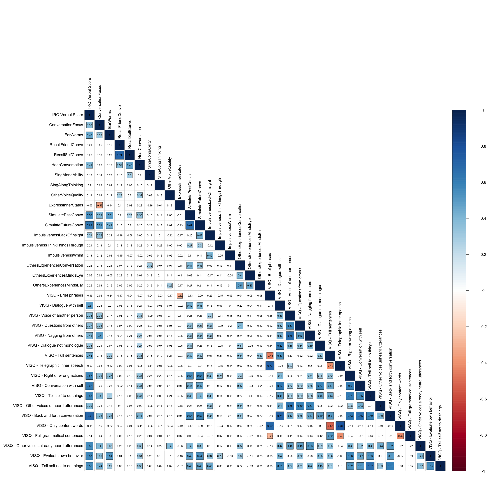

```{r setup, include = FALSE}
library("papaja")
library('tidyverse')
library('tufte')
library('lme4')
library('lmerTest')
library('kableExtra')
library('ggpubr')
source("summarySEwithin_imp.R")
irq_scores <- read.csv('irq_scores_anonymized.csv', row.names = 1)
#r_refs("r-references.bib")
knitr::opts_chunk$set(fig.pos = "!ht")
options(knitr.table.format = "latex")
color_palette <- c('#88CCEE', '#44AA99', '#117733', '#332288', '#DDCC77', '#999933','#CC6677', '#882255', '#AA4499', '#DDDDDD') # Tol_muted from https://zenodo.org/record/3381072#.Y0_5ilJBw-Q


# read in behavioural data
phon_sim_trials <- read.csv('../data/processed_data/phon_sim_trials.csv',row.names = 1)
rhyming_trials <- read.csv('../data/processed_data/rhyming_trials.csv',row.names = 1)
task_switch_trials <- read.csv('../data/processed_data/task_switch_trials.csv',row.names = 1)
same_different_trials <- read.csv('../data/processed_data/same_different_trials.csv',row.names = 1)
```

## Ordinal custom survey questions

```{r, echo=FALSE}
library(tidyverse)
library(kableExtra)
questionnaire_table_quantitative <- data.frame(
  Question = c('How often do you experience trouble focusing on a face-to-face conversation you are having because of a conflicting conversation happening in your mind at the same time?',
               'How often do you have songs stuck in your head?',
               'If you had to recall a short conversation about a specific topic that you had yesterday with a friend, how easily can you recall the exact words your friend said?',
               "If you had to recall a short conversation about a specific topic that you had yesterday with a friend, how easily can you recall the exact words you said?",
               'When you recall a conversation like the one you were thinking about for the last 2 questions, do you hear the words in your mind?',
               'Can you "sing along" to music without singing out loud?',
               'If you can "sing along" to music without singing out loud, to what extent does this feel like regular thinking?',
               'If you imagine someone else speaking, how do you experience their voice?',
               "To what extent do you agree with this statement: 'It is generally difficult
and takes effort to express in words how I think and feel'.",
                'Do you ever revise past conversations in your mind (i.e. think of a better comeback,
a way of phrasing what you wanted to say)?',
                'Do you ever rehearse a conversation before you have it in real life where you
simulate what you will say and how the other person will respond?',
                'To what extent do you agree with this statement: "I do not know why I do some of the things that I do."',
                'To what extent do you agree with this statement: “I am a firm believer in thinking things through.”',
                'To what extent do you agree with this statement: “I like to act on a whim.”',
                "For each scale, please indicate what percent of people you know you think have each of these three experiences:\n
-	Experience their thoughts in the form of a conversation with themselves\n
-	Can see vivid images in their mind's eye\n
-	Hear words in their mind's ear when they silently read"
),
  Options = c('Never (1)\n
	Rarely (2)\n
	Sometimes (3)\n
	Often (4)\n
	Always (5)',
	'	Multiple times a day (5)\n
	A few times a week (4)\n
	A few times a month (3)\n
	A few times a year (2)\n
	Never (1)',
	"I can easily recall it. If I wrote it down and matched to a recording of the conversation,
there'd be an almost perfect match (5)\n
	I remember the topic and remember much of what was said. If I matched it to a
recording of the conversation, a lot would match up. (4)\n
	I remember the topic, but remember only a few of the specific words/sentences. (3)\n
	I remember the topic, but can't remember any of the specifics. (2)\n
	Other (1)",
  "I can easily recall it. If I wrote it down and matched to a recording of the conversation,
there'd be an almost perfect match (5)\n
	I remember the topic and remember much of what was said. If I matched it to a
recording of the conversation, a lot would match up. (4)\n
	I remember the topic, but remember only a few of the specific words/sentences. (3)\n
	I remember the topic, but can't remember any of the specifics. (2)\n
	Other (1)",
  "It's just like I'm hearing the conversation again. (4)\n
	I hear a condensed version (e.g. only some words). (3)\n
	I hear something but I can't describe it. (2)\n
	I can't hear it, but I can still recall it. Please briefly say something about how you are
recalling it. (1)",
  "Yes - definitely (4)\n
	Yes - somewhat (3)\n
	No - but I can imagine how others can do it (2)\n
	No - I can't imagine how anyone could do this (1)",
  "Not at all (1)\n
  Mostly different from regular thinking (2)\n
	Neutral (3)\n
	Mostly similar to regular thinking (4)\n
	Exactly like regular thinking (5)\n
	I can't sing along without singing out loud (6)",
  "I hear what they say in their voice. (4)\n
	I hear what they say but in my own voice. (3)\n
	I hear the words but I can't tell whose voice it is. (2)\n
	I don’t “hear” anything, I imagine it by... (please specify) (1)",
  "Strongly agree (1)\n
	Agree (2)\n
	Neither agree nor disagree (3)\n
	Disagree (4)\n
	Strongly disagree (5)",
  "Never (1)\n
	Rarely (2)\n
	Sometimes (3)\n
	Often (4)\n
	Very often (5)",
  "Never (1)\n
	Rarely (2)\n
	Sometimes (3)\n
	Often (4)\n
	Very often (5)",
  "Strongly disagree (1)\n
	Disagree (2)\n
	Neither agree nor disagree (3)\n
	Agree (4)\n
	Strongly agree (5)",
  "Strongly disagree (1)\n
	Disagree (2)\n
	Neither agree nor disagree (3)\n
	Agree (4)\n
	Strongly agree (5)",
  "Strongly disagree (1)\n
	Disagree (2)\n
	Neither agree nor disagree (3)\n
	Agree (4)\n
	Strongly agree (5)",
"No one (0%) to Everyone (100%)"
	), Code = c('ConversationFocus', 'EarWorms', 'RecallFriendConvo','RecallSelfConvo','HearConversation', 'SingAlongAbility', 'SingAlongThinking','OtherVoiceQuality','ExpressInnerStates','SimulatePastConvo', 'SimulateFutureConvo', 'ImpulsivenessLackOfInsight','ImpulsivenessThinkThingsThrough', 'ImpulsivenessWhim', 'OthersExperiencesConversation, OthersExperiencesMindsEye, OthersExperiencesMindsEar')
)
  
kable(questionnaire_table_quantitative, align='l', booktabs = TRUE,
  longtable = TRUE, linesep = "") %>%
  kable_styling(full_width = T, latex_options = c("hold_position", 'repeat_header'),font_size = 8)
  
```

\newpage

## Nominal custom survey questions

```{r,echo=FALSE}
questionnaire_table_qualitative <- data.frame(
  Question = c('If you have to ask a question in front of an audience, which of these best describes what you typically do?',
               'Many people feel that a lot of their thinking, planning, and decision-making takes place in the form of a conversation with themselves. They describe that when they think, they hear words in their mind. Other people do not have this experience and instead say that they "think in ideas". Is your experience more like the first or the second?',
                'Do you think it is stressful and annoying to have an inner monologue?',
                'In books and movies, we often see characters talking to themselves at length. How much do you think this reflects real life?',
                'Have you been diagnosed with dyslexia or another reading disorder?',
                'Imagine you are lying in bed with your eyes closed trying to fall asleep. Is your inner experience then...'
),
  Options = c("I rehearse in my mind the exact phrasing of what I am going to ask (5)\n
	I rehearse in my mind some of what I am going to ask before asking it (4)\n
	I think of a question I want to ask and just ask it (3)\n
	Other (2)\n
	I'm never in a position to ask questions in front of an audience (1)",
  'More like a conversation (2)\n
	More like "thinking in ideas". Can you elaborate or give an example of what this means to you? (1)',
  "Yes, very (3)\n
	Maybe a little (2)\n
	No, I don't think so (1)",
  "It's just for the viewer/reader's benefit (1)\n
	It might be like real life but mostly for the viewer's/reader's benefit (2)\n
	It's exactly like real life (3)",
  "Yes, officially diagnosed (1)\n
	Yes, self-diagnosed (2)\n
	No, never (3)",
  'Primarily verbal (you "hear" or "speak" words and sentences in your mind) (1)\n
	Primarily visual (you "see" situations, objects, people etc. in your mind) (2)\n
	Primarily about sensory awareness (what you are hearing, smelling, and feeling in the
  moment) (3)\n
	Primarily emotional (4)\n
	An even mix of verbal, visual, sensory, and emotional (5)\n
	My inner experience in that situation does not have a specific "format" (6)'
	), Code = c('RehearseQuestion', 'ThinkingInIdeas','StressfulInnerSpeech','InnerSpeechFiction', 'Dyslexia', 'DriftOffQuality')
)

kable(questionnaire_table_qualitative, align='l', booktabs = TRUE,
  longtable = TRUE, linesep = "") %>%
  kable_styling(full_width = T, latex_options = c("hold_position", 'repeat_header'),font_size = 8)
```


## Correlations between custom questions and Varieties of Inner Speech Questionnaire (VISQ)

```{r questionnaire-correlation-matrix, echo=FALSE,include=FALSE}
library(corx)
library(corrtable)
library(Hmisc)
library(corrplot)
Q_anendophasia_numeric <- read.csv('../data/survey_data/qualtrics_numeric_anendophasia.csv')
Q_anendophasia_text <- read.csv('../data/survey_data/qualtrics_text_anendophasia.csv')
Q_anendophasia_numeric <- Q_anendophasia_numeric %>%
  rename(visq_cond_1 = Q63_95, visq_dial_1 = Q63_96, visq_other_voi_1 = Q63_97, visq_other_voi_2 = Q63_98, visq_other_voi_3 = Q63_100, visq_dial_2 = Q63_101, visq_cond_2_rev = Q63_102, visq_cond_3 = Q63_103, visq_eval_1 = Q63_105, visq_dial_3 = Q63_106, visq_eval_2 = Q63_108, visq_other_voi_4 = Q63_109, visq_dial_4 = Q63_111, visq_cond_4 = Q63_112, visq_cond_5_rev = Q63_115, visq_other_voi_5 = Factor2_1...68, visq_eval_3 = Q63_116, visq_eval_4 = Q63_117)
Q_anendophasia_numeric <- merge(Q_anendophasia_numeric, irq_scores, by = 'worker_id', all.x = T)
Q_anendophasia_numeric <- distinct(Q_anendophasia_numeric)
Q_anendophasia_text <- merge(Q_anendophasia_text, irq_scores, by = 'worker_id', all.x = T)
Q_anendophasia_text <- distinct(Q_anendophasia_text)

```

```{r survey-cor-plot-contrast, echo=FALSE, out.width="100%", out.height="100%", fig.cap="Correlations between survey measures in the total sample of participants. Colored squares represent significant correlations at p < .01 which with the given sample size (N = 92) is equivalent to a correlation coefficient of at least r = ±.27."}

```

\newpage

## Nominal questions and their relations with Verbal Score

```{r, echo=FALSE,warning=FALSE}
# plot nominal questions and their correlations with verbal score
# c('RehearseQuestion', 'ThinkingInIdeas','StressfulInnerSpeech','InnerSpeechFiction', 'DriftOffQuality')
rehearse_question_labs <- c('I rehearse in\nmy mind some\nof what I am\ngoing to ask\nbefore asking it', 'I rehearse in\nmy mind the\nexact phrasing of what\nI am going to ask', 'I think of a\nquestion I want\nto ask and\njust ask it', 'Other',"I'm never\nin a position\nto ask questions in\nfront of an audience")
rehearse_question_p <-
  Q_anendophasia_text %>% 
  ggplot(aes(y=VerbalScored,x=rehearse_question))+
  geom_violin(aes(group = rehearse_question,fill=as.factor(rehearse_question)),scale="width",alpha=.5)+
  geom_jitter(width=.1,height=.1)+
  theme_bw()+
  labs(title='If you have to ask a question in front of an audience,\nwhich of these best describes what you typically do?', x='', y='Propensity for inner speech') +
  theme(plot.title = element_text(size = 12, face = "bold"), axis.title = element_text(size = 10),
        axis.text.x = element_text(size = 10, angle = 90, hjust = 1), legend.position = 'none')+
  scale_x_discrete(labels=rehearse_question_labs)
rehearse_question_p
```


```{r, echo=FALSE}
ideas_labs <- c('"Thinking in ideas"', 'Conversation')
thinking_in_ideas_p <- 
  Q_anendophasia_text %>% 
  ggplot(aes(y=VerbalScored,x=thinking_in_ideas))+
  geom_violin(aes(group = thinking_in_ideas,fill=as.factor(thinking_in_ideas)),scale="width",alpha=.5)+
  geom_jitter(width=.1,height=.1)+
  theme_bw()+
  labs(title ='Many people feel that a lot of their thinking, planning, and\ndecision-making takes place in the form of a conversation with themselves.\nThey describe that when they think, they hear words in\ntheir mind. Other people do not have this experience and\ninstead say that they "think in ideas". Is your\nexperience more like the first or the second?',
       x='', y='Propensity for inner speech')+
  theme(plot.title = element_text(size = 12, face = "bold"), axis.title = element_text(size = 10),
        axis.text.x = element_text(size = 10, angle = 90, hjust = 1), legend.position = 'none')+
  scale_x_discrete(labels=ideas_labs) 
thinking_in_ideas_p
```


```{r, echo=FALSE}
stress_IS_p <- 
  Q_anendophasia_text %>% 
  ggplot(aes(y=VerbalScored,x=stress_IS))+  
  geom_violin(aes(group = stress_IS,fill=as.factor(stress_IS)),scale="width",alpha=.5)+
  geom_jitter(width=.1,height=.1)+
  theme_bw()+
  theme(plot.title = element_text(size = 12, face = "bold"), axis.title = element_text(size = 10),
        axis.text.x = element_text(size = 10, angle = 90, hjust = 1), legend.position = 'none')+
  labs(title='Do you think it is stressful and annoying to have an inner monologue?', x='', y='Propensity for inner speech')
stress_IS_p
```

```{r, echo=FALSE}

narrative_labs <- c("It might be\nlike real life but\nmostly for the viewer's/\nreader's benefit",
                    "It's exactly\nlike real life",
                    "It's just\nfor the viewer/\nreader's benefit")
narrative_IS_p <-
  Q_anendophasia_text %>% 
  ggplot(aes(y=VerbalScored,x=narrative_IS))+  
  geom_violin(aes(group = narrative_IS,fill=as.factor(narrative_IS)),scale="width",alpha=.5)+
  geom_jitter(width=.1,height=.1)+
  theme_bw()+
  theme(plot.title = element_text(size = 12, face = "bold"), axis.title = element_text(size = 10),
        axis.text.x = element_text(size = 10, angle = 90, hjust = 1), legend.position= 'none')+
  labs(title='In books and movies, we often see characters talking\nto themselves at length.\nHow much do you think this reflects real life?',
       x='', y='Propensity for inner speech')+
  scale_x_discrete(labels=narrative_labs)
narrative_IS_p
```

```{r,echo=FALSE}
exp_type_levs <- c("An even mix of\nverbal, visual,\nsensory, and emotional",                                  
                   "My inner experience\nin that situation\ndoesn't have a\nspecific \"format\"",                     
                   "Primarily about sensory\nawareness (what you\nare hearing, smelling, and \nfeeling in the moment)",
                   "Primarily emotional",                                                                          
                   "Primarily verbal\n(you \"hear\" or\n \"speak\" words and\nsentences in your mind)",                
                   "Primarily visual\n(you \"see\" situations,\n objects, people etc.\nin your mind)")
exp_type_nodding_off_p <-  
  Q_anendophasia_text %>% 
  ggplot(aes(y=VerbalScored,x=exp_type_nodding_off))+  
  geom_violin(aes(group = exp_type_nodding_off,fill=as.factor(exp_type_nodding_off)),scale="width",alpha=.5)+
  geom_jitter(width=.1,height=.1)+
  theme_bw()+
  theme(plot.title = element_text(size = 12, face = "bold"), axis.title = element_text(size = 10),
        axis.text.x = element_text(size = 10, angle = 90, hjust = 1), legend.position = 'none')+
  scale_x_discrete(labels=exp_type_levs)+
  labs(title='What is your experience like when you are trying to fall asleep?',x='', y='Propensity for inner speech')
exp_type_nodding_off_p
```

